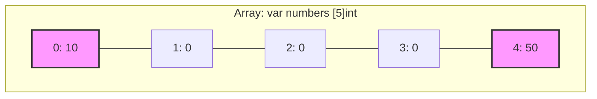
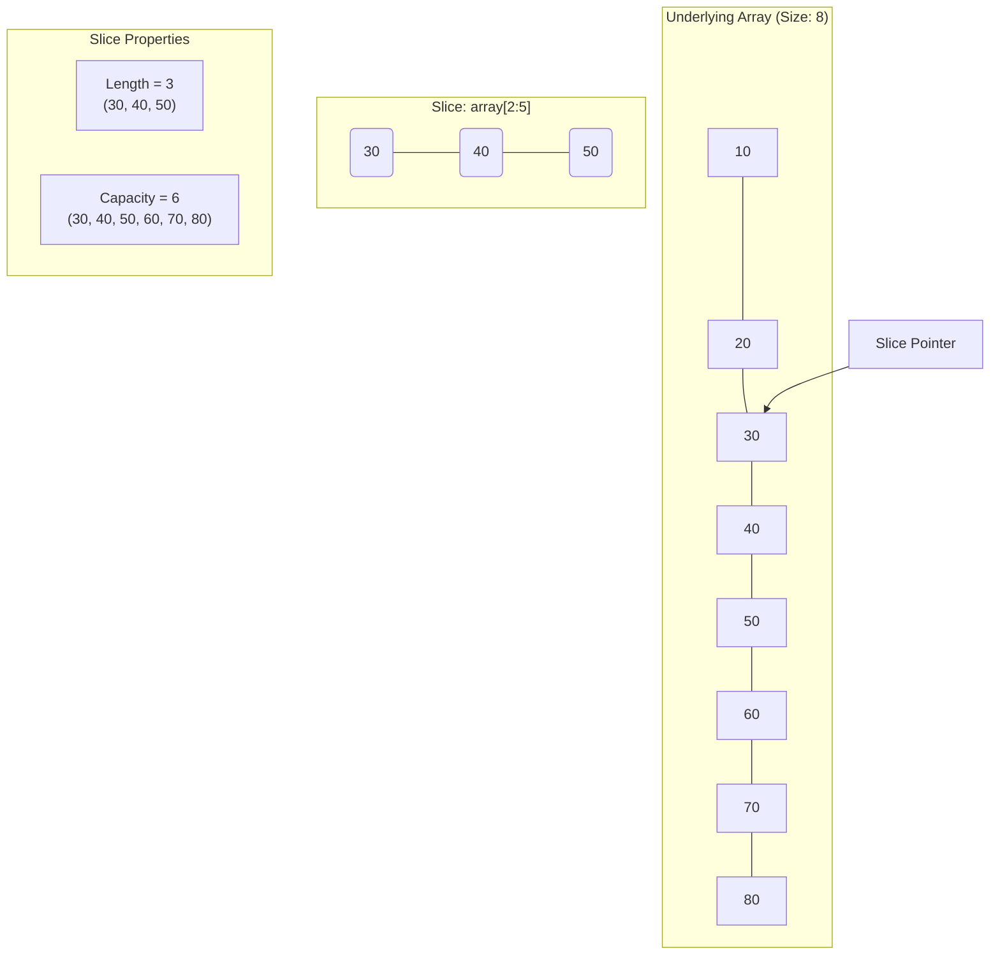
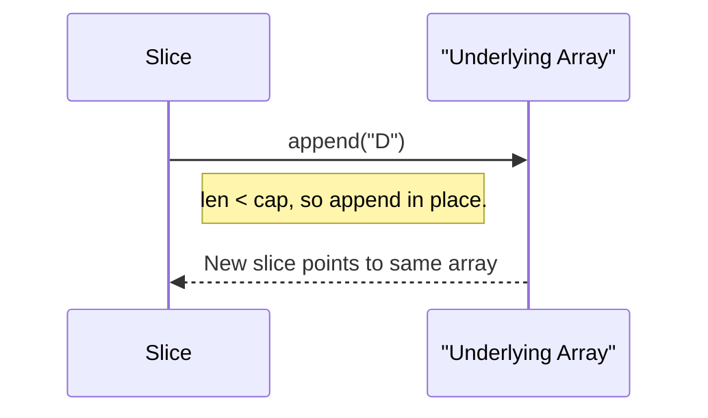
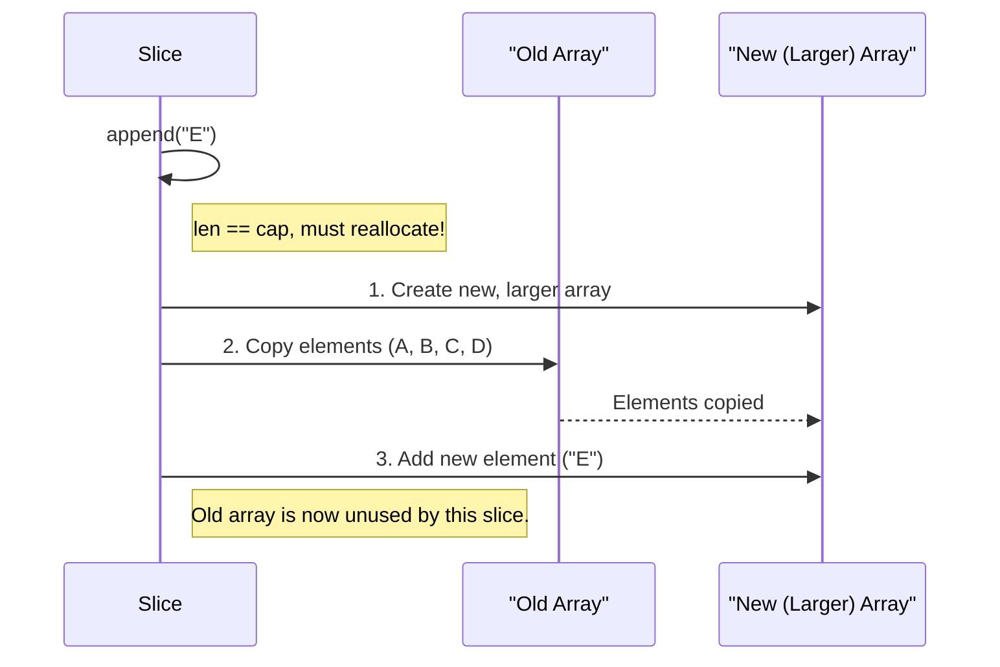
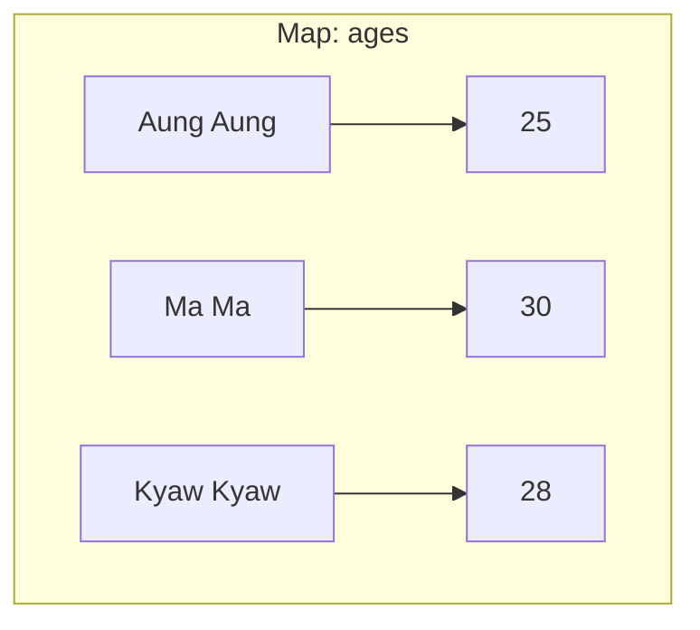

# အခန်း ၅: Composite Types - Arrays, Slices, and Maps

ယခုအခန်းတွင် Go ၏ အသုံးအများဆုံး composite data types များဖြစ်သော Arrays, Slices, နှင့် Maps တို့အကြောင်းကို လေ့လာသွားပါမည်။ ဤ data types များသည် data အစုအဝေးများကို စုစည်းသိမ်းဆည်းရန်အတွက် အလွန်အရေးပါပါသည်။

---

## 1. Arrays

Array ဆိုသည်မှာ **data type တစ်မျိုးတည်းကိုသာ** သိမ်းဆည်းနိုင်သော၊ **အရွယ်အစား (size) ပုံသေ** သတ်မှတ်ထားသည့် data collection တစ်ခုဖြစ်သည်။ Array တစ်ခုကို ကြေညာလိုက်သည်နှင့် ၎င်း၏ အရွယ်အစားကို ပြောင်းလဲ၍မရပါ။

Go တွင် Array ကို Slices များလောက် အသုံးမများသော်လည်း၊ Slices ၏ အလုပ်လုပ်ပုံကို နားလည်ရန်အတွက် Array သည် အခြေခံကျပါသည်။



**ဥပမာ Code:**

```go
package main

import "fmt"

func main() {
    // အရွယ်အစား 5 ရှိသော integer array တစ်ခုကို ကြေညာခြင်း
    // ကနဦးတွင် တန်ဖိုးအားလုံးသည် zero-value (int အတွက် 0) ဖြစ်သည်
    var numbers [5]int
    fmt.Println("Initial Array:", numbers) // Output: [0 0 0 0 0]

    // Index ကို အသုံးပြု၍ တန်ဖိုးများ ထည့်သွင်းခြင်း
    numbers[0] = 10
    numbers[4] = 50

    fmt.Println("After assignment:", numbers) // Output: [10 0 0 0 50]
    fmt.Println("Length:", len(numbers))   // Output: 5

    // ကြေညာစဉ် တန်ဖိုးများ တခါတည်းထည့်သွင်းခြင်း
    primes := [3]int{2, 3, 5}
    fmt.Println("Primes Array:", primes) // Output: [2 3 5]
}
```

---

## 2. Slices

Slice သည် Array အပေါ်တွင် တည်ဆောက်ထားသော ပိုမို flexible ဖြစ်ပြီး အစွမ်းထက်သည့် data structure ဖြစ်သည်။ Array ကဲ့သို့ အရွယ်အစား ပုံသေမဟုတ်ဘဲ **dynamic (ပြောင်းလွယ်ပြင်လွယ်)** ဖြစ်သောကြောင့် Go developer များ အသုံးအများဆုံးဖြစ်သည်။

Slice သည် အပိုင်းသုံးပိုင်းဖြင့် ဖွဲ့စည်းထားသည်-
1.  **Pointer:** နောက်ကွယ်ရှိ array (underlying array) ၏ element တစ်ခုကို ညွှန်ပြနေသော pointer။
2.  **Length (`len()`):** Slice ထဲတွင် လက်ရှိရှိနေသော element အရေအတွက်။
3.  **Capacity (`cap()`):** Slice ၏ pointer စတင်ညွှန်ပြသည့်နေရာမှ underlying array ၏ အဆုံးအထိရှိသော element အရေအတွက်။

### Slice, Length, and Capacity



### `append` ဖြင့် Slice ကို Element ထပ်ထည့်ခြင်း

`append` function သည် slice ၏ အရေးကြီးဆုံး အစိတ်အပိုင်းဖြစ်သည်။ ၎င်း၏ အလုပ်လုပ်ပုံကို `capacity` နှင့် ဆက်စပ်၍ နားလည်ရန် အရေးကြီးသည်။

**Case 1: Append within Capacity (Capacity အတွင်း Element ထပ်ထည့်ခြင်း)**

Slice ၏ `length` သည် `capacity` ထက်ငယ်နေသေးလျှင် `append` လုပ်သောအခါ **မူလ underlying array** ၏ နေရာလွတ်တွင်ပင် element အသစ်ကို ထည့်သွင်းသည်။



**Case 2: Append exceeding Capacity (Capacity ကျော်လွန်၍ Element ထပ်ထည့်ခြင်း)**

Slice ၏ `length` သည် `capacity` နှင့် တူညီနေချိန်တွင် `append` လုပ်သောအခါ Go runtime သည်-
1.  **Array အသစ်တစ်ခု** (များသောအားဖြင့် လက်ရှိ capacity ၏ နှစ်ဆ) ကို memory တွင် တည်ဆောက်သည်။
2.  Element အဟောင်းများအားလုံးကို array အသစ်သို့ **copy ကူးထည့်သည်**။
3.  Element အသစ်ကို array အသစ်၏ အဆုံးတွင် ထည့်သွင်းသည်။
4.  Slice ၏ pointer ကို **array အသစ်ဆီသို့** ပြောင်းလဲ ညွှန်ပြစေသည်။



**ဥပမာ Code (Length & Capacity):**

```go
package main

import "fmt"

func main() {
    // 1. Underlying array တစ်ခု ဖန်တီးခြင်း
    numbersArray := [6]int{10, 20, 30, 40, 50, 60}
    fmt.Println("Underlying Array:", numbersArray)

    // 2. Array မှ slice တစ်ခု ဖန်တီးခြင်း (index 2 မှ 4 မတိုင်ခင်အထိ)
    mySlice := numbersArray[2:4] // [30, 40]
    
    fmt.Printf("Slice: %v, Length: %d, Capacity: %d", mySlice, len(mySlice), cap(mySlice))
    // Capacity: index 2 မှ array အဆုံးထိ ရေတွက်မည် (30, 40, 50, 60) -> 4 ခု

    // 3. Append within Capacity
    mySlice = append(mySlice, 70)
    fmt.Println("
--- After appending 70 (within capacity) ---")
    fmt.Printf("Slice: %v, Length: %d, Capacity: %d
", mySlice, len(mySlice), cap(mySlice))
    // Underlying array ပါ ပြောင်းလဲသွားသည်ကို သတိပြုပါ
    fmt.Println("Underlying Array is now:", numbersArray) // Output: [10 20 30 40 70 60]

    // 4. Append exceeding Capacity
    // လက်ရှိ cap = 4, len = 3 ဖြစ်နေသေးသည်
    mySlice = append(mySlice, 80) // cap ပြည့်သွားပြီ
    mySlice = append(mySlice, 90) // cap ကျော်လွန်သွားပြီ
    
    fmt.Println("
--- After appending 80 and 90 (exceeding capacity) ---")
    // Go က array အသစ်တစ်ခု (size 8) ကို တည်ဆောက်ပြီး data တွေ copy ကူးထည့်ပါမည်။
    fmt.Printf("Slice: %v, Length: %d, Capacity: %d
", mySlice, len(mySlice), cap(mySlice))
    
    // array အသစ်ကို ညွှန်းဆိုသွားသောကြောင့် မူလ array ကို ထိခိုက်တော့မည် မဟုတ်ပါ။
    fmt.Println("Underlying Array remains unchanged:", numbersArray)
}
```

---

## 3. Maps

Map ဆိုသည်မှာ **key-value pair** များဖြင့် data များကို သိမ်းဆည်းသော **unordered collection** တစ်ခုဖြစ်သည်။ အခြား language များရှိ hash tables သို့မဟုတ် dictionaries များနှင့် ဆင်တူသည်။



**အရေးကြီးသော အချက်:** Map ထဲမှ data များကို `for...range` loop ဖြင့် ပြန်ထုတ်သည့်အခါ ရရှိလာသော အစီအစဉ်သည် data ထည့်သွင်းခဲ့သည့် အစီအစဉ်အတိုင်း ဖြစ်မည်ဟု **အာမမခံပါ**။ အဘယ်ကြောင့်ဆိုသော် Map သည် hash table ကို အခြေခံထားပြီး performance အတွက် iteration order ကို တမင် random ပြုလုပ်ထားသောကြောင့် ဖြစ်သည်။

**ဥပမာ Code:**

```go
package main

import (
    "fmt"
    "sort"
)

func main() {
    // string key နှင့် int value ရှိသော map တစ်ခုကို ကြေညာပြီး တန်ဖိုးထည့်ခြင်း
    ages := map[string]int{
        "Aung Aung": 25,
        "Ma Ma":     30,
    }
    fmt.Println("Initial Map:", ages)

    // Element တစ်ခုကို ဖျက်ခြင်း
    delete(ages, "Ma Ma")
    fmt.Println("After delete:", ages)

    // Key ရှိမရှိ စစ်ဆေးခြင်း
    // `val` တွင် value ကို ရရှိပြီး `ok` တွင် key ရှိ/မရှိ (true/false) ကို ရရှိမည်
    val, ok := ages["Kyaw Kyaw"]
    if ok {
        fmt.Println("Kyaw Kyaw's age is", val)
    } else {
        fmt.Println("Kyaw Kyaw not found.")
    }

    // --- Map Iteration ---
    testScores := map[string]int{
        "Charlie": 88,
        "Alice":   95,
        "Bob":     72,
    }

    fmt.Println("
Unordered Iteration:")
    // ဤ loop ကို run တိုင်း ရလဒ်အစီအစဉ် ပြောင်းလဲနိုင်သည်
    for name, score := range testScores {
        fmt.Printf("Name: %s, Score: %d", name, score)
    }

    // --- Sorted Iteration (အစီအစဉ်တကျ ပြန်ထုတ်ခြင်း) ---
    // 1. Key များကို slice တစ်ခုထဲ ထည့်ပါ
    var names []string
    for name := range testScores {
        names = append(names, name)
    }
    // 2. Slice ကို sort လုပ်ပါ
    sort.Strings(names)

    fmt.Println("Sorted Iteration:")
    // 3. Sort လုပ်ပြီးသား slice ကို loop ပတ်ပြီး map မှ value များကို ထုတ်ပါ
    for _, name := range names {
        fmt.Printf("Name: %s, Score: %d", name, testScores[name])
    }
}
```