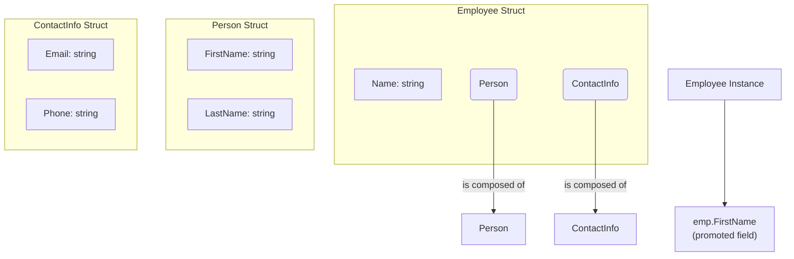

# အခန်း ၆: Structs

ယခုအခန်းတွင် Go ၏ အစွမ်းထက်သော feature တစ်ခုဖြစ်သည့် `struct` အကြောင်းကို လေ့လာသွားပါမည်။ Struct သည် data type အမျိုးမျိုးကို စုစည်း၍ ကိုယ်ပိုင် custom data type အသစ်များ တည်ဆောက်ရန် အသုံးပြုသည်။ ၎င်းသည် data များကို စနစ်တကျ စုစည်းကိုင်တွယ်ရန်အတွက် အလွန်အရေးပါပါသည်။

---

## Struct ဆိုတာဘာလဲ (Custom Data Types)

Struct (structure) ဆိုသည်မှာ data type အမျိုးမျိုးရှိနိုင်သော fields (အချက်အလက်များ) ကို စုစည်းထားသည့် collection တစ်ခုဖြစ်သည်။ ဥပမာအားဖြင့်၊ လူတစ်ယောက် (Person) ကို ဖော်ပြရန်အတွက် နာမည် (`string`), အသက် (`int`), နေရပ်လိပ်စာ (`string`) တို့ကို `Person` struct တစ်ခုတည်းတွင် စုစည်းထားနိုင်ပါသည်။

Struct ကို `type` နှင့် `struct` keywords များ အသုံးပြု၍ အောက်ပါအတိုင်း ကြေညာနိုင်ပါသည်။

```go
package main

import "fmt"

// 'Person' အမည်ဖြင့် custom data type အသစ်တစ်ခု တည်ဆောက်ခြင်း
type Person struct {
    FirstName string
    LastName  string
    Age       int
}

func main() {
    // Person struct မှ variable တစ်ခု တည်ဆောက်ခြင်း
    var p1 Person
    p1.FirstName = "Aung"
    p1.LastName = "Kyaw"
    p1.Age = 30

    fmt.Println("Person 1:", p1)

    // Struct literal ဖြင့် တန်ဖိုးများ တခါတည်း ထည့်သွင်းခြင်း
    p2 := Person{
        FirstName: "Ma",
        LastName:  "Hla",
        Age:       28,
    }

    fmt.Println("Person 2:", p2)
    fmt.Println("First Name of P2:", p2.FirstName)
}
```

---

## Methods (Struct နှင့် သက်ဆိုင်သော Functions)

Method ဆိုသည်မှာ struct တစ်ခုနှင့် သီးသန့်သက်ဆိုင်သော function တစ်မျိုးဖြစ်သည်။ ၎င်းသည် function ကြေညာရာတွင် `func` keyword နှင့် function name အကြား၌ "receiver" ဟုခေါ်သော argument တစ်ခု ပိုမိုပါဝင်သည်။

```go
package main

import "fmt"

type Person struct {
    FirstName string
    LastName  string
    Age       int
}

// (p Person) သည် receiver ဖြစ်ပြီး Person struct နှင့် ချိတ်ဆက်ပေးသည်
// ဤ method သည် Person struct ၏ data များကို ဖတ်ရန်သာဖြစ်သည် (Value Receiver)
func (p Person) FullName() string {
    return p.FirstName + " " + p.LastName
}

// (p *Person) သည် pointer receiver ဖြစ်သည်
// Struct ၏ field တန်ဖိုးကို ပြောင်းလဲလိုလျှင် pointer receiver ကို သုံးရသည်
func (p *Person) SetAge(newAge int) {
    p.Age = newAge
}

func main() {
    p := Person{FirstName: "Su", LastName: "Myat", Age: 25}
    fmt.Println("Full Name:", p.FullName())

    // အသက်ကို ပြောင်းလဲခြင်း
    p.SetAge(26)
    fmt.Println("New Age:", p.Age)
}
```

**Pointer Receiver ကို ဘာကြောင့်သုံးသင့်သလဲ?**
1.  **To modify state:** Method အတွင်းမှ struct ၏ မူလတန်ဖိုးများကို ပြောင်းလဲရန်။
2.  **Efficiency:** Struct ၏ data များစွာကို function သို့ copy ကူးခြင်းမှ ရှောင်ရှားရန်။ Struct အရွယ်အစားကြီးမားပါက pointer ဖြင့် pass လုပ်ခြင်းက ပိုမိုမြန်ဆန်ပါသည်။

---

## Embedded Structs (Struct ထပ်ခြင်း) - Composition

Go တွင် အခြား language များကဲ့သို့ class inheritance မရှိပါ။ သို့သော် struct တစ်ခုကို အခြား struct တစ်ခုထဲတွင် ထည့်သွင်းခြင်း (embedding) ဖြင့် code များကို ပြန်လည်အသုံးပြုနိုင်သည့် composition ကို အားပေးသည်။

Embedded struct ၏ fields များကို အပြင်ဘက် struct မှ တိုက်ရိုက်ခေါ်ယူသုံးစွဲနိုင်ပါသည်။



```go
package main

import "fmt"

type ContactInfo struct {
    Email string
    Phone string
}

type Employee struct {
    Name   string
    Person      // Person struct ကို embed လုပ်ခြင်း (Promoted Fields)
    ContactInfo
}

func main() {
    emp := Employee{
        Name: "Manager",
        Person: Person{
            FirstName: "Thura",
            LastName:  "Linn",
            Age:       40,
        },
        ContactInfo: ContactInfo{
            Email: "thura@example.com",
            Phone: "09123456789",
        },
    }

    // Embedded struct (Person) ၏ field များကို တိုက်ရိုက်ခေါ်သုံးနိုင်သည်
    fmt.Println("Employee's First Name:", emp.FirstName) // emp.Person.FirstName ဟု ရေးရန်မလို
    fmt.Println("Employee's Email:", emp.Email)         // emp.ContactInfo.Email ဟု ရေးရန်မလို
    fmt.Println("Full Info:", emp)
}
```