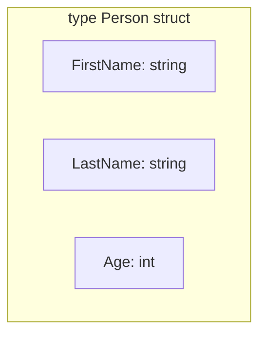
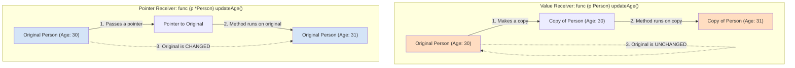
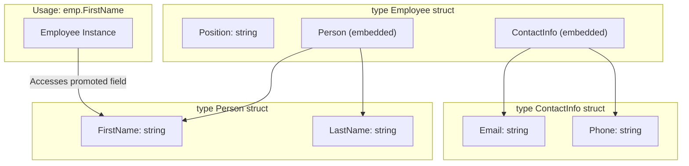

# အခန်း ၆: Structs and Methods

ယခုအခန်းတွင် Go ၏ အစွမ်းထက်သော feature တစ်ခုဖြစ်သည့် `struct` နှင့် `method` တို့အကြောင်းကို လေ့လာသွားပါမည်။ Struct သည် data type အမျိုးမျိုးကို စုစည်း၍ ကိုယ်ပိုင် custom data type အသစ်များ တည်ဆောက်ရန် အသုံးပြုပြီး၊ Method များသည် ထို struct များနှင့် သက်ဆိုင်သော လုပ်ဆောင်ချက် (behavior) များကို သတ်မှတ်ပေးပါသည်။

---

## 1. Struct (Custom Data Types)

Struct (structure) ဆိုသည်မှာ data type အမျိုးမျိုးရှိနိုင်သော **fields** (အချက်အလက်များ) ကို စုစည်းထားသည့် collection တစ်ခုဖြစ်သည်။ ဥပမာအားဖြင့်၊ လူတစ်ယောက် (`Person`) ကို ဖော်ပြရန်အတွက် နာမည် (`string`), အသက် (`int`) စသည်တို့ကို `Person` struct တစ်ခုတည်းတွင် စုစည်းထားနိုင်ပါသည်။



**ဥပမာ Code:**

```go
package main

import "fmt"

// 'Person' အမည်ဖြင့် custom data type အသစ်တစ်ခု တည်ဆောက်ခြင်း
type Person struct {
    FirstName string
    LastName  string
    Age       int
}

func main() {
    // Person struct မှ variable တစ်ခု တည်ဆောက်ခြင်း
    p1 := Person{
        FirstName: "Aung",
        LastName:  "Kyaw",
        Age:       30,
    }

    fmt.Println("Person 1:", p1)
    fmt.Println("First Name:", p1.FirstName) // field ကို dot (.) ဖြင့် ခေါ်သုံးခြင်း

    // field တန်ဖိုးကို ပြောင်းလဲခြင်း
    p1.Age = 31
    fmt.Println("Updated Age:", p1.Age)
}
```

---

## 2. Methods (Struct နှင့် သက်ဆိုင်သော Functions)

Method ဆိုသည်မှာ struct တစ်ခုနှင့် သီးသန့်သက်ဆိုင်သော function တစ်မျိုးဖြစ်သည်။ ၎င်းသည် function ကြေညာရာတွင် `func` keyword နှင့် function name အကြား၌ **"receiver"** ဟုခေါ်သော argument တစ်ခု ပိုမိုပါဝင်သည်။

Receiver အမျိုးအစား နှစ်မျိုးရှိသည်-
1.  **Value Receiver:** Struct ၏ **မိတ္တူ (copy)** ကိုသာ ရရှိသည်။ Method အတွင်း ပြောင်းလဲမှုများသည် မူလ struct ကို **မထိခိုက်ပါ**။
2.  **Pointer Receiver:** Struct ၏ **မူရင်း memory address (pointer)** ကို ရရှိသည်။ Method အတွင်း ပြောင်းလဲမှုများသည် မူလ struct ကို **တိုက်ရိုက် ထိခိုက်ပြောင်းလဲစေသည်**။

### Value Receiver vs. Pointer Receiver



**Pointer Receiver ကို ဘာကြောင့်/ဘယ်အချိန် သုံးသင့်သလဲ?**
1.  **To modify state:** Method အတွင်းမှ struct ၏ မူလတန်ဖိုးများကို ပြောင်းလဲရန် မဖြစ်မနေ သုံးရမည်။
2.  **Efficiency:** Struct အရွယ်အစားကြီးမားပါက data များစွာကို copy ကူးခြင်းမှ ရှောင်ရှားရန် pointer ဖြင့် pass လုပ်ခြင်းက ပိုမိုမြန်ဆန်ပြီး memory သက်သာစေသည်။

**ဥပမာ Code:**

```go
package main

import "fmt"

type Person struct {
    FirstName string
    Age       int
}

// (p Person) -> Value Receiver
func (p Person) Greet() {
    fmt.Printf("Hello, my name is %s and I am %d years old.\n", p.FirstName, p.Age)
    p.Age = 99 // ဤပြောင်းလဲမှုသည် copy ကိုသာ ထိခိုက်ပြီး မူရင်း struct ကို မပြောင်းလဲပါ
}

// (p *Person) -> Pointer Receiver
func (p *Person) SetAge(newAge int) {
    p.Age = newAge
}

func main() {
    p := Person{FirstName: "Su Myat", Age: 25}

    p.Greet()
    fmt.Println("Age after Greet():", p.Age) // Output: 25 (မပြောင်းလဲပါ)

    p.SetAge(26)
    fmt.Println("Age after SetAge():", p.Age) // Output: 26 (ပြောင်းလဲသွားသည်)
}
```

---

## 3. Embedded Structs (Composition)

Go တွင် class inheritance (အမွေဆက်ခံခြင်း) မရှိပါ။ သို့သော် struct တစ်ခုကို အခြား struct တစ်ခုထဲတွင် ထည့်သွင်းခြင်း (**embedding**) ဖြင့် **composition** ကို အားပေးသည်။



**ဥပမာ Code:**

```go
package main

import "fmt"

type ContactInfo struct {
    Email string
    Phone string
}

type Person struct {
    FirstName string
    LastName  string
}

type Employee struct {
    Position string
    Person      // Person struct ကို embed လုပ်ခြင်း
    ContactInfo // ContactInfo struct ကို embed လုပ်ခြင်း
}

func main() {
    emp := Employee{
        Position: "Software Engineer",
        Person: Person{
            FirstName: "Thura",
            LastName:  "Linn",
        },
        ContactInfo: ContactInfo{
            Email: "thura.linn@example.com",
            Phone: "09123456789",
        },
    }

    fmt.Println("Employee's First Name:", emp.FirstName)
    fmt.Println("Employee's Email:", emp.Email)
    fmt.Println("Full Info:", emp)
}
```