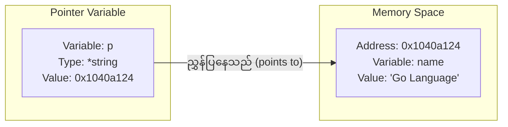

# အခန်း ၈: Pointers

ယခုအခန်းတွင် Go ၏ အရေးကြီးသော concept တစ်ခုဖြစ်သည့် Pointers အကြောင်းကို လေ့လာသွားပါမည်။ Pointer သည် memory address များကို တိုက်ရိုက်ကိုင်တွယ်ရန် အသုံးပြုပြီး၊ function များသို့ data များ pass လုပ်ရာတွင် ပိုမိုထိရောက်စေရန်နှင့် မူလ data များကို ပြောင်းလဲနိုင်ရန်အတွက် အဓိက အသုံးပြုပါသည်။

---

## Pointer ဆိုတာဘာလဲ။ (Memory Address)

Program တစ်ခုတွင် variable တိုင်းသည် ကွန်ပျူတာ၏ memory တွင် နေရာတစ်ခုယူ၍ တန်ဖိုးများကို သိမ်းဆည်းထားပါသည်။ ထို memory နေရာတိုင်းတွင် လိပ်စာ (address) တစ်ခုစီ ရှိပါသည်။

**Pointer** ဆိုသည်မှာ အခြား variable တစ်ခု၏ **memory address** ကို တန်ဖိုးအနေဖြင့် သိမ်းဆည်းထားသော variable တစ်မျိုးဖြစ်သည်။

ဥပမာ၊ `name` ဆိုသော variable တွင် `"Go Language"` ဟူသော တန်ဖိုးရှိပြီး ၎င်းသည် memory address `0x1040a124` တွင် ရှိနေသည်ဆိုပါစို့။ `p` ဟူသော pointer တစ်ခုသည် `name` ၏ တန်ဖိုး `"Go Language"` ကို တိုက်ရိုက်သိမ်းဆည်းခြင်းမဟုတ်ဘဲ၊ `name` ၏ memory address ဖြစ်သော `0x1040a124` ကို သိမ်းဆည်းထားပါသည်။

ဤဆက်စပ်မှုကို အောက်ပါပုံဖြင့် ပိုမိုရှင်းလင်းစွာ မြင်နိုင်ပါသည်။



Pointer type ကို ကြေညာရာတွင် ၎င်းညွှန်ပြမည့် variable ၏ type ရှေ့တွင် `*` သင်္ကေတကို ထည့်သွင်းရေးသားရသည်။ ဥပမာ၊ `int` variable တစ်ခုကို ညွှန်ပြမည့် pointer ၏ type မှာ `*int` ဖြစ်သည်။

---

## `&` (address of) နှင့် `*` (dereference) Operators

Pointers များနှင့် အလုပ်လုပ်ရာတွင် အဓိကကျသော operator နှစ်ခုမှာ `&` နှင့် `*` ဖြစ်သည်။

*   **`&` (Address of) Operator:** Variable တစ်ခု၏ ရှေ့တွင် `&` ကို ထားရှိပါက ၎င်း variable ၏ memory address ကို ရရှိမည်ဖြစ်သည်။
*   **`*` (Dereferencing) Operator:** Pointer variable တစ်ခု၏ ရှေ့တွင် `*` ကို ထားရှိပါက ၎င်း pointer ညွှန်ပြနေသော memory address ရှိ **တန်ဖိုး (value)** ကို ရရှိမည်ဖြစ်သည်။ ၎င်းကို "dereferencing" ဟုခေါ်သည်။

```go
package main

import "fmt"

func main() {
    // 1. 'name' variable ကို string တန်ဖိုးတစ်ခုဖြင့် ကြေညာခြင်း
    name := "Go Language"
    fmt.Println("Original value of name:", name)

    // 2. 'name' variable ၏ memory address ကို ရယူပြီး 'p' pointer ထဲသို့ ထည့်ခြင်း
    var p *string = &name
    
    fmt.Println("Memory address of name (&name):", &name)
    fmt.Println("Value of pointer p (address):", p)

    // 3. Pointer 'p' ကို dereference လုပ်ပြီး ၎င်းညွှန်ပြနေသော တန်ဖိုးကို ရယူခြင်း
    fmt.Println("Value at address p (*p):", *p)

    // 4. Pointer မှတစ်ဆင့် မူလ variable ၏ တန်ဖိုးကို ပြောင်းလဲခြင်း
    *p = "Golang"
    fmt.Println("Value of name after modification via pointer:", name)
}
```

---

## Pointer ကို ဘာကြောင့် သုံးသင့်သလဲ။

Pointer ကို အသုံးပြုရခြင်း၏ အဓိက အကြောင်းရင်းနှစ်ခုမှာ-

**1. Function များအတွင်းမှ မူလ Variable ၏ တန်ဖိုးကို ပြောင်းလဲရန်**

Go တွင် function တစ်ခုသို့ variable တစ်ခုကို pass လုပ်သည့်အခါ ၎င်း variable ၏ copy တစ်ခုကိုသာ pass လုပ်ခြင်းဖြစ်သည် (pass-by-value)။ ထို့ကြောင့် function အတွင်းတွင် ထို variable ကို ပြောင်းလဲလိုက်သော်လည်း မူလ variable ပြောင်းလဲသွားမည်မဟုတ်ပါ။

မူလ variable ကို ပြောင်းလဲလိုပါက ၎င်း variable ၏ pointer ကို function သို့ pass လုပ်ရမည်။

```go
package main

import "fmt"

// value ကို pass လုပ်ခြင်း (copy တစ်ခုသာ ရောက်ရှိသည်)
func changeValue(val int) {
    val = 100
}

// pointer ကို pass လုပ်ခြင်း (memory address ကို ရောက်ရှိသည်)
func changeValueByPointer(ptr *int) {
    *ptr = 100
}

func main() {
    x := 10
    changeValue(x)
    fmt.Println("Value of x after changeValue:", x) // 10 (မပြောင်းလဲ)

    y := 10
    changeValueByPointer(&y)
    fmt.Println("Value of y after changeValueByPointer:", y) // 100 (ပြောင်းလဲသွားသည်)
}
```

**2. Performance နှင့် Efficiency**

Struct ကဲ့သို့သော data structure ကြီးများကို function သို့ pass လုပ်သည့်အခါ value ဖြင့် pass လုပ်ပါက data အားလုံးကို copy ကူးရသောကြောင့် memory နှင့် အချိန် ပိုမိုကုန်ကျစေသည်။ Pointer ဖြင့် pass လုပ်ပါက memory address (များသောအားဖြင့် 8 bytes) ကိုသာ copy ကူးရသောကြောင့် ပိုမိုမြန်ဆန်ပြီး ထိရောက်မှုရှိပါသည်။ ဤသည်မှာ အခန်း ၆ တွင် လေ့လာခဲ့သော pointer receivers များ၏ အလုပ်လုပ်ပုံနှင့် တူညီပါသည်။

**Pointer ၏ Zero Value**

Pointer တစ်ခု၏ zero value (တန်ဖိုးမထည့်သွင်းရသေးခင် default တန်ဖိုး) မှာ `nil` ဖြစ်သည်။ `nil` pointer ဆိုသည်မှာ မည်သည့် memory address ကိုမှ ညွှန်ပြမထားသော pointer ဖြစ်သည်။

---

### Nil Pointer Dereference (အမှားများနှင့် ကာကွယ်ခြင်း)

`nil` pointer ဆိုသည်မှာ မည်သည့် memory address ကိုမှ ညွှန်ပြမထားသော pointer ဖြစ်သည်။

`nil` pointer တစ်ခုကို dereference လုပ်ရန် ကြိုးစားခြင်း (ဥပမာ `*p` ဟုရေးခြင်း) သည် Go တွင် အဖြစ်များသော runtime error တစ်ခုဖြစ်ပြီး၊ ၎င်းသည် program ကိုချက်ချင်းရပ်တန့်သွားစေသော **panic** ကို ဖြစ်စေပါသည်။

**အဘယ်ကြောင့် panic ဖြစ်ရသနည်း။**
`nil` pointer သည် မည်သည့် memory location ကိုမှ ညွှန်ပြမထားသောကြောင့် ၎င်းညွှန်ပြရာနေရာရှိ တန်ဖိုးကို ရယူရန် ကြိုးစားခြင်းသည် အဓိပ္ပာယ်မရှိသော လုပ်ဆောင်ချက်ဖြစ်သောကြောင့် program က `invalid memory address or nil pointer dereference` ဟူသော panic message ဖြင့် crash ဖြစ်သွားပါသည်။

```go
package main

import "fmt"

func main() {
    var p *int // p သည် nil ဖြစ်နေသည်

    // nil pointer ကို dereference မလုပ်မီ အမြဲတမ်းစစ်ဆေးသင့်သည်
    if p != nil {
        fmt.Println("Value of p:", *p)
    } else {
        fmt.Println("p is a nil pointer, cannot dereference.")
    }

    // အောက်ပါ code line သည် panic ကို ဖြစ်စေပါမည်။ uncomment လုပ်ပြီး run ကြည့်နိုင်ပါသည်။
    // fmt.Println(*p) 
    // panic: runtime error: invalid memory address or nil pointer dereference
}
```

**အကောင်းဆုံး လိုက်နာရန် (Best Practice):** Pointer တစ်ခုကို dereference မလုပ်မီ၊ ၎င်းသည် `nil` မဟုတ်ကြောင်း အမြဲတမ်း `if p != nil` ဖြင့် စစ်ဆေးခြင်းသည် program crash ဖြစ်ခြင်းမှ ကာကွယ်ပေးနိုင်သော အလေ့အကျင့်ကောင်းတစ်ခု ဖြစ်သည်။