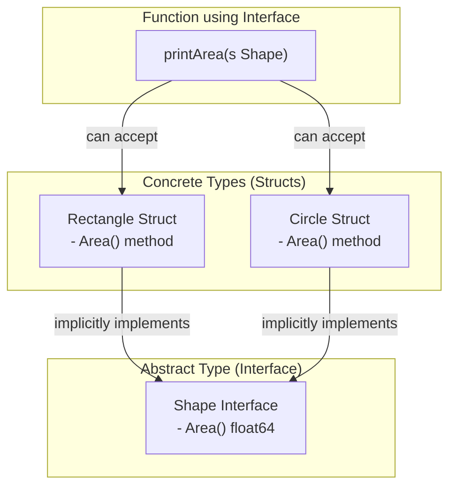
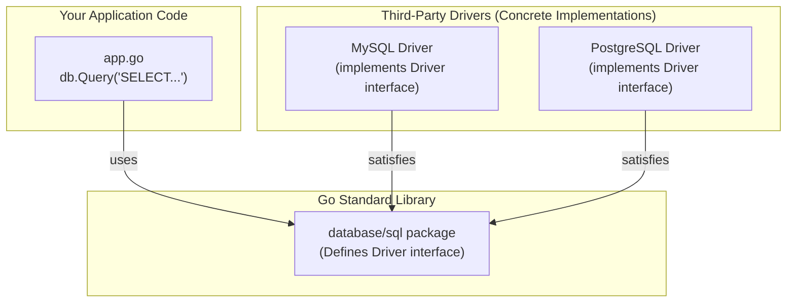

# အခန်း ၉: Interfaces

ယခုအခန်းတွင် Go ၏ အလွန်အရေးပါပြီး အစွမ်းထက်သော feature တစ်ခုဖြစ်သည့် `interface` အကြောင်းကို လေ့လာသွားပါမည်။ Interface သည် code များကို ပိုမို flexible, reusable, နှင့် decoupled ဖြစ်စေရန်အတွက် အဓိကကျသော concept တစ်ခုဖြစ်သည်။

---

## Interface ဆိုတာဘာလဲ။

Go တွင် Interface ဆိုသည်မှာ method signatures (method အမည်၊ parameters, return types) များ၏ စုစည်းမှုတစ်ခုကို သတ်မှတ်ထားသော abstract type တစ်ခုဖြစ်သည်။ Interface သည် "ဘာတွေလုပ်ဆောင်နိုင်ရမည်" (`what it can do`) ဆိုသည့် **behavior (အပြုအမူ)** ကိုသာ သတ်မှတ်ပြီး၊ "ဘယ်လိုလုပ်ဆောင်ရမည်" (`how it does it`) ဆိုသည့် implementation ကို မသတ်မှတ်ပါ။

Struct တစ်ခု သို့မဟုတ် အခြား type တစ်ခုက interface တွင် သတ်မှတ်ထားသော method များအားလုံးကို implement လုပ်ထားပါက၊ ထို type သည် ထို interface ကို "satisfy" လုပ်သည် (သို့မဟုတ် implement လုပ်သည်) ဟုခေါ်ဆိုနိုင်ပါသည်။ အခြား language များကဲ့သို့ `implements` keyword ကို တိတိကျကျ ရေးသားရန်မလိုဘဲ Go compiler က အလိုအလျောက် သိရှိပါသည်။

```go
package main

import (
    "fmt"
    "math"
)

// Shape interface သည် Area() 라는 method တစ်ခုရှိရမည်ဟု သတ်မှတ်သည်
type Shape interface {
    Area() float64
}

// Rectangle struct
type Rectangle struct {
    Width  float64
    Height float64
}

// Rectangle အတွက် Area() method ကို implement လုပ်ခြင်း
// ဤ method ရှိသောကြောင့် Rectangle သည် Shape interface ကို satisfy လုပ်သည်
func (r Rectangle) Area() float64 {
    return r.Width * r.Height
}

// Circle struct
type Circle struct {
    Radius float64
}

// Circle အတွက် Area() method ကို implement လုပ်ခြင်း
// ဤ method ရှိသောကြောင့် Circle သည် Shape interface ကို satisfy လုပ်သည်
func (c Circle) Area() float64 {
    return math.Pi * c.Radius * c.Radius
}

func main() {
    rect := Rectangle{Width: 10, Height: 5}
    circ := Circle{Radius: 7}

    // rect နှင့် circ တို့သည် Shape interface ကို implement လုပ်ထားသည်
    fmt.Printf("Rectangle Area: %f\n", rect.Area())
    fmt.Printf("Circle Area: %f\n", circ.Area())
}
```

---

## Polymorphism ကို Interfaces ဖြင့် အကောင်အထည်ဖော်ခြင်း

Interface ၏ အဓိကအသုံးဝင်မှုမှာ polymorphism ကို အကောင်အထည်ဖော်နိုင်ခြင်းဖြစ်သည်။ Polymorphism ဆိုသည်မှာ code တစ်ခုတည်းက မတူညီသော data types များစွာနှင့် အလုပ်လုပ်နိုင်စွမ်းရှိခြင်း ဖြစ်သည်။

Function တစ်ခု၏ parameter ကို interface type ဖြင့် သတ်မှတ်ထားပါက၊ ထို interface ကို satisfy လုပ်သော မည်သည့် concrete type (struct) ကိုမဆို ထို function သို့ pass လုပ်နိုင်ပါသည်။



အောက်ပါ code တွင် `printArea` function သည် `Shape` interface ကို parameter အဖြစ် လက်ခံသည်။ ထို့ကြောင့် `Rectangle` နှင့် `Circle` နှစ်မျိုးလုံးကို ၎င်းထံသို့ pass လုပ်နိုင်ပါသည်။

```go
// ... (အပေါ်မှ struct နှင့် method definitions များ ဆက်လက်ပါဝင်သည်)

// ဤ function သည် Shape interface ကို satisfy လုပ်သော မည်သည့် type ကိုမဆို လက်ခံနိုင်သည်
func printArea(s Shape) {
    fmt.Printf("The area of the shape is %f\n", s.Area())
}

func main() {
    rect := Rectangle{Width: 10, Height: 5}
    circ := Circle{Radius: 7}

    printArea(rect)
    printArea(circ)
}
```

---

## Empty Interface (`interface{}`)

Empty interface (`interface{}`) ဆိုသည်မှာ method တစ်ခုမှ မပါဝင်သော interface ဖြစ်သည်။ ၎င်းတွင် method မည်မျှမှ မသတ်မှတ်ထားသောကြောင့် Go ရှိ **မည်သည့် data type မဆို** empty interface ကို အလိုအလျောက် satisfy လုပ်ပါသည်။

၎င်းကို data type ကြိုတင်မသိနိုင်သော တန်ဖိုးများကို ကိုင်တွယ်ရန် အသုံးပြုသည်။ ဥပမာ၊ `int`, `string`, `bool`, `struct` စသည်ဖြင့် မည်သည့် type မဆို ဖြစ်နိုင်သည်။

### Type Assertion

Empty interface ထဲသို့ ထည့်လိုက်သော တန်ဖိုးသည် ၎င်း၏ မူလ type အချက်အလက် ပျောက်ဆုံးသွားသည်။ ထိုတန်ဖိုးကို ပြန်လည်အသုံးပြုရန်အတွက် ၎င်း၏ မူလ concrete type သို့ ပြန်လည်ပြောင်းလဲရန် လိုအပ်သည်။ ဤသို့ ပြောင်းလဲခြင်းကို **type assertion** ဟုခေါ်သည်။

Type assertion ကို `i.(T)` syntax ဖြင့် ပြုလုပ်သည်။ `i` သည် interface variable ဖြစ်ပြီး `T` သည် ပြောင်းလဲလိုသော type ဖြစ်သည်။

```go
package main

import "fmt"

func describe(i interface{}) {
    fmt.Printf("Value: %v, Type: %T\n", i, i)

    // Safe type assertion
    // `s` တွင် တန်ဖိုးကို ရရှိပြီး `ok` တွင် ပြောင်းလဲမှု အောင်မြင်/မအောင်မြင် (true/false) ကို ရရှိမည်
    s, ok := i.(string)
    if ok {
        fmt.Println("This is a string with length", len(s))
    }

    // `switch` ဖြင့် type assertion ပြုလုပ်ခြင်းက ပိုမိုရှင်းလင်းသည်
    switch v := i.(type) {
    case int:
        fmt.Println("This is an integer, and its value is", v)
    case string:
        fmt.Println("This is a string, and its value is", v)
    default:
        fmt.Println("Unknown type!")
    }
    fmt.Println("---")
}

func main() {
    describe(42)
    describe("hello")
    describe(true)
}
```

---

## Interface ၏ လက်တွေ့အသုံးဝင်ပုံ: Database Drivers

Interface ၏ အစွမ်းထက်ပုံကို အကောင်းဆုံးမြင်နိုင်သော လက်တွေ့ဥပမာမှာ Go ၏ standard `database/sql` package ဖြစ်သည်။

**ပြဿနာ:** ကျွန်ုပ်တို့၏ application သည် MySQL, PostgreSQL, SQLite ကဲ့သို့သော မတူညီသည့် database များစွာနှင့် ချိတ်ဆက်ရန် လိုအပ်နိုင်သည်။ Database တစ်ခုချင်းစီအတွက် code များကို သီးခြားစီ ရေးသားမည်ဆိုပါက code များ ထပ်တူညီပြီး ပြုပြင်ထိန်းသိမ်းရန် အလွန်ခက်ခဲသွားပါမည်။

**Interface ဖြင့် ဖြေရှင်းခြင်း:**
`database/sql` package သည် database နှင့် ဆက်သွယ်ရန်အတွက် `sql.Driver`, `sql.Conn` ကဲ့သို့သော interface များကို **သတ်မှတ်ပေးထားသည်**။ သို့သော် ၎င်းသည် MySQL သို့မဟုတ် PostgreSQL နှင့် မည်သို့ချိတ်ဆက်ရမည်ကို **implement မလုပ်ပါ**။

ထိုအစား၊ third-party driver developer များ (ဥပမာ- `go-sql-driver/mysql`) က ထို `sql.Driver` interface ကို သူတို့၏ database အတွက် implement လုပ်ထားသော concrete type များကို ရေးသားပေးပါသည်။

ကျွန်ုပ်တို့၏ application code သည် `database/sql` package ၏ functions (ဥပမာ- `sql.Open()`, `db.Query()`) များကိုသာ ခေါ်ယူသုံးစွဲပြီး၊ နောက်ကွယ်တွင် `database/sql` package က သက်ဆိုင်ရာ driver ၏ implementation ကို interface မှတစ်ဆင့် ခေါ်ယူသုံးစွဲပေးပါသည်။



**အကျိုးကျေးဇူး:** ကျွန်ုပ်တို့၏ application code သည် database အမျိုးအစားကို တိုက်ရိုက်သိရန်မလိုဘဲ (database-agnostic)၊ `database/sql` interface ကိုသာ သိရန်လိုအပ်သည်။ ထို့ကြောင့် နောင်တွင် MySQL မှ PostgreSQL သို့ ပြောင်းလဲလိုပါက driver import နှင့် connection string ကိုသာ ပြောင်းလဲရန်လိုအပ်ပြီး application ၏ core logic (e.g., `db.Query(...)`) ကို လုံးဝပြောင်းလဲရန် မလိုအပ်တော့ပါ။

**ဥပမာ Code:**

```go
package main

import (
	"database/sql"
	"fmt"

	// Driver များကို ၎င်းတို့၏ side effect (registering) အတွက် import လုပ်သည်
	// `_` ကို အသုံးပြုခြင်းမှာ driver variable များကို တိုက်ရိုက်အသုံးမပြုသောကြောင့်ဖြစ်သည်
	_ "github.com/go-sql-driver/mysql"
	_ "github.com/lib/pq"
)

// getUsers function သည် database-agnostic ဖြစ်သည်
// ၎င်းသည် *sql.DB ကိုသာ သိပြီး MySQL လား PostgreSQL လား မသိပါ
func getUsers(db *sql.DB) {
	rows, err := db.Query("SELECT id, name FROM users LIMIT 2")
	if err != nil {
		panic(err)
	}
	defer rows.Close()
	fmt.Println("Successfully queried users.")
}

func main() {
	// ဤသည်မှာ conceptual example ဖြစ်သည်
	// MySQL database နှင့် ချိတ်ဆက်ခြင်း
	mysqlDB, err := sql.Open("mysql", "user:password@tcp(127.0.0.1:3306)/hello")
	if err == nil {
		getUsers(mysqlDB)
		mysqlDB.Close()
	}

	// PostgreSQL database နှင့် ချိတ်ဆက်ခြင်း
	postgresDB, err := sql.Open("postgres", "user=pqgotest dbname=pqgotest sslmode=disable")
	if err == nil {
		getUsers(postgresDB) // တူညီသော function ကို ပြန်လည်အသုံးပြုနိုင်သည်
		postgresDB.Close()
	}
}
```