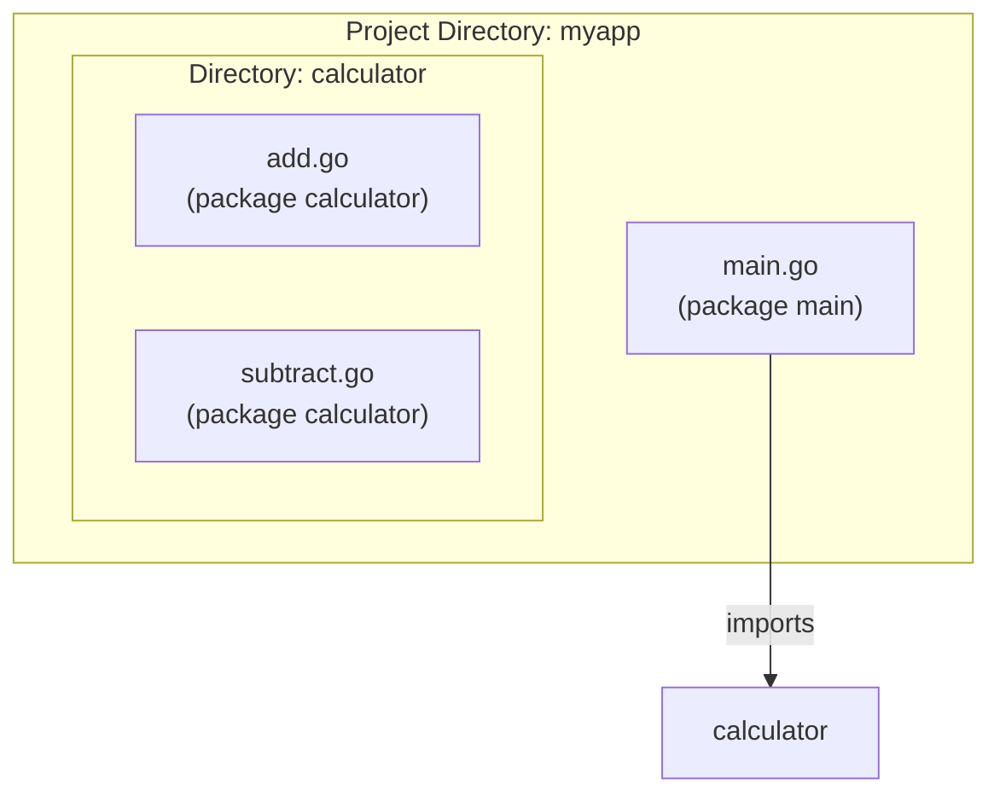

# အခန်း ၁၀: Packages နှင့် Modules

ယခုအခန်းတွင် Go project များကို စနစ်တကျ တည်ဆောက်ရန်နှင့် code များကို ပြန်လည်အသုံးပြုရန်အတွက် အခြေခံကျသော Packages နှင့် Modules များအကြောင်းကို လေ့လာသွားပါမည်။

---

## Package ဆိုတာဘာလဲ။

Go တွင် **Package** ဆိုသည်မှာ code များကို စုစည်းရန်နှင့် organize လုပ်ရန်အတွက် အသုံးပြုသော mechanism တစ်ခုဖြစ်သည်။ ရိုးရှင်းစွာဆိုရလျှင်၊ directory တစ်ခုအတွင်းရှိ Go source file များအားလုံးသည် package တစ်ခုတည်းကို ဖွဲ့စည်းထားသည်။

*   Directory တစ်ခုတည်းရှိ file အားလုံးသည် package name တူညီရမည်။
*   Package name ကို source file တိုင်း၏ ထိပ်ဆုံးတွင် `package <name>` ဟု ကြေညာရသည်။
*   Executable program များအတွက် package name သည် `main` ဖြစ်ရမည်။ အခြား library package များအတွက် directory name နှင့် တူညီသော package name ကို အသုံးပြုလေ့ရှိသည်။



---

## Standard Library မှ Packages များကို `import` လုပ်ခြင်း

Go တွင် အသုံးဝင်သော functions နှင့် types များစွာပါဝင်သည့် standard library တစ်ခု ပါရှိသည်။ ဤ packages များကို အသုံးပြုရန် `import` keyword ကို အသုံးပြုရသည်။

```go
package main

// Multiple packages များကို import လုပ်ခြင်း
import (
    "fmt"
    "math"
    "strings"
)

func main() {
    fmt.Println("Pi is roughly", math.Pi)
    fmt.Println(strings.ToUpper("hello world"))
}
```

### Import Aliases နှင့် Blank Imports

*   **Alias:** Package name တူညီနေပါက သို့မဟုတ် ပိုတိုသော নামဖြင့် ခေါ်လိုပါက alias သတ်မှတ်နိုင်သည်။
    ```go
    import f "fmt" // "fmt" အစား "f" ဖြင့် ခေါ်နိုင်သည်
    ```
*   **Blank Identifier (`_`):** Package ကို တိုက်ရိုက်အသုံးမပြုသော်လည်း ၎င်း၏ side-effects (ဥပမာ- `init` function ကို run စေခြင်း) အတွက်သာ import လုပ်လိုပါက blank identifier `_` ကို အသုံးပြုသည်။ Database drivers များကို import လုပ်ရာတွင် ဤပုံစံကို တွေ့ရလေ့ရှိသည်။
    ```go
    import _ "github.com/go-sql-driver/mysql"
    ```

---

## ကိုယ်ပိုင် Package များ တည်ဆောက်ခြင်း

Project ကြီးမားလာသည်နှင့်အမျှ code များကို သက်ဆိုင်ရာ package များအဖြစ် ခွဲထုတ်ရန် လိုအပ်လာသည်။

### Exported vs. Unexported Names

Go တွင် package တစ်ခုမှ အခြား package တစ်ခုက ခေါ်ယူသုံးစွဲနိုင်ရန်အတွက် ထိုအရာ (variable, function, struct, etc.) ၏ အမည်ကို **စာလုံးအကြီး (uppercase letter)** ဖြင့် စတင်ရမည်။ ၎င်းကို "exported" ဟုခေါ်သည်။

အမည်ကို **စာလုံးအသေး (lowercase letter)** ဖြင့် စတင်ပါက ၎င်းကို package အတွင်းမှာသာ အသုံးပြုနိုင်ပြီး အခြား package များမှ ခေါ်ယူသုံးစွဲနိုင်မည် မဟုတ်ပါ။ ၎င်းကို "unexported" ဟုခေါ်သည်။

### ဥပမာ: `calculator` package တည်ဆောက်ခြင်း

**Project File Structure:**

```
myproject/
├── go.mod
├── main.go
└── calculator/
    └── calc.go
```

**1. `calculator/calc.go` (Library Package)**

```go
package calculator

// 'Add' function သည် စာလုံးအကြီးဖြင့် စသောကြောင့် exported ဖြစ်သည်
func Add(a, b int) int {
    return a + b
}

// 'secretValue' သည် စာလုံးအသေးဖြင့် စသောကြောင့် unexported ဖြစ်သည်
var secretValue = 123
```

**2. `main.go` (Executable Package)**

```go
package main

import (
    "fmt"
    "myproject/calculator" // ကိုယ်ပိုင် package ကို import လုပ်ခြင်း
)

func main() {
    sum := calculator.Add(10, 5)
    fmt.Println("The sum is:", sum)

    // အောက်ပါ code line သည် compile error ဖြစ်စေပါမည်
    // কারণ 'secretValue' သည် unexported ဖြစ်သောကြောင့် main package မှ ခေါ်ယူသုံးစွဲ၍မရပါ
    // fmt.Println(calculator.secretValue)
}
```

---

## Go Modules ကို အသုံးပြု၍ Dependencies များကို စီမံခန့်ခွဲခြင်း

**Go Modules** သည် Go project များ၏ dependencies (အခြား packages များအပေါ် မှီခိုမှု) များကို စီမံခန့်ခွဲသည့် စနစ်ဖြစ်သည်။ Project တစ်ခုကို module အဖြစ် သတ်မှတ်လိုက်သည်နှင့် Go က လိုအပ်သော packages များကို download လုပ်ခြင်း၊ version များကို မှတ်သားခြင်းတို့ကို အလိုအလျောက် ပြုလုပ်ပေးသည်။

### အဓိက Commands များ

*   **`go mod init <module-path>`**
    *   Project directory တွင် module အသစ်တစ်ခု စတင်ရန် အသုံးပြုသည်။ `module-path` သည် များသောအားဖြင့် GitHub repository path (e.g., `github.com/your-user/myproject`) ဖြစ်သည်။
    *   ဤ command သည် `go.mod` file ကို ဖန်တီးပေးသည်။

    ```sh
    # ဥပမာ
    go mod init github.com/aung/myproject
    ```

*   **`go get <package-path>`**
    *   Third-party package အသစ်တစ်ခုကို download လုပ်ပြီး dependency အဖြစ် `go.mod` file ထဲသို့ ထည့်သွင်းရန် အသုံးပြုသည်။

    ```sh
    # ဥပမာ: gorilla/mux router ကို download လုပ်ခြင်း
    go get github.com/gorilla/mux
    ```

*   **`go mod tidy`**
    *   Source code ထဲရှိ `import` statements များကို စစ်ဆေးပြီး `go.mod` file ကို update လုပ်ပေးသည်။ အသုံးမပြုတော့သော dependencies များကို ဖယ်ရှားပြီး၊ လိုအပ်နေသော dependencies များကို ထည့်သွင်းပေးသည်။

### `go.mod` နှင့် `go.sum` Files

*   **`go.mod` file:**
    *   Module ၏ path ကို သတ်မှတ်သည်။
    *   Project က အသုံးပြုနေသော Go version ကို သတ်မှတ်သည်။
    *   Project ၏ direct နှင့် indirect dependencies အားလုံးနှင့် ၎င်းတို့၏ version များကို စာရင်းပြုစုထားသည်။

    ```
    module github.com/aung/myproject

    go 1.18

    require (
        github.com/gorilla/mux v1.8.0
        github.com/lib/pq v1.10.7
    )
    ```
*   **`go.sum` file:**
    *   Dependency တိုင်း၏ cryptographic checksum (hash) ကို မှတ်သားထားသည်။
    *   `go build` လုပ်သည့်အခါ download လုပ်လာသော package သည် မူလ package အစစ်အမှန်ဖြစ်ကြောင်းနှင့် ကြားဖြတ်ပြောင်းလဲထားခြင်းမရှိကြောင်း ဤ file ဖြင့် တိုက်ဆိုင်စစ်ဆေးသည်။ ၎င်းသည် supply chain attacks များမှ ကာကွယ်ပေးသည်။
