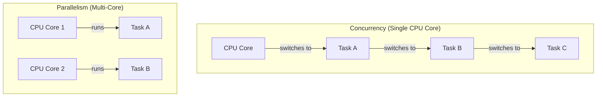
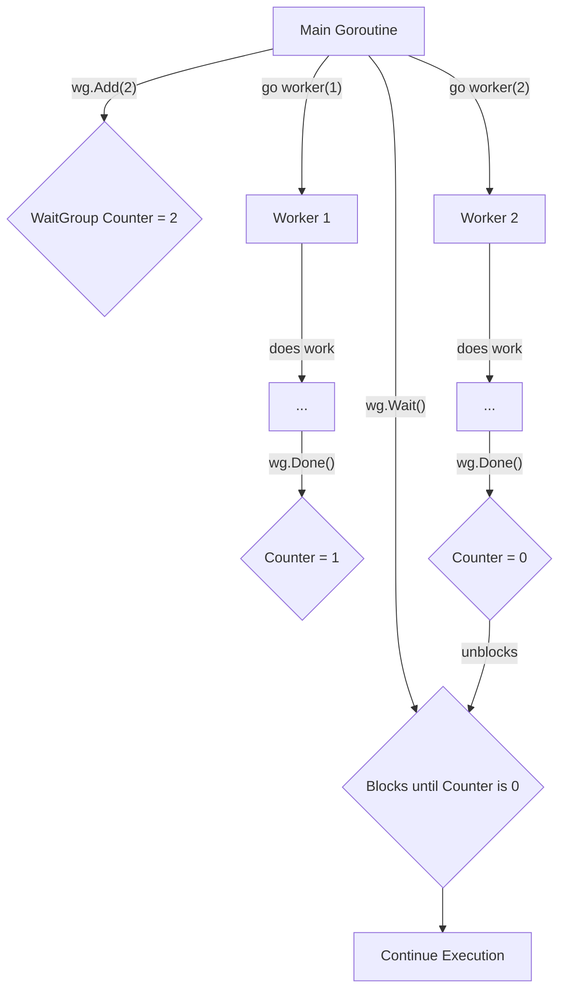

# အခန်း ၁၂: Goroutines

ယခုအခန်းတွင် Go ၏ အကျော်ကြားဆုံးနှင့် အစွမ်းထက်ဆုံး feature ဖြစ်သော concurrency ကို စတင်လေ့လာပါမည်။ Go သည် Goroutines ဟုခေါ်သော အလွန်ပေါ့ပါးသည့် execution unit များကို အသုံးပြု၍ concurrent programming ကို အလွန်လွယ်ကူအောင် ပြုလုပ်ပေးထားသည်။

---

## Concurrency နှင့် Parallelism ကွာခြားချက်

Concurrency နှင့် Parallelism သည် ဆင်တူသယောင်ရှိသော်လည်း အဓိပ္ပာယ် မတူညီပါ။

*   **Concurrency (တစ်ပြိုင်နက်တည်း စီမံခန့်ခွဲခြင်း):** လုပ်ငန်းတာဝန် (tasks) များစွာကို တစ်ချိန်တည်းတွင် စီမံခန့်ခွဲနိုင်စွမ်းရှိခြင်း ဖြစ်သည်။ Task တစ်ခုကို လုပ်ဆောင်နေစဉ် ခေတ္တရပ်နားပြီး အခြား task တစ်ခုကို ပြောင်းလဲလုပ်ဆောင်နိုင်သည်။ ၎င်းသည် **လုပ်ငန်းများကို စီမံခန့်ခွဲသည့် ပုံစံ (structure)** ဖြစ်ပြီး တစ်ပြိုင်နက်တည်း အမှန်တကယ် run နေရန် မလိုအပ်ပါ။

*   **Parallelism (တစ်ပြိုင်နက်တည်း လုပ်ဆောင်ခြင်း):** လုပ်ငန်းတာဝန်များစွာကို တစ်ချိန်တည်းတွင် အမှန်တကယ် **တစ်ပြိုင်နက်တည်း လုပ်ဆောင်ခြင်း** ဖြစ်သည်။ ၎င်းကို multi-core processor များပေါ်တွင်သာ လုပ်ဆောင်နိုင်ပြီး core တစ်ခုချင်းစီက task တစ်ခုစီကို တစ်ချိန်တည်းမှာပင် လုပ်ဆောင်ပါသည်။



Go သည် concurrency ကို အဓိကထား ဒီဇိုင်းထုတ်ထားပြီး၊ multi-core processor များရှိပါက Go runtime က goroutines များကို cores များပေါ်တွင် parallel အဖြစ် အလိုအလျောက် run ပေးပါသည်။

---

## Goroutine ဆိုတာဘာလဲ။ (`go` keyword)

**Goroutine** ဆိုသည်မှာ Go runtime မှ စီမံခန့်ခွဲသော အလွန်ပေါ့ပါးသည့် thread (lightweight thread) တစ်ခုဖြစ်သည်။ OS thread များနှင့် နှိုင်းယှဉ်ပါက memory အသုံးပြုမှု အလွန်နည်းပါးပြီး (kilobytes အနည်းငယ်သာ)၊ ဖန်တီးရန်နှင့် ဖျက်သိမ်းရန် အလွန်မြန်ဆန်သည်။ ထို့ကြောင့် goroutines ထောင်ပေါင်းများစွာ၊ သိန်းပေါင်းများစွာကို တစ်ပြိုင်နက်တည်း run နိုင်ပါသည်။

Function call တစ်ခု၏ ရှေ့တွင် `go` keyword ကို ထည့်သွင်းလိုက်ရုံဖြင့် goroutine အသစ်တစ်ခုကို အလွယ်တကူ ဖန်တီးနိုင်ပါသည်။

```go
package main

import (
    "fmt"
    "time"
)

func say(s string) {
    for i := 0; i < 3; i++ {
        fmt.Println(s)
        time.Sleep(100 * time.Millisecond)
    }
}

func main() {
    // 'say' function ကို goroutine အသစ်တစ်ခုအနေဖြင့် run မည်
    go say("World")

    // main function (main goroutine) က ဆက်လက် run နေမည်
    say("Hello")
}
```

**ပြဿနာ:** အထက်ပါ code ကို run ကြည့်ပါက "Hello" ကိုသာ print ထုတ်ပြီး "World" ကို print ထုတ်သည်ကို မြင်ရချင်မှ မြင်ရမည်။ အကြောင်းမှာ `main` function (main goroutine) သည် `say("World")` goroutine ပြီးဆုံးသည်ကို **မစောင့်ဘဲ** ၎င်း၏အလုပ် ပြီးဆုံးသွားသည်နှင့် program တစ်ခုလုံးကို ရပ်တန့်လိုက်သောကြောင့် ဖြစ်သည်။

---

## `sync.WaitGroup` ကို အသုံးပြုခြင်း

Goroutines များအားလုံး ပြီးဆုံးသည်အထိ main goroutine ကို စောင့်ဆိုင်းစေရန်အတွက် `sync` package မှ `WaitGroup` ကို အသုံးပြုနိုင်ပါသည်။ `WaitGroup` သည် goroutines အစုအဝေးတစ်ခု ပြီးဆုံးသည်အထိ စောင့်ဆိုင်းရန်အတွက် counter တစ်ခုကို အသုံးပြုသည်။

`WaitGroup` တွင် အဓိက method ၃ ခုရှိသည်:

1.  **`Add(delta int)`:** Counter ကို `delta` တန်ဖိုး만큼 တိုးရန်။ စတင်မည့် goroutine အရေအတွက်ကို သတ်မှတ်ရန် အသုံးပြုသည်။
2.  **`Done()`:** Counter ကို ၁ လျှော့ရန်။ Goroutine တစ်ခု ပြီးဆုံးသည့်အခါ ခေါ်ယူရသည်။
3.  **`Wait()`:** Counter ၏ တန်ဖိုး 0 ဖြစ်သွားသည်အထိ (goroutines အားလုံး `Done()` ခေါ်ပြီးသည်အထိ) program ၏ execution ကို block လုပ်ထားရန် (စောင့်ဆိုင်းရန်)။



**`WaitGroup` ဖြင့် ပြင်ဆင်ထားသော ဥပမာ:**

```go
package main

import (
    "fmt"
    "sync"
    "time"
)

func worker(id int, wg *sync.WaitGroup) {
    // Goroutine ပြီးဆုံးသည့်အခါ WaitGroup counter ကို လျှော့ရန် defer ဖြင့် ကြိုတင်သတ်မှတ်ထားသည်
    defer wg.Done()

    fmt.Printf("Worker %d starting\n", id)

    // အလုပ်လုပ်နေသည်ကို ပုံဖော်ရန် sleep လုပ်ခြင်း
    time.Sleep(time.Second)
    fmt.Printf("Worker %d done\n", id)
}

func main() {
    // WaitGroup variable တစ်ခု တည်ဆောက်ခြင်း
    var wg sync.WaitGroup

    // Worker goroutines ၃ ခုကို run မည်
    for i := 1; i <= 3; i++ {
        // WaitGroup counter ကို ၁ တိုးသည်
        wg.Add(1)

        // worker function ကို goroutine အဖြစ် run ပြီး WaitGroup pointer ကို pass လုပ်သည်
        go worker(i, &wg)
    }

    // Goroutines အားလုံး ပြီးဆုံးသည်အထိ ဤနေရာတွင် စောင့်ဆိုင်းနေမည်
    wg.Wait()

    fmt.Println("All workers have finished.")
}
```

ဤ code တွင် `main` function သည် `wg.Wait()` နေရာတွင် worker goroutines ၃ ခုလုံး `wg.Done()` ကို ခေါ်ပြီးသည်အထိ စောင့်ဆိုင်းနေမည်ဖြစ်သောကြောင့် worker များအားလုံး၏ output များကို စနစ်တကျ မြင်တွေ့ရမည်ဖြစ်သည်။