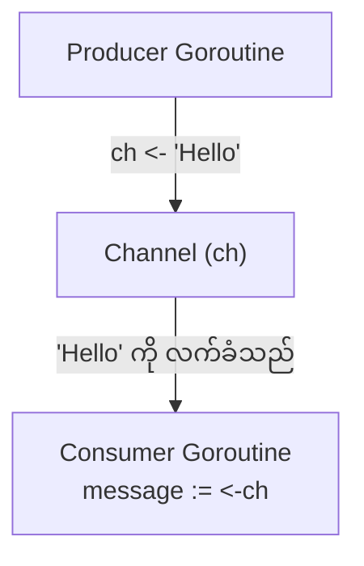
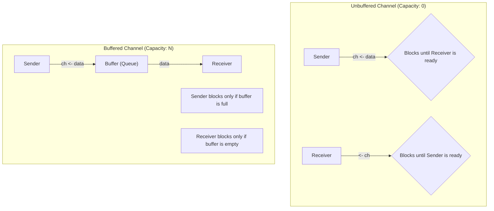

# အခန်း ၁၂: Channels

ယခင်အခန်းတွင် goroutines များကို အသုံးပြု၍ concurrent tasks များ မည်သို့ run ရမည်ကို လေ့လာခဲ့ပြီးဖြစ်သည်။ ယခုအခန်းတွင် ထို goroutines များ အချင်းချင်း ဘေးကင်းလုံခြုံစွာ ဆက်သွယ်ရန်နှင့် data များ အပြန်အလှန် ပေးပို့ရန်အတွက် Go ၏ အဓိကကျသော feature ဖြစ်သည့် **Channels** အကြောင်းကို လေ့လာသွားပါမည်။

---

## Channel ဆိုတာဘာလဲ။ (Goroutines များကြား ဆက်သွယ်ရေး)

**Channel** ဆိုသည်မှာ goroutines များ အချင်းချင်း data များ ပေးပို့ခြင်း (send) နှင့် လက်ခံခြင်း (receive) ပြုလုပ်နိုင်ရန်အတွက် တည်ဆောက်ထားသော ပိုက်လိုင်း (pipeline) သို့မဟုတ် conduit တစ်ခုဖြစ်သည်။ Channel တိုင်းတွင် သီးခြား data type တစ်ခု သတ်မှတ်ထားပြီး၊ ထို type နှင့် ကိုက်ညီသော data များကိုသာ ပေးပို့ လက်ခံနိုင်ပါသည်။

Go ၏ ဆောင်ပုဒ်မှာ **"Don't communicate by sharing memory; share memory by communicating."** ဖြစ်သည်။ ၎င်းမှာ memory ကို goroutines များစွာက တိုက်ရိုက် access လုပ်ခြင်းထက်၊ channel မှတစ်ဆင့် data များကို ပေးပို့ခြင်းဖြင့် ဆက်သွယ်ခြင်းက ပိုမိုဘေးကင်းပြီး ရိုးရှင်းသည်ဟု ဆိုလိုခြင်းဖြစ်သည်။

### Channel ဖန်တီးခြင်း နှင့် အသုံးပြုခြင်း

Channel ကို `make()` function ဖြင့် ဖန်တီးသည်။ `<-` operator ကို data ပေးပို့ရန်နှင့် လက်ခံရန် အသုံးပြုသည်။

*   `ch <- value`  // `value` ကို channel `ch` ထဲသို့ ပို့သည်
*   `result := <-ch` // channel `ch` မှ data ကို လက်ခံပြီး `result` ထဲသို့ ထည့်သည်



**ဥပမာ:**

```go
package main

import (
    "fmt"
    "time"
)

func producer(ch chan string) {
    fmt.Println("Producer: Sending a message...")
    time.Sleep(2 * time.Second)
    ch <- "Hello from Producer!"
}

func main() {
    // string type data များ သယ်ဆောင်မည့် channel တစ်ခု ဖန်တီးခြင်း
    messages := make(chan string)

    // producer function ကို goroutine အဖြစ် run ခြင်း
    go producer(messages)

    fmt.Println("Main: Waiting for a message...")
    // channel မှ message ရောက်လာသည်အထိ ဤနေရာတွင် block ဖြစ်နေမည် (စောင့်နေမည်)
    msg := <-messages

    fmt.Println("Main: Received message:", msg)
}
```

---

## Buffered vs. Unbuffered Channels

Channels များကို unbuffered နှင့် buffered ဟူ၍ နှစ်မျိုးခွဲခြားနိုင်သည်။

### Unbuffered Channels

`make(chan T)` ဖြင့် capacity မသတ်မှတ်ဘဲ ဖန်တီးသော channel များသည် unbuffered ဖြစ်သည်။

*   **Send Operation:** Sender goroutine သည် channel ထဲသို့ data ပို့သည့်အခါ receiver goroutine က ထို data ကို လက်ခံရန် အသင့်မဖြစ်သေးပါက sender သည် **block** ဖြစ်နေမည် (ရပ်တန့်စောင့်ဆိုင်းနေမည်)။
*   **Receive Operation:** Receiver goroutine သည် channel မှ data လက်ခံရန် ကြိုးစားသည့်အခါ channel ထဲတွင် data မရှိသေးပါက receiver သည် **block** ဖြစ်နေမည်။

Unbuffered channel သည် sender နှင့် receiver ကြားတွင် synchronization (တစ်ပြိုင်တည်း အချိတ်အဆက်မိခြင်း) ကို အာမခံပေးသည်။

### Buffered Channels

`make(chan T, capacity)` ဖြင့် capacity သတ်မှတ်ပြီး ဖန်တီးသော channel များသည် buffered ဖြစ်သည်။

*   **Send Operation:** Channel ၏ buffer မပြည့်မချင်း sender သည် data ပို့ပြီးနောက် block မဖြစ်ဘဲ ဆက်လက်အလုပ်လုပ်နိုင်သည်။ Buffer ပြည့်သွားမှသာ နောက်ထပ် data ပို့သည့်အခါ block ဖြစ်မည်။
*   **Receive Operation:** Channel ၏ buffer ထဲတွင် data ရှိနေသမျှ receiver သည် block မဖြစ်ဘဲ data ကို လက်ခံနိုင်သည်။ Buffer empty ဖြစ်သွားမှသာ နောက်ထပ် data လက်ခံရန် ကြိုးစားသည့်အခါ block ဖြစ်မည်။



**Buffered Channel ဥပမာ:**

```go
package main

import "fmt"

func main() {
    // capacity 2 ရှိသော buffered channel တစ်ခု ဖန်တီးခြင်း
    ch := make(chan int, 2)

    // buffer မပြည့်သေးသောကြောင့် block မဖြစ်ပါ
    ch <- 1
    ch <- 2

    // အောက်ပါ line ကို uncomment လုပ်ပါက buffer ပြည့်နေသောကြောင့် deadlock ဖြစ်ပြီး panic ဖြစ်မည်
    // ch <- 3 

    fmt.Println(<-ch)
    fmt.Println(<-ch)
}
```

---

## `select` Statement ဖြင့် Channels များကို ကိုင်တွယ်ခြင်း

`select` statement သည် goroutine တစ်ခုကို multiple channel operations များပေါ်တွင် တစ်ပြိုင်နက်တည်း စောင့်ဆိုင်းစေနိုင်သည်။ ၎င်းသည် `switch` statement နှင့် ဆင်တူသော်လည်း channels များအတွက်သာ ဖြစ်သည်။

*   `select` သည် ၎င်း၏ `case` များထဲမှ channel တစ်ခုခု ready ဖြစ်လာသည်အထိ (send/receive လုပ်နိုင်သည်အထိ) block ဖြစ်နေမည်။
*   Channel များစွာ တစ်ပြိုင်နက်တည်း ready ဖြစ်နေပါက `select` က တစ်ခုကို ကျပန်း (randomly) ရွေးချယ်မည်။
*   `default` case ကို ထည့်သွင်းထားပါက မည်သည့် channel မှ ready မဖြစ်သည့်အခါ `default` case ကို ချက်ချင်း run ပြီး `select` သည် block မဖြစ်တော့ပါ။

```go
package main

import (
    "fmt"
    "time"
)

func main() {
    c1 := make(chan string)
    c2 := make(chan string)

    go func() {
        time.Sleep(1 * time.Second)
        c1 <- "one"
    }()
    go func() {
        time.Sleep(2 * time.Second)
        c2 <- "two"
    }()

    // c1 နှင့် c2 မှ data များ ရောက်လာသည်ကို စောင့်ဆိုင်းရန် select ကို အသုံးပြုသည်
    // loop 2 ကြိမ် ပတ်ခြင်းဖြင့် channel နှစ်ခုလုံးမှ data ကို လက်ခံမည်
    for i := 0; i < 2; i++ {
        select {
        case msg1 := <-c1:
            fmt.Println("received", msg1)
        case msg2 := <-c2:
            fmt.Println("received", msg2)
        }
    }
}
```

### Timeout အတွက် `select` ကို အသုံးပြုခြင်း

`select` ကို `time.After` channel နှင့် တွဲဖက်အသုံးပြု၍ channel operation တစ်ခုအတွက် timeout သတ်မှတ်နိုင်သည်။

```go
package main

import (
    "fmt"
    "time"
)

func main() {
    ch := make(chan string)

    go func() {
        time.Sleep(2 * time.Second)
        ch <- "result"
    }()

    select {
    case res := <-ch:
        fmt.Println(res)
    case <-time.After(1 * time.Second):
        fmt.Println("timeout: operation took too long")
    }
}
```