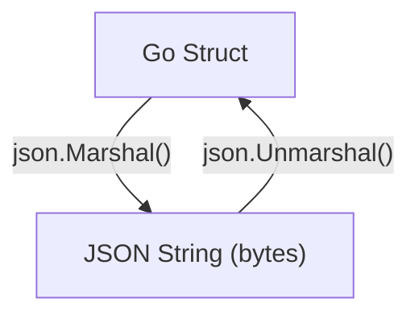
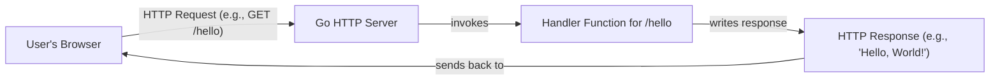

# အခန်း ၁၄: အသုံးများသော Standard Library Packages

Go ၏ အကြီးမားဆုံး အားသာချက်တစ်ခုမှာ အလွန်စွမ်းဆောင်ရည်မြင့်မားပြီး ကျယ်ပြန့်သော standard library ပါဝင်ခြင်းဖြစ်သည်။ ယခုအခန်းတွင် နေ့စဉ် programming ပြုလုပ်ရာတွင် အသုံးအများဆုံးဖြစ်သော standard library packages အချို့၏ အခြေခံအသုံးပြုပုံကို လေ့လာသွားပါမည်။

---

## `fmt` (Formatted I/O)

`fmt` package သည် console သို့ data များ print ထုတ်ခြင်း (output) နှင့် user ထံမှ data များ ဖတ်ရှုခြင်း (input) ကဲ့သို့သော formatted I/O (Input/Output) လုပ်ဆောင်ချက်များကို ကိုင်တွယ်သည်။

*   `fmt.Println()`: Arguments များကို space ခြား၍ print ထုတ်ပြီးနောက် new line တစ်ကြောင်းဆင်းပေးသည်။
*   `fmt.Printf()`: Format specifiers (`%s`, `%d`, `%v` etc.) များကို အသုံးပြု၍ string ကို format လုပ်ပြီး print ထုတ်သည်။
*   `fmt.Sprintf()`: `Printf` ကဲ့သို့ပင်ဖြစ်သော်လည်း console တွင် print မထုတ်ဘဲ formatted string ကို return ပြန်ပေးသည်။

```go
package main

import "fmt"

func main() {
    name := "Go"
    version := 1.18

    fmt.Println("Language:", name, "Version:", version)

    // %s for string, %f for float
    fmt.Printf("Language: %s, Version: %.2f\n", name, version)

    // %v for any value (default format)
    fmt.Printf("Value: %v, Type: %T\n", version, version)
}
```

---

## `os` (Operating System Interactions)

`os` package သည် operating system နှင့် တိုက်ရိုက်ဆက်နွယ်သော လုပ်ဆောင်ချက်များ (e.g., files, command-line arguments) ကို ကိုင်တွယ်ရန် platform-independent interface တစ်ခုကို ပေးသည်။

*   `os.Args`: Program ကို run သည့်အခါ ပေးလိုက်သော command-line arguments များကို string slice (`[]string`) အဖြစ် ရရှိသည်။ `os.Args[0]` သည် program ၏ အမည်ဖြစ်သည်။
*   `os.ReadFile(name string)`: File တစ်ခုလုံးကို ဖတ်ပြီး byte slice (`[]byte`) အဖြစ် return ပြန်ပေးသည်။
*   `os.WriteFile(name string, data []byte, perm fs.FileMode)`: `data` ကို file ထဲသို့ ရေးသားသည်။

```go
package main

import (
    "fmt"
    "os"
)

func main() {
    // File ထဲသို့ ရေးသားခြင်း
    data := []byte("Hello from Go standard library!")
    err := os.WriteFile("test.txt", data, 0644)
    if err != nil {
        panic(err)
    }
    fmt.Println("Successfully wrote to test.txt")

    // File မှ ဖတ်ရှုခြင်း
    readData, err := os.ReadFile("test.txt")
    if err != nil {
        panic(err)
    }
    fmt.Println("Read from test.txt:", string(readData))
}
```

---

## `strings` and `strconv`

*   **`strings` package:** String များကို ကိုင်တွယ်ရန် အသုံးဝင်သော functions များစွာ ပါဝင်သည်။
*   **`strconv` package:** String နှင့် အခြား data types (e.g., `int`, `bool`) များအကြား အပြန်အလှန် ပြောင်းလဲရန် (conversion) အသုံးပြုသည်။

```go
package main

import (
    "fmt"
    "strconv"
    "strings"
)

func main() {
    // strings package
    s := "Hello, World, Go"
    fmt.Println("Contains 'World':", strings.Contains(s, "World"))
    fmt.Println("To Upper:", strings.ToUpper(s))
    fmt.Println("Split by ',':", strings.Split(s, ","))

    // strconv package
    numStr := "123"
    num, err := strconv.Atoi(numStr) // Atoi = ASCII to Integer
    if err != nil {
        fmt.Println("Error converting string to int:", err)
    } else {
        fmt.Println("Converted number:", num+1)
    }

    numToConvert := 456
    str := strconv.Itoa(numToConvert) // Itoa = Integer to ASCII
    fmt.Println("Converted string:", str)
}
```

---

## `encoding/json` (JSON Data ကိုင်တွယ်ခြင်း)

`encoding/json` package သည် Go data structures (structs, maps) နှင့် JSON data format အကြား အပြန်အလှန် ပြောင်းလဲရန် အသုံးပြုသည်။

*   **Marshalling:** Go struct ကို JSON string (byte slice) အဖြစ်သို့ ပြောင်းလဲခြင်း။
*   **Unmarshalling:** JSON string (byte slice) ကို Go struct အဖြစ်သို့ ပြောင်းလဲခြင်း။



**ဥပမာ:**

```go
package main

import (
    "encoding/json"
    "fmt"
)

// Struct field များကို JSON key များနှင့် mapping လုပ်ရန် struct tags များကို အသုံးပြုသည်
type User struct {
    ID       int    `json:"id"`
    Name     string `json:"name"`
    Email    string `json:"email"`
    Password string `json:"-"` // `json:"-"` tag သည် ဤ field ကို JSON တွင် မပါဝင်စေရန် ဖြစ်သည်
}

func main() {
    // --- Marshalling (Go struct to JSON) ---
    user := User{ID: 1, Name: "Aung Aung", Email: "aung@example.com", Password: "secret-password"}
    jsonData, err := json.MarshalIndent(user, "", "  ") // MarshalIndent for pretty-printing
    if err != nil {
        panic(err)
    }
    fmt.Println("Marshalled JSON:\n", string(jsonData))

    // --- Unmarshalling (JSON to Go struct) ---
    jsonString := `{"id": 2, "name": "Ma Ma", "email": "ma@example.com"}`
    var anotherUser User
    err = json.Unmarshal([]byte(jsonString), &anotherUser)
    if err != nil {
        panic(err)
    }
    fmt.Println("\nUnmarshalled User:", anotherUser)
    fmt.Println("Unmarshalled User's Name:", anotherUser.Name)
}
```

---

## `net/http` (Web Server တည်ဆောက်ခြင်း)

`net/http` package သည် production-ready HTTP client နှင့် server များကို အလွယ်တကူ တည်ဆောက်နိုင်ရန် လိုအပ်သော tools များအားလုံးကို ပေးသည်။



**ဥပမာ: Simple Web Server**

```go
package main

import (
    "fmt"
    "net/http"
)

// handler function သည် http.ResponseWriter နှင့် *http.Request ကို parameter အဖြစ် လက်ခံသည်
func helloHandler(w http.ResponseWriter, r *http.Request) {
    // ResponseWriter သို့ data ရေးသားခြင်းဖြင့် client သို့ response ပြန်ပေးသည်
    fmt.Fprintf(w, "Hello, you've requested: %s\n", r.URL.Path)
}

func main() {
    // URL path "/hello" အတွက် helloHandler function ကို register လုပ်သည်
    http.HandleFunc("/hello", helloHandler)

    fmt.Println("Starting server on port 8080...")
    // Port 8080 တွင် server ကို စတင် run ပြီး incoming requests များကို စောင့်ဆိုင်းသည်
    // ဤ function သည် error return ပြန်မှသာ ပြီးဆုံးမည် (e.g., port is already in use)
    err := http.ListenAndServe(":8080", nil)
    if err != nil {
        panic(err)
    }
}
```

ဤ program ကို run ပြီး web browser တွင် `http://localhost:8080/hello` သို့ သွားရောက်ကြည့်ရှုပါက "Hello, you've requested: /hello" ဟူသော စာသားကို မြင်တွေ့ရမည်ဖြစ်သည်။