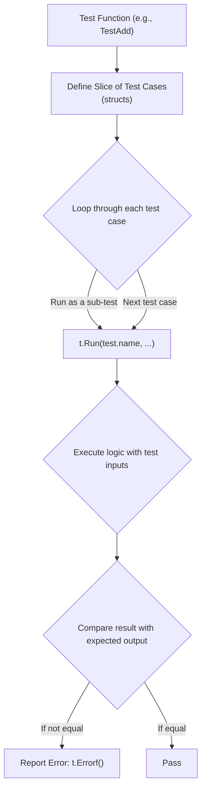

# အခန်း ၁၅: Testing in Go

Software development တွင် testing သည် code ၏ အရည်အသွေး၊ မှန်ကန်မှု၊ နှင့် ယုံကြည်စိတ်ချရမှုကို အာမခံရန်အတွက် မရှိမဖြစ်လိုအပ်သော အစိတ်အပိုင်းတစ်ခုဖြစ်သည်။ Go သည် `testing` package ကို standard library တွင် တပါတည်း ထည့်သွင်းပေးထားပြီး၊ unit tests နှင့် performance benchmark tests များကို ရိုးရှင်းလွယ်ကူစွာ ရေးသားနိုင်ရန် အားပေးသည်။

---

## `testing` package နှင့် Testing Conventions

Go တွင် test code များကို ရေးသားရန်အတွက် လိုက်နာရမည့် conventions အချို့ရှိသည်။

*   **File Naming:** Test code များပါဝင်သော file ၏ အမည်သည် `_test.go` ဖြင့် အဆုံးသတ်ရမည် (e.g., `calculator_test.go`)။
*   **Test Function Signature:** Test function တိုင်းသည် `Test` ဖြင့် စတင်ရမည်ဖြစ်ပြီး `*testing.T` type parameter တစ်ခုတည်းသာ လက်ခံရမည် (e.g., `func TestAdd(t *testing.T)`)။
*   **`*testing.T` Type:** ဤ type သည် test ၏ state ကို စီမံခန့်ခွဲရန်နှင့် test failure များကို report လုပ်ရန် `t.Errorf()`, `t.Fatalf()`, `t.Log()` ကဲ့သို့သော methods များကို ပေးသည်။
*   **Running Tests:** Terminal တွင် `go test` command ကို အသုံးပြု၍ package တစ်ခုအတွင်းရှိ test များအားလုံးကို run နိုင်ပါသည်။

---

## Unit Tests ရေးသားခြင်း

Unit test ဆိုသည်မှာ program ၏ အစိတ်အပိုင်းငယ်တစ်ခု (function သို့မဟုတ် method တစ်ခု) ကို သီးခြားစမ်းသပ်ခြင်းဖြစ်သည်။

**ဥပမာ:** `calculator` package ထဲတွင် `Add` function တစ်ခုရှိသည်ဆိုပါစို့။

**`calculator.go`**
```go
package calculator

func Add(a, b int) int {
    return a + b
}
```

**`calculator_test.go`**
```go
package calculator

import "testing"

func TestAdd(t *testing.T) {
    result := Add(2, 3)
    expected := 5

    if result != expected {
        // Test ကျရှုံးပါက error message ကို print ထုတ်ပြီး test ကို ဆက်လက် run နေမည်
        t.Errorf("Add(2, 3) = %d; want %d", result, expected)
    }
}
```

---

## Table-Driven Tests

Function တစ်ခုကို input အမျိုးမျိုးဖြင့် စမ်းသပ်လိုသည့်အခါ test case တစ်ခုချင်းစီအတွက် test function တစ်ခုစီ ရေးသားခြင်းထက်၊ **Table-driven test** ပုံစံကို အသုံးပြုခြင်းက ပိုမိုရှင်းလင်းပြီး ထိရောက်မှုရှိသည်။ ဤပုံစံတွင် test cases များကို slice of structs အဖြစ် ကြိုတင်သတ်မှတ်ပြီး loop ပတ်၍ တစ်ခုချင်း စမ်းသပ်သည်။



**ဥပမာ:**

```go
package calculator

import "testing"

func TestAddTableDriven(t *testing.T) {
    // Test cases များကို struct slice အဖြစ် သတ်မှတ်ခြင်း
    testCases := []struct {
        name     string // test case ၏ အမည်
        a, b     int    // inputs
        expected int    // expected output
    }{
        {"positive numbers", 2, 3, 5},
        {"negative numbers", -2, -3, -5},
        {"mixed numbers", -2, 3, 1},
        {"zero value", 0, 0, 0},
    }

    // Test case တစ်ခုချင်းစီကို loop ပတ်၍ run ခြင်း
    for _, tc := range testCases {
        // t.Run() ကို အသုံးပြု၍ sub-test တစ်ခုအဖြစ် run ခြင်းဖြင့် test output များကို ပိုမိုရှင်းလင်းစေသည်
        t.Run(tc.name, func(t *testing.T) {
            result := Add(tc.a, tc.b)
            if result != tc.expected {
                t.Errorf("Add(%d, %d) = %d; want %d", tc.a, tc.b, result, tc.expected)
            }
        })
    }
}
```

---

## Benchmarking

Benchmarking ဆိုသည်မှာ code ၏ performance (အထူးသဖြင့် speed) ကို တိုင်းတာခြင်းဖြစ်သည်။ Go တွင် benchmark tests များကို `testing` package ဖြင့် အလွယ်တကူ ရေးသားနိုင်သည်။

*   **Benchmark Function Signature:** Benchmark function တိုင်းသည် `Benchmark` ဖြင့် စတင်ရမည်ဖြစ်ပြီး `*testing.B` type parameter တစ်ခုတည်းသာ လက်ခံရမည် (e.g., `func BenchmarkAdd(b *testing.B)`)။
*   **`b.N`:** `testing.B` တွင် `N` ဟူသော field တစ်ခုပါဝင်သည်။ Benchmark function အတွင်းရှိ loop ကို `b.N` အကြိမ်အထိ run ရန်ဖြစ်သည်။ Go test runner သည် တည်ငြိမ်သော performance တိုင်းတာမှုတစ်ခုရရှိရန် `N` ၏တန်ဖိုးကို အလိုအလျောက် ချိန်ညှိပေးသည်။
*   **Running Benchmarks:** Benchmarks များကို run ရန် `go test -bench=.` command ကို အသုံးပြုရသည်။ (`.` သည် package အတွင်းရှိ benchmark အားလုံးကို run ရန် ညွှန်ပြသည်)။

**ဥပမာ:**

```go
package calculator

import "testing"

func BenchmarkAdd(b *testing.B) {
    // b.N သည် Go test runner မှ သတ်မှတ်ပေးသော loop အကြိမ်အရေအတွက်ဖြစ်သည်
    for i := 0; i < b.N; i++ {
        Add(100, 200)
    }
}
```

**Benchmark Result ဥပမာ:**

```sh
$ go test -bench=.
goos: darwin
goarch: amd64
pkg: myproject/calculator
cpu: Intel(R) Core(TM) i7-9750H CPU @ 2.60GHz
BenchmarkAdd-12         1000000000               0.2831 ns/op
PASS
ok      myproject/calculator    0.358s
```

*   `BenchmarkAdd-12`: Benchmark function အမည်နှင့် အသုံးပြုခဲ့သော CPU core အရေအတွက်။
*   `1000000000`: `b.N` ၏ တန်ဖိုး (loop ကို အကြိမ်ပေါင်း ဘီလီယံ ၁ ထောင် run ခဲ့သည်)။
*   `0.2831 ns/op`: Operation တစ်ခု (loop တစ်ခါပတ်ခြင်း) အတွက် ပျမ်းမျှကြာချိန် (nanoseconds)။