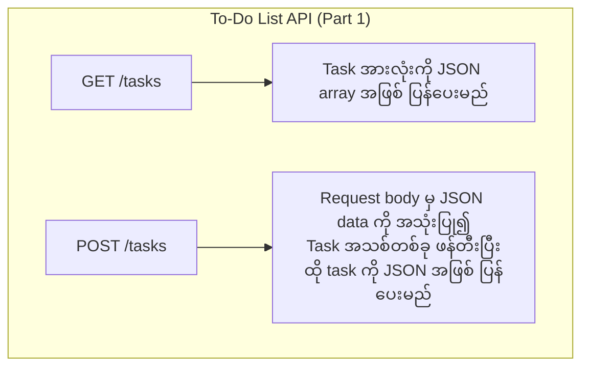

# အခန်း ၁၆: Project - Simple REST API တည်ဆောက်ခြင်း (အပိုင်း ၁)

ယခုအခန်းမှစ၍ ယခင်လေ့လာခဲ့သော Go ၏ concepts များကို ပေါင်းစပ်ပြီး လက်တွေ့ project တစ်ခုကို စတင်တည်ဆောက်ပါမည်။ ကျွန်ုပ်တို့ တည်ဆောက်မည့် project မှာ To-Do List တစ်ခုကို စီမံခန့်ခွဲနိုင်သော ရိုးရှင်းသည့် REST API တစ်ခုဖြစ်သည်။

ဤအပိုင်း (Part 1) တွင် project အတွက် planning ပြုလုပ်ခြင်း၊ data structure များ သတ်မှတ်ခြင်း၊ နှင့် standard `net/http` package ကို အသုံးပြု၍ အခြေခံ routing နှင့် handlers များ ရေးသားခြင်းတို့ကို လေ့လာသွားပါမည်။

---

## Project Planning

Project တစ်ခုကို မစတင်မီ ဘာတွေလုပ်ဆောင်မည်ကို ကြိုတင် plan လုပ်ခြင်းသည် အလွန်အရေးကြီးပါသည်။

**1. Project ၏ ရည်ရွယ်ချက်:**
*   To-Do tasks များကို စီမံခန့်ခွဲရန်အတွက် RESTful API တစ်ခု တည်ဆောက်ရန်။

**2. အဓိက Features (สำหรับ Part 1):**
*   Task အားလုံးကို list အဖြစ် ကြည့်ရှုနိုင်ခြင်း။
*   Task အသစ်တစ်ခု ဖန်တီးနိုင်ခြင်း။

**3. Data Structure:**
*   Task တစ်ခုကို ဖော်ပြရန်အတွက် `Task` struct ကို အောက်ပါအတိုင်း သတ်မှတ်ပါမည်။

```go
type Task struct {
    ID        int    `json:"id"`
    Title     string `json:"title"`
    Completed bool   `json:"completed"`
}
```

**4. API Endpoints:**
*   ကျွန်ုပ်တို့၏ API တွင် အောက်ပါ endpoints များ ပါဝင်မည်ဖြစ်သည်။



---

## HTTP Handlers များ ရေးသားခြင်း

HTTP Handler ဆိုသည်မှာ নির্দিষ্ট URL path သို့ ရောက်ရှိလာသော HTTP request များကို လက်ခံပြီး response ပြန်ပေးရန် တာဝန်ရှိသော function ဖြစ်သည်။

ဤ project ၏ ပထမပိုင်းတွင် data များကို database တွင် မသိမ်းဆည်းဘဲ၊ program run နေစဉ်အတွင်း memory ထဲတွင်သာ သိမ်းဆည်းထားရန် in-memory slice တစ်ခုကို အသုံးပြုပါမည်။

**`main.go` File ကို စတင်တည်ဆောက်ခြင်း:**

```go
package main

import (
	"encoding/json"
	"fmt"
	"log"
	"net/http"
	"sync"
)

// Task struct
type Task struct {
	ID        int    `json:"id"`
	Title     string `json:"title"`
	Completed bool   `json:"completed"`
}

// Data များကို memory တွင် သိမ်းဆည်းရန်
var (
	tasks  = make(map[int]Task) // Use a map for easier lookup/delete later
	nextID = 1
	mu     sync.Mutex // Mutex for thread-safe access to tasks and nextID
)

// tasksHandler သည် "/tasks" path သို့ ရောက်လာသော requests များကို ကိုင်တွယ်မည်
func tasksHandler(w http.ResponseWriter, r *http.Request) {
	switch r.Method {
	case http.MethodGet:
		getTasks(w, r)
	case http.MethodPost:
		createTask(w, r)
	default:
		// အခြား HTTP methods များကို ခွင့်မပြုပါ
		http.Error(w, "Method not allowed", http.StatusMethodNotAllowed)
	}
}

// GET /tasks - Task အားလုံးကို ပြန်ပေးသည်
func getTasks(w http.ResponseWriter, r *http.Request) {
	mu.Lock()
	defer mu.Unlock()

	// Map မှ value များကို slice အဖြစ် ပြောင်းလဲခြင်း
	var taskList []Task
	for _, task := range tasks {
		taskList = append(taskList, task)
	}

	w.Header().Set("Content-Type", "application/json")
	json.NewEncoder(w).Encode(taskList)
}

// POST /tasks - Task အသစ်တစ်ခု ဖန်တီးသည်
func createTask(w http.ResponseWriter, r *http.Request) {
	var newTask Task
	
	// Request body မှ JSON ကို decode လုပ်ခြင်း
	if err := json.NewDecoder(r.Body).Decode(&newTask); err != nil {
		http.Error(w, err.Error(), http.StatusBadRequest)
		return
	}

	mu.Lock()
	defer mu.Unlock()

	// ID အသစ်တစ်ခု သတ်မှတ်ပြီး tasks map ထဲသို့ ထည့်သွင်းခြင်း
	newTask.ID = nextID
	tasks[newTask.ID] = newTask
	nextID++

	w.Header().Set("Content-Type", "application/json")
	w.WriteHeader(http.StatusCreated) // 201 Created status code
	json.NewEncoder(w).Encode(newTask)
}

func main() {
    // Routing ကို အောက်တွင် ဆက်လက်ရေးသားပါမည်
}
```

**Code ရှင်းလင်းချက်:**
*   Data များကို in-memory `map` တွင် သိမ်းဆည်းထားသည်။ Map ကို အသုံးပြုခြင်းသည် နောင်တွင် task တစ်ခုကို ID ဖြင့် ရှာဖွေ/ဖျက်ပစ်ရန် ပိုမိုလွယ်ကူစေသည်။
*   `sync.Mutex` ကို အသုံးပြု၍ goroutines များစွာက `tasks` map နှင့် `nextID` ကို တစ်ပြိုင်နက်တည်း access လုပ်ခြင်းမှ ကာကွယ်ထားသည် (thread-safety)။
*   `tasksHandler` သည် request ၏ HTTP method ကို စစ်ဆေးပြီး သက်ဆိုင်ရာ function (`getTasks` or `createTask`) ကို ခေါ်ယူပေးသည်။
*   `getTasks` နှင့် `createTask` functions များသည် JSON data များကို encode/decode လုပ်ပြီး client သို့ response ပြန်ပေးသည်။

---

## Routing ပြုလုပ်ခြင်း

Routing ဆိုသည်မှာ URL path တစ်ခုကို သက်ဆိုင်ရာ handler function တစ်ခုနှင့် ချိတ်ဆက်ပေးခြင်းဖြစ်သည်။ `net/http` package မှ `http.HandleFunc` ကို အသုံးပြု၍ routing ကို အလွယ်တကူ ပြုလုပ်နိုင်သည်။

**`main` function ကို ပြီးပြည့်စုံအောင် ရေးသားခြင်း:**

```go
// ... (အပေါ်မှ code များ ဆက်လက်ပါဝင်သည်)

func main() {
    // "/tasks" path ကို tasksHandler နှင့် ချိတ်ဆက်သည်
    http.HandleFunc("/tasks", tasksHandler)

    fmt.Println("Starting REST API server on http://localhost:8080")
    // Port 8080 တွင် server ကို စတင် run သည်
    if err := http.ListenAndServe(":8080", nil); err != nil {
        log.Fatalf("Could not start server: %s\n", err.Error())
    }
}
```

ယခု `main.go` file ကို `go run main.go` ဖြင့် run ပြီးနောက် `curl` သို့မဟုတ် Postman ကဲ့သို့သော tool များကို အသုံးပြု၍ API ကို စမ်းသပ်နိုင်ပြီဖြစ်သည်။

*   **Get all tasks:** `curl http://localhost:8080/tasks`
*   **Create a new task:** `curl -X POST -d '{"title":"Learn Go", "completed":false}' http://localhost:8080/tasks`