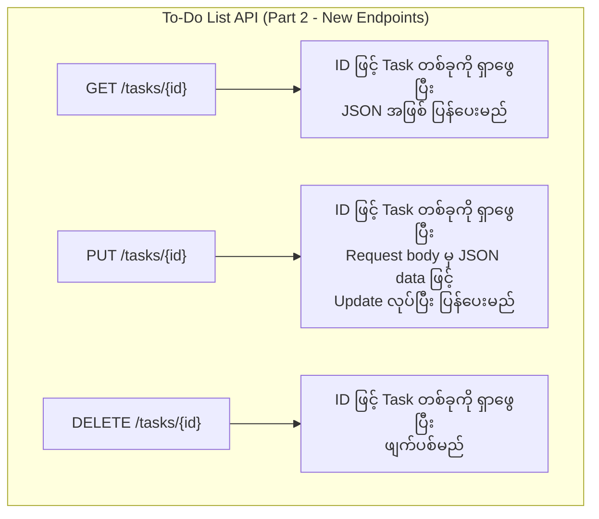

# အခန်း ၁၇: Project - Simple REST API တည်ဆောက်ခြင်း (အပိုင်း ၂)

ယခင်အခန်းတွင် ကျွန်ုပ်တို့၏ To-Do List API အတွက် အခြေခံ server တစ်ခုကို `net/http` package ဖြင့် တည်ဆောက်ခဲ့ပြီး `GET /tasks` နှင့် `POST /tasks` endpoints များကို implement လုပ်ခဲ့ပါသည်။

ယခုအခန်းတွင် API ကို ပိုမိုစွမ်းဆောင်ရည်ပြည့်ဝအောင် တိုးချဲ့တည်ဆောက်သွားပါမည်။

1.  Task တစ်ခုချင်းစီကို ID ဖြင့် `GET`, `PUT`, `DELETE` လုပ်နိုင်သော endpoints များ ထပ်မံထည့်သွင်းပါမည်။
2.  Standard `net/http` router ထက် ပိုမိုအစွမ်းထက်သော third-party router ဖြစ်သည့် `gorilla/mux` ကို အသုံးပြု၍ routing ကို ပြန်လည်တည်ဆောက်ပါမည်။

---

## `gorilla/mux` ကို အသုံးပြုခြင်း

Standard `net/http` router သည် ရိုးရှင်းသော routing များအတွက် ကောင်းမွန်သော်လည်း၊ URL path တွင် variables များ (e.g., `/tasks/{id}`) ပါဝင်လာသည့်အခါ ကိုင်တွယ်ရန် ခက်ခဲပါသည်။

`gorilla/mux` သည် Go community တွင် အလွန်ရေပန်းစားသော HTTP router တစ်ခုဖြစ်ပြီး အောက်ပါကဲ့သို့သော အစွမ်းထက်သည့် features များ ပါဝင်သည်။

*   URL path variables များကို အလွယ်တကူ parsing လုပ်နိုင်ခြင်း (e.g., `/tasks/{id}`).
*   HTTP method (`GET`, `POST`, `PUT`, `DELETE`) အလိုက် route များကို သီးခြားသတ်မှတ်နိုင်ခြင်း။
*   Hostnames, schemes, headers, နှင့် query parameters များပေါ်တွင် အခြေခံ၍ routing ပြုလုပ်နိုင်ခြင်း။

### `gorilla/mux` ကို Install ပြုလုပ်ခြင်း

Terminal တွင် အောက်ပါ command ကို run ၍ `gorilla/mux` package ကို သင်၏ project ထဲသို့ ထည့်သွင်းပါ။

```sh
go get github.com/gorilla/mux
```

---

## API Endpoints အသစ်များ ထပ်တိုးခြင်း

ကျွန်ုပ်တို့၏ API ကို အောက်ပါ endpoints များဖြင့် တိုးချဲ့ပါမည်။



---

## Code ကို Refactor လုပ်ခြင်း နှင့် Handlers အသစ်များ ရေးသားခြင်း

ယခုအခါ `main.go` file ကို `gorilla/mux` router ကို အသုံးပြုရန်နှင့် endpoints အသစ်များအတွက် handler functions များ ထပ်တိုးရန် ပြန်လည်ပြင်ဆင်ပါမည်။

**`main.go` (Updated Version)**

```go
package main

import (
	"encoding/json"
	"fmt"
	"log"
	"net/http"
	"strconv"
	"sync"

	"github.com/gorilla/mux" // gorilla/mux ကို import လုပ်ခြင်း
)

type Task struct {
	ID        int    `json:"id"`
	Title     string `json:"title"`
	Completed bool   `json:"completed"`
}

var (
	tasks  = make(map[int]Task)
	nextID = 1
	mu     sync.Mutex
)

// GET /tasks
func getTasks(w http.ResponseWriter, r *http.Request) {
	mu.Lock()
	defer mu.Unlock()
	var taskList []Task
	for _, task := range tasks {
		taskList = append(taskList, task)
	}
	w.Header().Set("Content-Type", "application/json")
	json.NewEncoder(w).Encode(taskList)
}

// POST /tasks
func createTask(w http.ResponseWriter, r *http.Request) {
	var newTask Task
	if err := json.NewDecoder(r.Body).Decode(&newTask); err != nil {
		http.Error(w, err.Error(), http.StatusBadRequest)
		return
	}
	mu.Lock()
	defer mu.Unlock()
	newTask.ID = nextID
	tasks[newTask.ID] = newTask
	nextID++
	w.Header().Set("Content-Type", "application/json")
	w.WriteHeader(http.StatusCreated)
	json.NewEncoder(w).Encode(newTask)
}

// --- Handler အသစ်များ ---

// GET /tasks/{id}
func getTask(w http.ResponseWriter, r *http.Request) {
	// URL path မှ "id" variable ကို ရယူခြင်း
	vars := mux.Vars(r)
	id, err := strconv.Atoi(vars["id"])
	if err != nil {
		http.Error(w, "Invalid task ID", http.StatusBadRequest)
		return
	}

	mu.Lock()
	defer mu.Unlock()

	task, ok := tasks[id]
	if !ok {
		http.Error(w, "Task not found", http.StatusNotFound)
		return
	}

	w.Header().Set("Content-Type", "application/json")
	json.NewEncoder(w).Encode(task)
}

// PUT /tasks/{id}
func updateTask(w http.ResponseWriter, r *http.Request) {
	vars := mux.Vars(r)
	id, err := strconv.Atoi(vars["id"])
	if err != nil {
		http.Error(w, "Invalid task ID", http.StatusBadRequest)
		return
	}

	var updatedTask Task
	if err := json.NewDecoder(r.Body).Decode(&updatedTask); err != nil {
		http.Error(w, err.Error(), http.StatusBadRequest)
		return
	}

	mu.Lock()
	defer mu.Unlock()

	if _, ok := tasks[id]; !ok {
		http.Error(w, "Task not found", http.StatusNotFound)
		return
	}

	updatedTask.ID = id
	tasks[id] = updatedTask

	w.Header().Set("Content-Type", "application/json")
	json.NewEncoder(w).Encode(updatedTask)
}

// DELETE /tasks/{id}
func deleteTask(w http.ResponseWriter, r *http.Request) {
	vars := mux.Vars(r)
	id, err := strconv.Atoi(vars["id"])
	if err != nil {
		http.Error(w, "Invalid task ID", http.StatusBadRequest)
		return
	}

	mu.Lock()
	defer mu.Unlock()

	if _, ok := tasks[id]; !ok {
		http.Error(w, "Task not found", http.StatusNotFound)
		return
	}

	delete(tasks, id)
	w.WriteHeader(http.StatusNoContent) // 204 No Content
}

func main() {
	// gorilla/mux router အသစ်တစ်ခု တည်ဆောက်ခြင်း
	r := mux.NewRouter()

	// Routes များကို router တွင် register လုပ်ခြင်း
	r.HandleFunc("/tasks", getTasks).Methods(http.MethodGet)
	r.HandleFunc("/tasks", createTask).Methods(http.MethodPost)
	r.HandleFunc("/tasks/{id}", getTask).Methods(http.MethodGet)
	r.HandleFunc("/tasks/{id}", updateTask).Methods(http.MethodPut)
	r.HandleFunc("/tasks/{id}", deleteTask).Methods(http.MethodDelete)

	fmt.Println("Starting REST API server on http://localhost:8080")
	// http.ListenAndServe တွင် router ကို pass လုပ်သည်
	if err := http.ListenAndServe(":8080", r); err != nil {
		log.Fatalf("Could not start server: %s\n", err.Error())
	}
}
```

**Code ရှင်းလင်းချက်:**
*   `main` function တွင် `mux.NewRouter()` ဖြင့် router အသစ်တစ်ခု တည်ဆောက်သည်။
*   `r.HandleFunc()` ကို အသုံးပြု၍ URL path နှင့် handler function ကို ချိတ်ဆက်သည်။ `.Methods()` ကို ဆက်လက်အသုံးပြုခြင်းဖြင့် ထို path အတွက် သီးခြား HTTP method ကို သတ်မှတ်နိုင်သည်။
*   `getTask`, `updateTask`, `deleteTask` functions များတွင် `mux.Vars(r)` ကို အသုံးပြု၍ URL path မှ `{id}` variable ကို ရယူပြီး `strconv.Atoi` ဖြင့် integer သို့ ပြောင်းလဲသည်။
*   `http.ListenAndServe` ၏ ဒုတိယ argument တွင် `nil` အစား ကျွန်ုပ်တို့ ဖန်တီးထားသော `r` (router) ကို ထည့်သွင်းပေးရသည်။

ယခုအခါ ကျွန်ုပ်တို့၏ API သည် CRUD (Create, Read, Update, Delete) operations အားလုံးကို လုပ်ဆောင်နိုင်ပြီဖြစ်သည်။