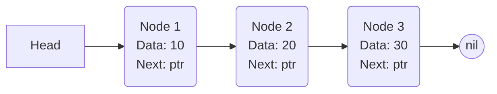
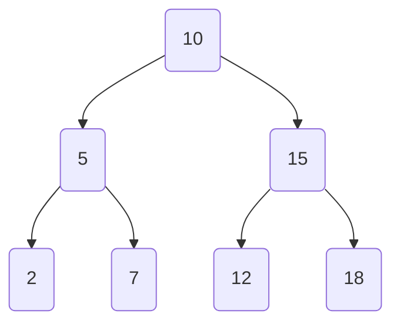
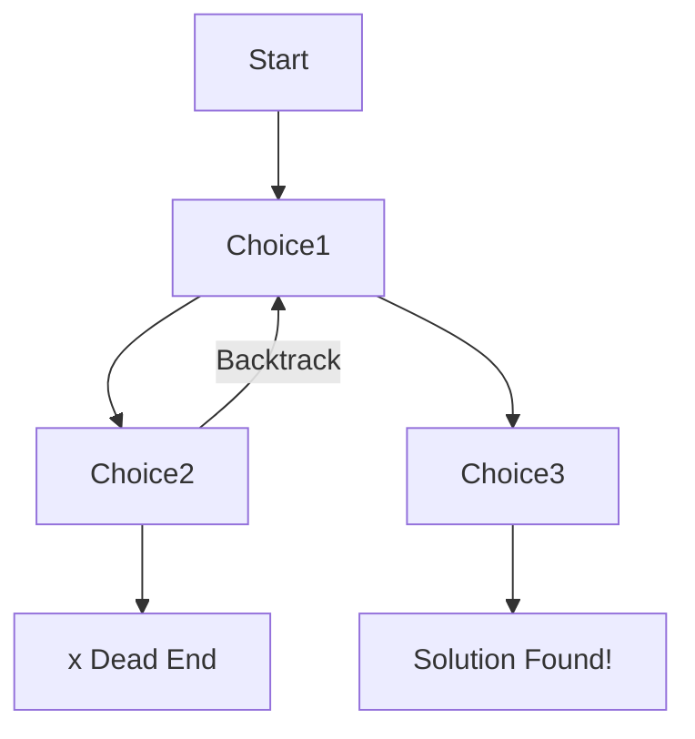

# အခန်း ၁၈: အသုံးများသော Data Structures နှင့် Algorithms များ

Software engineering တွင် ထိရောက်ပြီး စွမ်းဆောင်ရည်မြင့်မားသော program များ ရေးသားနိုင်ရန်အတွက် Data Structures (အချက်အလက် တည်ဆောက်ပုံ) နှင့် Algorithms (တွက်ချက်နည်းစနစ်) များကို နားလည်တတ်ကျွမ်းခြင်းသည် အလွန်အရေးကြီးပါသည်။ ဤအခန်းတွင် Go language ကို အသုံးပြု၍ အသုံးအများဆုံး DSA concept များကို လက်တွေ့ code များနှင့်တကွ အသေးစိတ် လေ့လာသွားပါမည်။

---

## Linked Lists

**Linked List** ဆိုသည်မှာ data element များ (Nodes) ကို sequence အလိုက် ချိတ်ဆက်ထားသော linear data structure တစ်ခုဖြစ်သည်။ Array/Slice နှင့်မတူဘဲ၊ linked list ၏ elements များသည် memory တွင် တစ်ဆက်တည်းရှိမနေဘဲ၊ node တစ်ခုစီက နောက် node တစ်ခု၏ memory address ကို pointer ဖြင့် ညွှန်ပြထားသည်။

*   **Node:** Data နှင့် နောက် node ကို ညွှန်ပြသော pointer (`next`) တို့ ပါဝင်သည်။
*   **Head:** List ၏ ပထမဆုံး node ကို ညွှန်ပြသော pointer ဖြစ်သည်။



**Go ဖြင့် ရေးသားခြင်း:**

```go
package main

import "fmt"

// Node struct
type Node struct {
	Data int
	Next *Node
}

// LinkedList struct
type LinkedList struct {
	Head *Node
}

// Append method သည် list ၏ အဆုံးတွင် node အသစ်တစ်ခု ထည့်ပေးသည်
func (ll *LinkedList) Append(data int) {
	newNode := &Node{Data: data}
	if ll.Head == nil {
		ll.Head = newNode
		return
	}

	current := ll.Head
	for current.Next != nil {
		current = current.Next
	}
	current.Next = newNode
}

func main() {
	list := LinkedList{}
	list.Append(10)
	list.Append(20)
	list.Append(30)

	// Print the list
	current := list.Head
	for current != nil {
		fmt.Printf("%d -> ", current.Data)
		current = current.Next
	}
	fmt.Println("nil")
}
```

---

## Stacks and Queues

### Stack (LIFO - Last-In, First-Out)

Stack ဆိုသည်မှာ နောက်ဆုံးထည့်လိုက်သော element ကို ပထမဆုံး ပြန်ထုတ်ရသည့် data structure ဖြစ်သည်။ ဥပမာ- ပန်းကန်ပြားများ ထပ်ထားခြင်းနှင့်တူသည်။ Go တွင် slice ကို အသုံးပြု၍ stack ကို အလွယ်တကူ implement လုပ်နိုင်သည်။

*   **Push:** Stack ၏ အပေါ်ဆုံးတွင် element အသစ်တစ်ခု ထပ်ထည့်ခြင်း (`append`)။
*   **Pop:** Stack ၏ အပေါ်ဆုံးမှ element ကို ဖယ်ထုတ်ခြင်း။

```go
type Stack []string

func (s *Stack) Push(val string) {
	*s = append(*s, val)
}

func (s *Stack) Pop() (string, bool) {
	if len(*s) == 0 {
		return "", false // Stack is empty
	}
	index := len(*s) - 1
	element := (*s)[index]
	*s = (*s)[:index]
	return element, true
}
```

### Queue (FIFO - First-In, First-Out)

Queue ဆိုသည်မှာ ပထမဆုံးထည့်လိုက်သော element ကို ပထမဆုံး ပြန်ထုတ်ရသည့် data structure ဖြစ်သည်။ ဥပမာ- တန်းစီခြင်းနှင့်တူသည်။

*   **Enqueue:** Queue ၏ အနောက်ဆုံးတွင် element အသစ်တစ်ခု ထည့်ခြင်း (`append`)။
*   **Dequeue:** Queue ၏ အရှေ့ဆုံးမှ element ကို ဖယ်ထုတ်ခြင်း။

```go
type Queue []string

func (q *Queue) Enqueue(val string) {
	*q = append(*q, val)
}

func (q *Queue) Dequeue() (string, bool) {
	if len(*q) == 0 {
		return "", false // Queue is empty
	}
	element := (*q)[0]
	*q = (*q)[1:]
	return element, true
}
```

---

## Trees (Binary Search Tree)

**Binary Search Tree (BST)** ဆိုသည်မှာ tree data structure တစ်မျိုးဖြစ်ပြီး node တိုင်းတွင် အောက်ပါ ဂုဏ်သတ္တိများရှိသည်။
1.  ဘယ်ဘက် child node ၏ တန်ဖိုးသည် parent node ၏ တန်ဖိုးထက် အမြဲငယ်ရမည်။
2.  ညာဘက် child node ၏ တန်ဖိုးသည် parent node ၏ တန်ဖိုးထက် အမြဲကြီးရမည်။
3.  ဘယ်ဘက်နှင့် ညာဘက် subtrees များသည်လည်း binary search trees များ ဖြစ်ရမည်။

ဤဂုဏ်သတ္တိကြောင့် data များကို ရှာဖွေရာတွင် အလွန်မြန်ဆန်သည် (ပျမ်းမျှ O(log n))။



**Go ဖြင့် ရေးသားခြင်း:**

```go
type TreeNode struct {
	Value int
	Left  *TreeNode
	Right *TreeNode
}

func (n *TreeNode) Insert(value int) {
	if value < n.Value {
		if n.Left == nil {
			n.Left = &TreeNode{Value: value}
		} else {
			n.Left.Insert(value)
		}
	} else if value > n.Value {
		if n.Right == nil {
			n.Right = &TreeNode{Value: value}
		} else {
			n.Right.Insert(value)
		}
	}
}
```

---

## Sorting Algorithms

### Bubble Sort

Bubble Sort သည် ရိုးရှင်းသော sorting algorithm တစ်ခုဖြစ်ပြီး၊ ကပ်လျက် element နှစ်ခုကို နှိုင်းယှဉ်ကာ နေရာမှန်မရောက်မချင်း အပြန်အလှန် လဲလှယ်ပေးသည်။ ၎င်းသည် performance မကောင်းသော်လည်း (O(n²))၊ sorting ၏ အခြေခံကို နားလည်ရန်အတွက် ကောင်းမွန်သော ဥပမာတစ်ခုဖြစ်သည်။

```go
func BubbleSort(arr []int) {
	n := len(arr)
	for i := 0; i < n-1; i++ {
		for j := 0; j < n-i-1; j++ {
			if arr[j] > arr[j+1] {
				arr[j], arr[j+1] = arr[j+1], arr[j] // Swap
			}
		}
	}
}
```

### Quick Sort

Quick Sort သည် "divide and conquer" နည်းစနစ်ကို အသုံးပြုထားသော ပိုမိုထိရောက်သည့် sorting algorithm ဖြစ်သည်။
1.  Array ထဲမှ element တစ်ခုကို **pivot** အဖြစ် ရွေးချယ်သည်။
2.  Array ကို pivot ထက်ငယ်သော elements များ (ဘယ်ဘက်) နှင့် pivot ထက်ကြီးသော elements များ (ညာဘက်) ဟူ၍ နှစ်ပိုင်းခွဲ (partition) သည်။
3.  ဘယ်ဘက်နှင့် ညာဘက် sub-arrays များကို Quick Sort ဖြင့် recursive ပြန်ခေါ်၍ sort လုပ်သည်။

ပျမ်းမျှအားဖြင့် ၎င်း၏ time complexity မှာ O(n log n) ဖြစ်သောကြောင့် အလွန်မြန်ဆန်သည်။

```go
func QuickSort(arr []int) []int {
	if len(arr) < 2 {
		return arr
	}

	left, right := 0, len(arr)-1
	pivotIndex := len(arr) / 2
	arr[pivotIndex], arr[right] = arr[right], arr[pivotIndex]

	for i := range arr {
		if arr[i] < arr[right] {
			arr[i], arr[left] = arr[left], arr.i]
			left++
		}
	}

	arr[left], arr[right] = arr[right], arr[left]

	QuickSort(arr[:left])
	QuickSort(arr[left+1:])

	return arr
}
```

---

## Backtracking (နောက်ပြန်ဆုတ်၍ ရှာဖွေခြင်း)

**Backtracking** ဆိုသည်မှာ ပြဿနာတစ်ခု၏ solution ကို ရှာဖွေရာတွင် ဖြစ်နိုင်ခြေရှိသော လမ်းကြောင်း (choices) အားလုံးကို တစ်ဆင့်ချင်း စမ်းသပ်တည်ဆောက်သွားသည့် algorithm နည်းစနစ်ဖြစ်သည်။ ဝင်္ကပါတစ်ခုကို ဖြေရှင်းသကဲ့သို့ပင်၊ လမ်းကြောင်းတစ်ခုသည် solution သို့ မရောက်နိုင်တော့ဟု သိရှိပါက (dead end)၊ နောက်ဆုံး ပြုလုပ်ခဲ့သော choice ကို ပြန်ဖျက်ပြီး နောက်ပြန်ဆုတ် (backtrack) ကာ အခြားလမ်းကြောင်းတစ်ခုကို ရွေးချယ်စမ်းသပ်သည်။



Backtracking ကို Sudoku solvers, N-Queens problem, နှင့် permutations/combinations ရှာဖွေခြင်းကဲ့သို့သော ပြဿနာများတွင် တွင်ကျယ်စွာ အသုံးပြုသည်။

### ဥပမာ ၁: String Permutations

String တစ်ခု (`"ABC"`) ၏ ဖြစ်နိုင်ခြေရှိသော ပြောင်းပြန်လှန်လှယ်မှု (permutations) အားလုံးကို ရှာဖွေခြင်း။

```go
func findPermutations(s string) []string {
	var result []string
	var permute func(prefix string, str string)

	permute = func(prefix string, str string) {
		n := len(str)
		if n == 0 {
			result = append(result, prefix)
		} else {
			for i := 0; i < n; i++ {
				// Recursive call: i-th character ကို prefix ထဲထည့်ပြီး ကျန် string ကို pass လုပ်သည်
				permute(prefix+string(str[i]), str[0:i]+str[i+1:n])
			}
		}
	}

	permute("", s)
	return result
}
```

### ဥပမာ ၂: N-Queens Problem

**ပြဿနာ:** N x N စစ်တုရင်ခုံပေါ်တွင် ဘုရင်မ (Queen) N ကောင်ကို တစ်ကောင်နှင့်တစ်ကောင် တိုက်ခိုက်၍မရအောင် (တူညီသော row, column, သို့မဟုတ် diagonal တွင် မရှိစေရ) မည်သို့နေရာချမည်နည်း။

**Backtracking ဖြင့် ဖြေရှင်းခြင်း:**
1.  ပထမဆုံး row မှ စတင်ပြီး column တစ်ခုတွင် Queen တစ်ကောင်ကို ချကြည့်ပါ။
2.  ထိုနေရာသည် အခြား Queen များနှင့် conflict ဖြစ်/မဖြစ် စစ်ဆေးပါ။
3.  Conflict မရှိပါက နောက်တစ် row သို့ ဆက်သွားပြီး အဆင့် ၁ ကို ပြန်လုပ်ပါ။
4.  Conflict ရှိပါက (သို့မဟုတ် နောက် row တွင် နေရာချရန်မဖြစ်နိုင်ပါက) လက်ရှိ Queen ကို ဖယ်ရှားပြီး (backtrack)၊ လက်ရှိ row ၏ နောက် column တစ်ခုတွင် ပြန်ချကြည့်ပါ။
5.  Queen N ကောင်လုံး အောင်မြင်စွာ နေရာချပြီးပါက solution တစ်ခုကို တွေ့ရှိပြီဖြစ်သည်။

```go
func solveNQueens(n int) [][]string {
	var result [][]string
	board := make([][]byte, n)
	for i := range board {
		board[i] = make([]byte, n)
		for j := range board[i] {
			board[i][j] = '.'
		}
	}

	var backtrack func(row int)
	backtrack = func(row int) {
		if row == n {
			var solution []string
			for _, r := range board {
				solution = append(solution, string(r))
			}
			result = append(result, solution)
			return
		}

		for col := 0; col < n; col++ {
			if isValid(board, row, col, n) {
				board[row][col] = 'Q'
				backtrack(row + 1)
				board[row][col] = '.' // Backtrack
			}
		}
	}

	backtrack(0)
	return result
}

func isValid(board [][]byte, row, col, n int) bool {
	// Check column
	for i := 0; i < row; i++ {
		if board[i][col] == 'Q' {
			return false
		}
	}
	// Check upper-left diagonal
	for i, j := row-1, col-1; i >= 0 && j >= 0; i, j = i-1, j-1 {
		if board[i][j] == 'Q' {
			return false
		}
	}
	// Check upper-right diagonal
	for i, j := row-1, col+1; i >= 0 && j < n; i, j = i-1, j+1 {
		if board[i][j] == 'Q' {
			return false
		}
	}
	return true
}
```

---

## Dynamic Programming (DP)

**Dynamic Programming** ဆိုသည်မှာ ပြဿနာကြီးတစ်ခုကို ပိုမိုသေးငယ်ပြီး **ထပ်နေသော ပြဿနာငယ်များ (overlapping subproblems)** အဖြစ် ခွဲခြမ်းစိတ်ဖြာပြီး၊ ထိုပြဿနာငယ်များ၏ အဖြေများကို မှတ်သားထားကာ (caching) နောက်တစ်ကြိမ် ထပ်မံတွက်ချက်ရန်မလိုဘဲ ပြန်လည်အသုံးပြုသည့် နည်းစနစ်ဖြစ်သည်။ ၎င်းသည် naive recursive solutions များ၏ performance ကို အဆများစွာ တိုးတက်စေသည်။

DP တွင် အဓိက နည်းလမ်းနှစ်မျိုးရှိသည်။
1.  **Memoization (Top-Down):** ပြဿနာကြီးမှ စတင်၍ recursive ခေါ်ဆိုပြီး၊ subproblem တစ်ခု၏ အဖြေကို ပထမဆုံးအကြိမ် တွက်ချက်ပြီးတိုင်း cache (e.g., map or array) ထဲတွင် မှတ်သားထားသည်။ နောက်တစ်ကြိမ် ထို subproblem ကို ထပ်မံတွေ့ရှိပါက တွက်ချက်မနေတော့ဘဲ cache မှ အဖြေကို ချက်ချင်းပြန်ယူသုံးသည်။
2.  **Tabulation (Bottom-Up):** အသေးငယ်ဆုံး subproblem မှ စတင်၍ အဖြေများကို တွက်ချက်ပြီး table (e.g., array) တစ်ခုတွင် သိမ်းဆည်းသည်။ ထို့နောက် ထိုအဖြေများကို အသုံးပြု၍ ပိုကြီးသော subproblem များကို တစ်ဆင့်ပြီးတစ်ဆင့် ဖြေရှင်းသွားပြီး နောက်ဆုံးတွင် မူလပြဿနာကြီး၏ အဖြေကို ရရှိသည်။

### ဥပမာ ၁: Fibonacci Sequence (Memoization ဖြင့်)

Fibonacci sequence `fib(n)` ကို တွက်ချက်ရာတွင် `fib(n-1)` နှင့် `fib(n-2)` ကို လိုအပ်သည်။ `fib(5)` ကို တွက်ရန် `fib(3)` ကို နှစ်ကြိမ် တွက်ချက်ရသည်ကို တွေ့ရမည်။ DP သည် ဤသို့ ထပ်ခါထပ်ခါ တွက်ချက်ခြင်းကို ရှောင်ရှားပေးသည်။

```go
// memo (map) ကို အသုံးပြု၍ တွက်ချက်ပြီးသား အဖြေများကို မှတ်သားထားမည်
func fibDP(n int, memo map[int]int) int {
	// 1. Cache ကို စစ်ဆေးခြင်း
	if val, ok := memo[n]; ok {
		return val // မှတ်သားထားသော အဖြေကို ပြန်ပေးသည်
	}
	// 2. Base case
	if n <= 1 {
		return n
	}

	// 3. Recursive တွက်ချက်ခြင်း
	result := fibDP(n-1, memo) + fibDP(n-2, memo)
	
	// 4. အဖြေကို cache ထဲသို့ မှတ်သားခြင်း
	memo[n] = result
	return result
}
```

### ဥပမာ ၂: Climbing Stairs (Tabulation ဖြင့်)

**ပြဿနာ:** လှေကားထစ် N ထစ်ကို တက်ရန်အတွက် တစ်ကြိမ်လျှင် ၁ ထစ် သို့မဟုတ် ၂ ထစ် တက်နိုင်သည်။ နည်းလမ်းပေါင်း မည်မျှဖြင့် တက်နိုင်မည်နည်း။

**DP ဖြင့် ဖြေရှင်းခြင်း:**
*   `ways(n)` = လှေကားထစ် n ထစ်ကို တက်နိုင်သော နည်းလမ်းအရေအတွက်
*   `ways(n) = ways(n-1) + ways(n-2)` (နောက်ဆုံးအဆင့်ကို ၁ ထစ်ဖြင့် တက်ခဲ့ခြင်း + နောက်ဆုံးအဆင့်ကို ၂ ထစ်ဖြင့် တက်ခဲ့ခြင်း)
*   Base cases: `ways(1) = 1`, `ways(2) = 2`

```go
func climbStairs(n int) int {
	if n <= 2 {
		return n
	}
	// dp array (table) ကို တည်ဆောက်သည်
	dp := make([]int, n+1)
	dp[1] = 1
	dp[2] = 2

	// Bottom-up တွက်ချက်သည်
	for i := 3; i <= n; i++ {
		dp[i] = dp[i-1] + dp[i-2]
	}

	return dp[n]
}
```