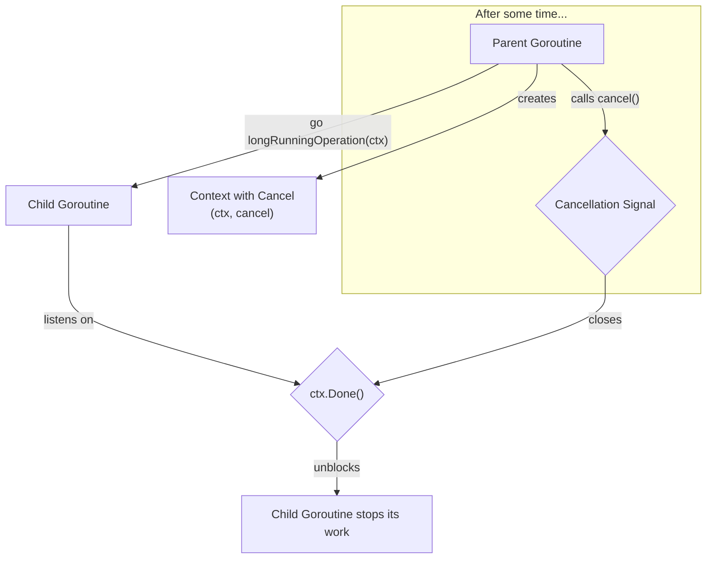

# အခန်း ၁၉: Context

Go တွင် concurrent programming နှင့် network applications များ ရေးသားရာတွင် `context` package သည် အလွန်အရေးပါသော အခန်းကဏ္ဍမှ ပါဝင်ပါသည်။ `context.Context` သည် API boundaries များ (ဥပမာ- function calls, goroutines) တစ်လျှောက်တွင် cancellation signals, deadlines, နှင့် request-scoped values များကို သယ်ဆောင်ရန်အတွက် standard mechanism တစ်ခုဖြစ်သည်။

---

## `context` package ဆိုတာဘာလဲ။

`Context` သည် program တစ်ခု၏ execution path တစ်လျှောက်တွင် သက်ဆိုင်ရာ အချက်အလက်များကို လက်ဆင့်ကမ်း သယ်ဆောင်သွားသော "context" သို့မဟုတ် ပတ်ဝန်းကျင်တစ်ခု ဖြစ်သည်။ ၎င်း၏ အဓိက အသုံးဝင်မှုများမှာ-

1.  **Cancellation:** Parent operation တစ်ခုက ၎င်းမှစတင်ခဲ့သော child operations (goroutines) များကို အချိန်မရွေး ရပ်တန့်စေနိုင်ခြင်း။
2.  **Timeouts/Deadlines:** Operation တစ်ခုကို အချိန်အကန့်အသတ်တစ်ခုအတွင်း ပြီးမြောက်ရန် သတ်မှတ်ပြီး၊ အချိန်ကျော်လွန်ပါက အလိုအလျောက် cancel လုပ်ခြင်း။
3.  **Request-scoped Values:** Request တစ်ခုနှင့်သာ သက်ဆိုင်သော data (e.g., request ID, user token) များကို function call chain တစ်လျှောက် လက်ဆင့်ကမ်း သယ်ဆောင်သွားခြင်း။

`Context` သည် immutable ဖြစ်သည်။ `context` အသစ်တစ်ခုကို ဖန်တီးလိုပါက ရှိပြီးသား parent context မှ child context အသစ်တစ်ခုကို ထုတ်ယူ (derive) ရသည်။

---

## Cancellation (လုပ်ငန်းစဉ်များကို ရပ်တန့်စေခြင်း)

`context.WithCancel()` function သည် parent context မှ cancel function တစ်ခုပါဝင်သော child context အသစ်တစ်ခုကို ဖန်တီးပေးသည်။ ထို cancel function ကို ခေါ်လိုက်သည့်အခါ၊ ထို child context နှင့် ၎င်းမှ ဆင်းသက်လာသော context များအားလုံးသည် cancelled ဖြစ်သွားပြီး၊ ၎င်းတို့၏ `Done()` channel သည် close ဖြစ်သွားသည်။

Goroutines များသည် `ctx.Done()` channel ကို `select` statement ဖြင့် စောင့်ကြည့်နားထောင်ခြင်းဖြင့် cancellation signal ကို လက်ခံရရှိပြီး မိမိတို့၏ လုပ်ငန်းစဉ်များကို ဘေးကင်းစွာ ရပ်တန့်နိုင်သည်။



**ဥပမာ:**

```go
package main

import (
	"context"
	"fmt"
	"time"
)

func worker(ctx context.Context) {
	for {
		select {
		case <-ctx.Done():
			// Cancellation signal ရရှိပါက goroutine မှ ထွက်ခွာမည်
			fmt.Println("Worker: cancellation signal received. Shutting down.")
			return
		default:
			// ပုံမှန်အလုပ်များကို ဆက်လက်လုပ်ဆောင်နေမည်
			fmt.Println("Worker: doing some work...")
			time.Sleep(500 * time.Millisecond)
		}
	}
}

func main() {
	// Background context မှ cancelable context အသစ်တစ်ခု ဖန်တီးသည်
	ctx, cancel := context.WithCancel(context.Background())

	go worker(ctx)

	// 2 seconds ကြာသောအခါ worker goroutine ကို cancel လုပ်မည်
	time.Sleep(2 * time.Second)
	fmt.Println("Main: sending cancellation signal.")
	cancel()

	// Worker goroutine မှ shutdown message ကို မြင်နိုင်ရန် ခေတ္တစောင့်ဆိုင်းသည်
	time.Sleep(1 * time.Second)
	fmt.Println("Main: finished.")
}
```

---

## Timeouts နှင့် Deadlines

`context.WithTimeout()` နှင့် `context.WithDeadline()` functions များသည် အချိန်အကန့်အသတ်ဖြင့် context များကို ဖန်တီးရန် အသုံးပြုသည်။

*   `context.WithTimeout(parent, duration)`: လက်ရှိအချိန်မှစ၍ သတ်မှတ် `duration` ကြာပြီးနောက် အလိုအလျောက် cancel ဖြစ်မည့် context ကို ဖန်တီးသည်။
*   `context.WithDeadline(parent, time)`: သတ်မှတ်ထားသော `time` အချိန်အတိအကျတွင် အလိုအလျောက် cancel ဖြစ်မည့် context ကို ဖန်တီးသည်။

ဤသည်မှာ external network call များ သို့မဟုတ် database queries များကဲ့သို့ အချိန်ကြာမြင့်နိုင်သော operations များအတွက် အလွန်အသုံးဝင်သည်။

**ဥပမာ: HTTP Request Timeout**

```go
package main

import (
	"context"
	"fmt"
	"net/http"
	"time"
)

func main() {
	// 50 milliseconds timeout ဖြင့် context တစ်ခု ဖန်တီးသည်
	ctx, cancel := context.WithTimeout(context.Background(), 50*time.Millisecond)
	defer cancel() // context နှင့် သက်ဆိုင်သော resources များကို ရှင်းလင်းရန် အရေးကြီးသည်

	// HTTP request အသစ်တစ်ခု တည်ဆောက်သည်
	req, _ := http.NewRequestWithContext(ctx, "GET", "http://google.com", nil)

	// Request ကို ပေးပို့သည်
	fmt.Println("Sending request...")
	_, err := http.DefaultClient.Do(req)

	if err != nil {
		// Timeout ဖြစ်သွားပါက context deadline exceeded error ကို ရရှိမည်
		fmt.Println("Error:", err)
	} else {
		fmt.Println("Success!")
	}
}
```

---

## Request-Scoped Values

`context.WithValue(parent, key, value)` function ကို အသုံးပြု၍ context ထဲတွင် key-value pair များကို သိမ်းဆည်းပြီး function call chain တစ်လျှောက် လက်ဆင့်ကမ်း သယ်ဆောင်သွားနိုင်သည်။

**အကောင်းဆုံး လိုက်နာရန် (Best Practice):**
1.  **Key Type:** Key collision များ မဖြစ်စေရန်အတွက် key ကို `string` ကဲ့သို့သော built-in type များအစား ကိုယ်ပိုင် custom type (`type myKey string`) ဖြင့် သတ်မှတ်သင့်သည်။
2.  **အသုံးဝင်ပုံ:** `WithValue` ကို function တစ်ခုအတွက် optional parameters များ pass လုပ်ရန် **မသုံးသင့်ပါ**။ ၎င်းကို request-scoped data (e.g., request ID, user authentication info) ကဲ့သို့ process တစ်ခုလုံးနှင့် သက်ဆိုင်သော data များကို သယ်ဆောင်ရန်အတွက်သာ အသုံးပြုသင့်သည်။

**ဥပမာ:**

```go
package main

import (
	"context"
	"fmt"
)

// Key အတွက် custom type တစ်ခု သတ်မှတ်ခြင်း
type key string

const requestIDKey key = "requestID"

func processRequest(ctx context.Context) {
	// Context မှ request ID ကို ထုတ်ယူခြင်း
	reqID, ok := ctx.Value(requestIDKey).(string)
	if !ok {
		reqID = "unknown"
	}
	fmt.Printf("Processing request with ID: %s\n", reqID)

	// အခြား function ကို context နှင့်အတူ ခေါ်ဆိုခြင်း
	logSomething(ctx, "Starting step 1...")
}

func logSomething(ctx context.Context, message string) {
	reqID, _ := ctx.Value(requestIDKey).(string)
	fmt.Printf("[Log - %s] %s\n", reqID, message)
}

func main() {
	// Context ထဲသို့ request ID ကို ထည့်သွင်းသည်
	ctx := context.WithValue(context.Background(), requestIDKey, "abc-123-xyz")

	processRequest(ctx)
}
```