# အခန်း ၁: Go ဘာသာစကား မိတ်ဆက်

Go (Golang ဟုလည်း ခေါ်ကြသည်) သည် Google မှ Robert Griesemer, Rob Pike, နှင့် Ken Thompson တို့က ၂၀၀၉ ခုနှစ်တွင် စတင်ဖန်တီးခဲ့သော open-source programming language တစ်ခုဖြစ်သည်။ Go သည် ရိုးရှင်းမှု (simplicity), စွမ်းဆောင်ရည်မြင့်မားမှု (high performance), နှင့် concurrency (တစ်ပြိုင်နက်တည်း အလုပ်များစွာ လုပ်ဆောင်နိုင်မှု) တို့ကို အဓိကထား၍ ဒီဇိုင်းထုတ်ထားပါသည်။

---

## Go ဆိုတာဘာလဲ။

Go သည် statically typed, compiled programming language တစ်ခုဖြစ်ပြီး C++ သို့မဟုတ် Java ကဲ့သို့သော language များ၏ performance နှင့် C-like syntax ကို Python သို့မဟုတ် JavaScript ကဲ့သို့သော dynamic language များ၏ ရိုးရှင်းလွယ်ကူမှုနှင့် ပေါင်းစပ်ထားပါသည်။

၎င်း၏ အဓိကရည်ရွယ်ချက်မှာ ခေတ်မီ multi-core processor များ၊ computer network များနှင့် large codebases များအတွက် software များကို လွယ်ကူစွာ တည်ဆောက်နိုင်ရန် ဖြစ်သည်။

---

## ဘာကြောင့် Go ကို ရွေးချယ်သင့်သလဲ။

Go ကို software developer များစွာက နှစ်သက်စွာ အသုံးပြုလာကြရခြင်း၏ အဓိကအကြောင်းအရင်းများမှာ-

*   **Performance:** Go သည် compiled language ဖြစ်သောကြောင့် machine code သို့ တိုက်ရိုက် compile လုပ်သည်။ ထို့ကြောင့် interpreted languages များဖြစ်သော Python သို့မဟုတ် Ruby တို့ထက် များစွာပိုမိုမြန်ဆန်ပါသည်။

*   **Concurrency:** Go ၏ အစွမ်းထက်ဆုံး feature မှာ concurrency ဖြစ်သည်။ Goroutines နှင့် Channels များကို အသုံးပြု၍ program များကို တစ်ပြိုင်နက်တည်း အလုပ်များစွာကို အလွန်လွယ်ကူစွာနှင့် ထိရောက်စွာ လုပ်ဆောင်နိုင်အောင် ရေးသားနိုင်ပါသည်။ ၎င်းသည် web servers, data pipelines နှင့် အခြားသော concurrent systems များ တည်ဆောက်ရာတွင် အလွန်အသုံးဝင်ပါသည်။

*   **Simplicity:** Go ၏ syntax သည် ရိုးရှင်းပြီး သင်ယူရန် လွယ်ကူသည်။ Language တွင် keywords အနည်းငယ်သာ ပါရှိသောကြောင့် code များကို ဖတ်ရှုရန်နှင့် ပြုပြင်ထိန်းသိမ်းရန် (maintain) လွယ်ကူစေပါသည်။

---

## Go ၏ အားသာချက်များနှင့် အသုံးဝင်မှုများ

### အားသာချက်များ
*   **Fast Compilation:** Compile အလွန်မြန်ဆန်သောကြောင့် development process ကို ပိုမိုသွက်လက်စေသည်။
*   **Garbage Collection:** Memory management ကို အလိုအလျောက် ပြုလုပ်ပေးသည်။
*   **Strong Standard Library:** Web server, cryptography, I/O နှင့် အခြားသော လုပ်ဆောင်ချက်များစွာအတွက် built-in packages များ ပါဝင်သည်။
*   **Single Binary:** Program ကို compile ပြုလုပ်ပြီးသောအခါ dependency များအားလုံးပါဝင်သော executable file တစ်ခုတည်းသာ ရရှိသောကြောင့် deployment ပြုလုပ်ရန် အလွန်လွယ်ကူသည်။

### အသုံးဝင်မှုများ
*   Cloud & Network Services
*   Command-line Interfaces (CLIs)
*   Web Development (Backend APIs)
*   DevOps & Site Reliability Engineering (SRE)

---

## Go ကို အသုံးပြုနေသော နာမည်ကြီး Company များ

Go ၏ စွမ်းဆောင်ရည်နှင့် ယုံကြည်စိတ်ချရမှုတို့ကြောင့် ကမ္ဘာ့ထိပ်တန်း နည်းပညာ company များစွာက ၎င်းတို့၏ systems များတွင် Go ကို ကျယ်ပြန့်စွာ အသုံးပြုနေကြပါသည်။ ဥပမာအချို့မှာ-

*   Google (Go ကို ဖန်တီးခဲ့သည့် ကုမ္ပဏီ)
*   Uber
*   Twitch
*   Dropbox
*   SoundCloud
*   Netflix# အခန်း ၂: Development Environment တည်ဆောက်ခြင်း

Go programming language ဖြင့် software များ စတင်ရေးသားရန်အတွက် လိုအပ်သော development environment ကို မည်သို့တည်ဆောက်ရမည်ကို ဤအခန်းတွင် လေ့လာသွားပါမည်။ Go ကို install ပြုလုပ်ခြင်းမှစ၍ သင်၏ ပထမဆုံး "Hello, World!" program ကို ရေးသား run ကြည့်ခြင်းအထိ အဆင့်ဆင့် လမ်းညွှန်ပေးသွားပါမည်။

---

## Go ကို Install ပြုလုပ်ခြင်း (Windows, macOS, Linux)

Go ကို စတင်အသုံးပြုရန်အတွက် သင်၏ ကွန်ပျူတာတွင် Go compiler နှင့် tools များကို install ပြုလုပ်ရန် လိုအပ်ပါသည်။

Go ၏ တရားဝင် website ဖြစ်သော [go.dev/dl/](https://go.dev/dl/) တွင် သင်၏ operating system (Windows, macOS, Linux) အတွက် installer များကို အလွယ်တကူ download ရယူပြီး install ပြုလုပ်နိုင်ပါသည်။

Installation ပြီးစီးကြောင်း စစ်ဆေးရန် သင်၏ terminal သို့မဟုတ် command prompt တွင် အောက်ပါ command ကို ရိုက်ထည့်ကြည့်ပါ။

```sh
go version
```

`go version go1.xx.x` ကဲ့သို့သော စာကြောင်းကို မြင်ရပါက Go ကို အောင်မြင်စွာ install ပြုလုပ်ပြီးဖြစ်ပါသည်။

---

## Workspace နှင့် GOPATH ကို နားလည်ခြင်း

ယခင် Go version များတွင် `GOPATH` သည် Go projects များ၏ workspace ကို သတ်မှတ်ပေးသော environment variable တစ်ခုဖြစ်ပြီး အရေးပါခဲ့ပါသည်။ သို့သော် Go version 1.11 မှစ၍ **Go Modules** စနစ်ကို စတင်မိတ်ဆက်ခဲ့ပြီးနောက်ပိုင်းတွင် `GOPATH` ၏ အရေးပါမှုမှာ လျော့ကျသွားခဲ့သည်။

ယခုခေတ် Go development တွင် project များကို သင်၏ computer ရှိ မည်သည့် directory တွင်မဆို တည်ဆောက်နိုင်ပြီး `go mod` command ဖြင့် dependency များကို စီမံခန့်ခွဲနိုင်ပြီ ဖြစ်သောကြောင့် ပိုမိုလွယ်ကူလာပါသည်။ ဤစာအုပ်တွင်လည်း Go Modules ကို အခြေခံ၍ ဆက်လက်ရှင်းလင်းသွားပါမည်။

---

## Code Editor (VS Code) Setup ပြုလုပ်ခြင်း

Go code များကို ရေးသားရန်အတွက် text editor အမျိုးမျိုးကို အသုံးပြုနိုင်သော်လည်း Visual Studio Code (VS Code) သည် Go developer များကြားတွင် ရေပန်းအစားဆုံး editor တစ်ခုဖြစ်သည်။

1.  VS Code ကို download လုပ်ပြီး install ပြုလုပ်ပါ။
2.  VS Code ကိုဖွင့်ပြီး Extensions view (Ctrl+Shift+X) သို့ သွားပါ။
3.  Search bar တွင် `Go` ဟု ရိုက်ရှာပြီး **Go Team at Google** မှ ထုတ်ဝေသော extension ကို install ပြုလုပ်ပါ။
4.  ၎င်း extension က code completion, debugging, testing နှင့် အခြားသော အသုံးဝင်သည့် feature များစွာကို ထောက်ပံ့ပေးပါလိမ့်မည်။

---

## သင်၏ ပထမဆုံး ပရိုဂရမ်: "Hello, World!"

သင်၏ ပထမဆုံး Go program ကို စတင်ရေးသားကြည့်ကြပါစို့။

1.  `hello` အမည်ဖြင့် project folder အသစ်တစ်ခု တည်ဆောက်ပါ။
2.  Terminal တွင် ထို folder ထဲသို့ `cd hello` ဖြင့် ဝင်ပါ။
3.  `go mod init example.com/hello` command ဖြင့် module အသစ်တစ်ခု ဖန်တီးပါ။
4.  `main.go` အမည်ဖြင့် file အသစ်တစ်ခုဖွင့်ပြီး အောက်ပါ code များကို ရေးသားပါ။

```go
package main

import "fmt"

func main() {
    fmt.Println("Hello, World!")
}
```

- `package main`: ဤ file သည် executable program တစ်ခုဖြစ်ကြောင်း ကြေညာသည်။
- `import "fmt"`: "format" package ကို import လုပ်ခြင်းဖြစ်သည်။ ၎င်း package တွင် `Println` ကဲ့သို့သော printing functions များ ပါဝင်သည်။
- `func main()`: Program စတင်အလုပ်လုပ်မည့် အဓိက function ဖြစ်သည်။
- `fmt.Println(...)`: Console တွင် စာသားများကို print ထုတ်ပေးသည်။

---

## `go run`, `go build`, `go install` Commands များ

Terminal တွင် `main.go` file ရှိသော directory ထဲ၌ အောက်ပါ command များကို စမ်းသပ်ကြည့်နိုင်ပါသည်။

- **`go run main.go`**

  - Code ကို compile လုပ်ပြီး တိုက်ရိုက် run ပေးသည်။ Executable file အသစ်ကို မဖန်တီးပါ။ Development ပြုလုပ်နေစဉ် program ကို အမြန်စမ်းသပ်ရန် အသုံးဝင်သည်။

- **`go build`**

  - Code ကို compile လုပ်ပြီး လက်ရှိ directory ထဲတွင် `hello` (Windows တွင် `hello.exe`) အမည်ဖြင့် executable file တစ်ခု တည်ဆောက်ပေးသည်။ ထို file ကို အခြားနေရာများသို့ copy ယူပြီး တိုက်ရိုက် run နိုင်ပါသည်။

- **`go install`**
  - Code ကို compile လုပ်ပြီး ရလာသော executable file ကို `$GOPATH/bin` (သို့မဟုတ် `GOBIN` သတ်မှတ်ထားလျှင် ထိုနေရာ) တွင် install ပြုလုပ်ပေးသည်။ ၎င်းသည် command-line tool များ ဖြန့်ဝေရန် အသုံးဝင်သည်။
# အခန်း ၃: Go ၏ အခြေခံ Syntax များ

ယခုအခန်းတွင် Go programming language ၏ အခြေခံအကျဆုံးနှင့် အရေးအကြီးဆုံးဖြစ်သော syntax များကို လေ့လာသွားပါမည်။ Variables, constants, data types, operators နှင့် comments များ မည်သို့ရေးသားရမည်ကို ဥပမာများနှင့်တကွ ရှင်းလင်းဖော်ပြသွားပါမည်။

---

## Variables နှင့် Constants များ ကြေညာခြင်း

Go တွင် တန်ဖိုးများကို မှတ်သားသိမ်းဆည်းရန်အတွက် variables နှင့် constants များကို အသုံးပြုပါသည်။

### Variables

Variable ဆိုသည်မှာ program တစ်ခု run နေစဉ်အတွင်း တန်ဖိုးများ ပြောင်းလဲနိုင်သော memory location တစ်ခု၏ အမည်နာမ ဖြစ်သည်။ Go တွင် variable ကြေညာရန် နည်းလမ်းများစွာရှိသည်။

**1. `var` keyword ဖြင့် ကြေညာခြင်း**

Data type ကို တိတိကျကျ သတ်မှတ်ပေးနိုင်သည်။

```go
// data type ကို သတ်မှတ်ပြီး ကြေညာခြင်း
var name string = "Aung Aung"

// data type မပါဘဲ ကြေညာခြင်း (Go က တန်ဖိုးကိုကြည့်၍ type ကို အလိုအလျောက် သတ်မှတ်ပေးသည်)
var age = 25

// တန်ဖိုးမထည့်ဘဲ ကြေညာခြင်း (zero value ဖြစ်သည့် "" သို့မဟုတ် 0 ကို ရရှိမည်)
var address string
```

**2. Short Variable Declaration (`:=`)**

ဤနည်းလမ်းသည် function များအတွင်းတွင် အသုံးအများဆုံးဖြစ်ပြီး `var` keyword နှင့် type ကို ရေးရန်မလိုဘဲ variable ကို အတို gọn ကြေညာနိုင်သည်။

```go
func main() {
    // `:=` ကို function scope အတွင်းမှာသာ အသုံးပြုနိုင်သည်
    country := "Myanmar"
    population := 55000000

    fmt.Println(country, population)
}
```

### Constants

Constant ဆိုသည်မှာ program တစ်ခုလုံးတွင် တန်ဖိုး လုံးဝမပြောင်းလဲသော variable တစ်မျိုးဖြစ်သည်။ `const` keyword ကို အသုံးပြု၍ ကြေညာသည်။

```go
const PI = 3.14159
const AppVersion = "1.0.2"
```

---

## အခြေခံ Data Types

Go သည် statically typed language ဖြစ်သောကြောင့် variable တိုင်းတွင် data type တစ်ခုရှိရပါမည်။

*   **Numbers:**
    *   `int`: ကိန်းပြည့် (e.g., `-10`, `0`, `100`)။ ကွန်ပျူတာ၏ architecture (32-bit or 64-bit) ပေါ်မူတည်၍ `int32` သို့မဟုတ် `int64` ဖြစ်သည်။
    *   `float64`: ဒသမကိန်း (e.g., `3.14`, `-0.01`)။
    *   `uint`: အပေါင်းကိန်းပြည့် (e.g., `0`, `10`, `200`)။

*   **Strings:**
    *   `string`: စာသားများကို ဖော်ပြရန် အသုံးပြုသည်။ Double quotes (`"`) ကို အသုံးပြု၍ ရေးသားသည်။
    *   ဥပမာ: `var message string = "Hello from Go!"`

*   **Booleans:**
    *   `bool`: မှန်/မှား (`true`/`false`) တန်ဖိုးနှစ်မျိုးတည်းသာ ရှိသည်။
    *   ဥပမာ: `var isReady bool = true`

---

## Operators

Operators များသည် variables နှင့် values များအပေါ်တွင် လုပ်ဆောင်ချက်များ (operations) ကို ပြုလုပ်ရန် အသုံးပြုသော သင်္ကေတများဖြစ်သည်။

*   **Arithmetic Operators:** `+` (ပေါင်း), `-` (နှုတ်), `*` (မြှောက်), `/` (စား), `%` (အကြွင်း)
*   **Comparison Operators:** `==` (ညီမျှ), `!=` (မညီမျှ), `<` (ငယ်သည်), `>` (ကြီးသည်), `<=` (ငယ်သည် သို့မဟုတ် ညီမျှသည်), `>=` (ကြီးသည် သို့မဟုတ် ညီမျှသည်)
*   **Logical Operators:** `&&` (and), `||` (or), `!` (not)

---

## Comments ရေးသားခြင်း

Comment ဆိုသည်မှာ code ၏ လုပ်ဆောင်ချက်ကို ရှင်းပြရန် ရေးသားသော စာသားများဖြစ်ပြီး compiler က ၎င်းတို့ကို ထည့်သွင်းစဉ်းစားခြင်းမရှိပါ။

```go
// ဤသည်မှာ single-line comment ဖြစ်သည်။

/*
  ဤသည်မှာ
  multi-line comment ဖြစ်သည်။
*/
```# အခန်း ၄: Control Flow (စီးဆင်းမှု ထိန်းချုပ်ခြင်း)

`Control Flow` ဆိုသည်မှာ program တစ်ခု၏ code များ မည်သည့်အစဉ်အတိုင်း လုပ်ဆောင်ရမည်ကို ထိန်းချုပ်သော statements များ ဖြစ်သည်။ Go တွင် `if`/`else`, `switch`, နှင့် `for` တို့ကို အသုံးပြု၍ program ၏ စီးဆင်းမှုကို ထိန်းချုပ်နိုင်ပါသည်။

---

## `if`/`else` Statements

`if`/`else` statement သည် အခြေအနေ (condition) တစ်ခု မှန်/မှား ပေါ်မူတည်၍ code block တစ်ခုကို run ရန် သို့မဟုတ် မ run ရန် ဆုံးဖြတ်ပေးသည်။

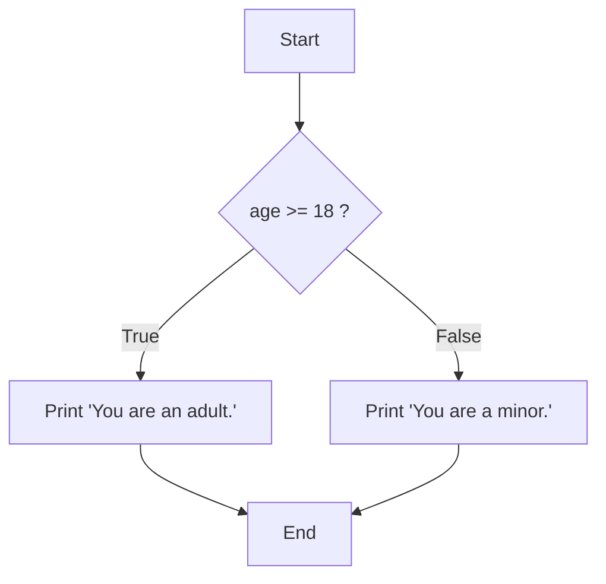

```go
package main

import "fmt"

func main() {
    age := 20

    if age >= 18 {
        fmt.Println("You are an adult.")
    } else {
        fmt.Println("You are a minor.")
    }

    // Statement နှင့်အတူ if ကို အတိုချုံး ရေးသားခြင်း
    // ဤနည်းလမ်းတွင် `num` variable ကို if/else block အတွင်းမှာသာ အသုံးပြုနိုင်သည်
    if num := 9; num < 0 {
        fmt.Println(num, "is negative")
    } else if num < 10 {
        fmt.Println(num, "has 1 digit")
    } else {
        fmt.Println(num, "has multiple digits")
    }
}
```

---

## `switch` Statements

`switch` statement သည် variable တစ်ခု၏ တန်ဖိုးကို `case` များစွာနှင့် နှိုင်းယှဉ်စစ်ဆေးရန် အသုံးပြုသည်။ အခြား language များကဲ့သို့ `break` keyword ကို case တိုင်းတွင် ရေးရန်မလိုပါ။ Go တွင် case တစ်ခုပြီးဆုံးပါက switch မှ အလိုအလျောက် ထွက်ခွာပါသည်။

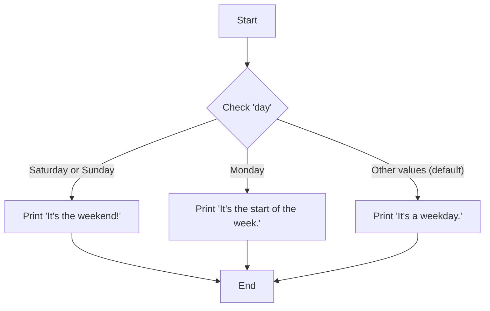

```go
package main

import "fmt"

func main() {
    day := "Monday"

    switch day {
    case "Saturday", "Sunday":
        fmt.Println("It's the weekend!")
    case "Monday":
        fmt.Println("It's the start of the week.")
    default:
        fmt.Println("It's a weekday.")
    }
}
```

---

## `for` Loops

Go တွင် loop အမျိုးအစား တစ်မျိုးတည်းသာရှိပြီး ၎င်းမှာ `for` loop ဖြစ်သည်။ သို့သော် `for` loop ကို ပုံစံအမျိုးမျိုးဖြင့် အသုံးပြုနိုင်ပါသည်။

**1. Classic `for` loop (C-style)**

```go
for i := 0; i < 5; i++ {
    fmt.Println(i)
}
```

**2. `while` loop ကဲ့သို့ အသုံးပြုခြင်း**

```go
n := 0
for n < 5 {
    fmt.Println(n)
    n++
}
```

**3. `for-range` loop (Slices, Maps, Arrays များအတွက်)**

```go
fruits := []string{"Apple", "Banana", "Cherry"}
for index, value := range fruits {
    fmt.Printf("Index: %d, Value: %s\n", index, value)
}

// index သို့မဟုတ် value မလိုအပ်ပါက blank identifier (_) ကို အသုံးပြုနိုင်သည်
for _, value := range fruits {
    fmt.Println("Value:", value)
}
```
# အခန်း ၅: Composite Types - Arrays, Slices, and Maps

ယခုအခန်းတွင် Go ၏ အသုံးအများဆုံး composite data types များဖြစ်သော Arrays, Slices, နှင့် Maps တို့အကြောင်းကို လေ့လာသွားပါမည်။ ဤ data types များသည် data အစုအဝေးများကို စုစည်းသိမ်းဆည်းရန်အတွက် အလွန်အရေးပါပါသည်။

---

## 1. Arrays

Array ဆိုသည်မှာ **data type တစ်မျိုးတည်းကိုသာ** သိမ်းဆည်းနိုင်သော၊ **အရွယ်အစား (size) ပုံသေ** သတ်မှတ်ထားသည့် data collection တစ်ခုဖြစ်သည်။ Array တစ်ခုကို ကြေညာလိုက်သည်နှင့် ၎င်း၏ အရွယ်အစားကို ပြောင်းလဲ၍မရပါ။

Go တွင် Array ကို Slices များလောက် အသုံးမများသော်လည်း၊ Slices ၏ အလုပ်လုပ်ပုံကို နားလည်ရန်အတွက် Array သည် အခြေခံကျပါသည်။

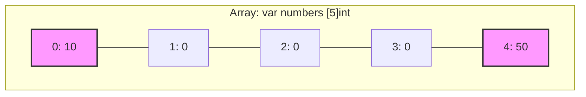

**ဥပမာ Code:**

```go
package main

import "fmt"

func main() {
    // အရွယ်အစား 5 ရှိသော integer array တစ်ခုကို ကြေညာခြင်း
    // ကနဦးတွင် တန်ဖိုးအားလုံးသည် zero-value (int အတွက် 0) ဖြစ်သည်
    var numbers [5]int
    fmt.Println("Initial Array:", numbers) // Output: [0 0 0 0 0]

    // Index ကို အသုံးပြု၍ တန်ဖိုးများ ထည့်သွင်းခြင်း
    numbers[0] = 10
    numbers[4] = 50

    fmt.Println("After assignment:", numbers) // Output: [10 0 0 0 50]
    fmt.Println("Length:", len(numbers))   // Output: 5

    // ကြေညာစဉ် တန်ဖိုးများ တခါတည်းထည့်သွင်းခြင်း
    primes := [3]int{2, 3, 5}
    fmt.Println("Primes Array:", primes) // Output: [2 3 5]
}
```

---

## 2. Slices

Slice သည် Array အပေါ်တွင် တည်ဆောက်ထားသော ပိုမို flexible ဖြစ်ပြီး အစွမ်းထက်သည့် data structure ဖြစ်သည်။ Array ကဲ့သို့ အရွယ်အစား ပုံသေမဟုတ်ဘဲ **dynamic (ပြောင်းလွယ်ပြင်လွယ်)** ဖြစ်သောကြောင့် Go developer များ အသုံးအများဆုံးဖြစ်သည်။

Slice သည် အပိုင်းသုံးပိုင်းဖြင့် ဖွဲ့စည်းထားသည်-
1.  **Pointer:** နောက်ကွယ်ရှိ array (underlying array) ၏ element တစ်ခုကို ညွှန်ပြနေသော pointer။
2.  **Length (`len()`):** Slice ထဲတွင် လက်ရှိရှိနေသော element အရေအတွက်။
3.  **Capacity (`cap()`):** Slice ၏ pointer စတင်ညွှန်ပြသည့်နေရာမှ underlying array ၏ အဆုံးအထိရှိသော element အရေအတွက်။

### Slice, Length, and Capacity

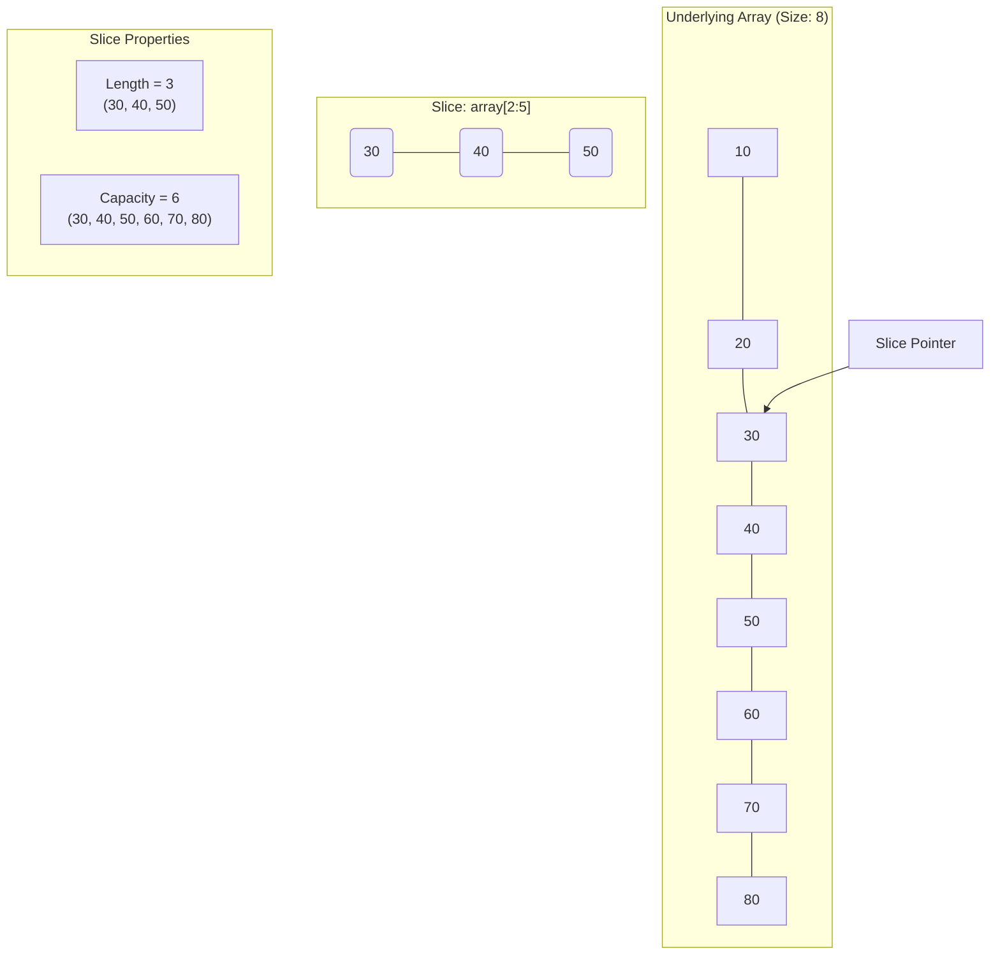

### `append` ဖြင့် Slice ကို Element ထပ်ထည့်ခြင်း

`append` function သည် slice ၏ အရေးကြီးဆုံး အစိတ်အပိုင်းဖြစ်သည်။ ၎င်း၏ အလုပ်လုပ်ပုံကို `capacity` နှင့် ဆက်စပ်၍ နားလည်ရန် အရေးကြီးသည်။

**Case 1: Append within Capacity (Capacity အတွင်း Element ထပ်ထည့်ခြင်း)**

Slice ၏ `length` သည် `capacity` ထက်ငယ်နေသေးလျှင် `append` လုပ်သောအခါ **မူလ underlying array** ၏ နေရာလွတ်တွင်ပင် element အသစ်ကို ထည့်သွင်းသည်။

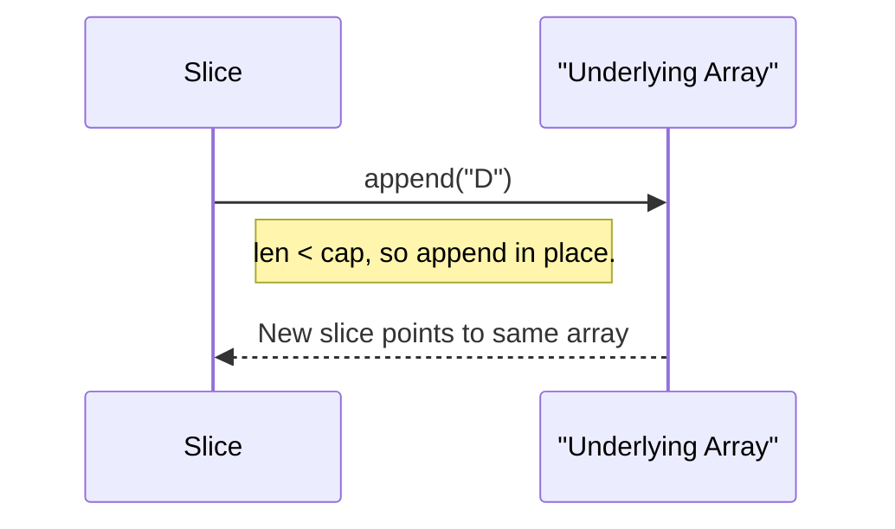

**Case 2: Append exceeding Capacity (Capacity ကျော်လွန်၍ Element ထပ်ထည့်ခြင်း)**

Slice ၏ `length` သည် `capacity` နှင့် တူညီနေချိန်တွင် `append` လုပ်သောအခါ Go runtime သည်-
1.  **Array အသစ်တစ်ခု** (များသောအားဖြင့် လက်ရှိ capacity ၏ နှစ်ဆ) ကို memory တွင် တည်ဆောက်သည်။
2.  Element အဟောင်းများအားလုံးကို array အသစ်သို့ **copy ကူးထည့်သည်**။
3.  Element အသစ်ကို array အသစ်၏ အဆုံးတွင် ထည့်သွင်းသည်။
4.  Slice ၏ pointer ကို **array အသစ်ဆီသို့** ပြောင်းလဲ ညွှန်ပြစေသည်။

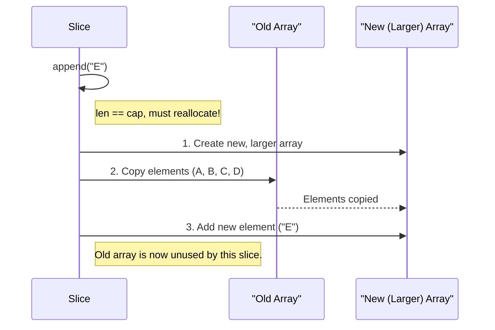

**ဥပမာ Code (Length & Capacity):**

```go
package main

import "fmt"

func main() {
    // 1. Underlying array တစ်ခု ဖန်တီးခြင်း
    numbersArray := [6]int{10, 20, 30, 40, 50, 60}
    fmt.Println("Underlying Array:", numbersArray)

    // 2. Array မှ slice တစ်ခု ဖန်တီးခြင်း (index 2 မှ 4 မတိုင်ခင်အထိ)
    mySlice := numbersArray[2:4] // [30, 40]
    
    fmt.Printf("Slice: %v, Length: %d, Capacity: %d", mySlice, len(mySlice), cap(mySlice))
    // Capacity: index 2 မှ array အဆုံးထိ ရေတွက်မည် (30, 40, 50, 60) -> 4 ခု

    // 3. Append within Capacity
    mySlice = append(mySlice, 70)
    fmt.Println("
--- After appending 70 (within capacity) ---")
    fmt.Printf("Slice: %v, Length: %d, Capacity: %d
", mySlice, len(mySlice), cap(mySlice))
    // Underlying array ပါ ပြောင်းလဲသွားသည်ကို သတိပြုပါ
    fmt.Println("Underlying Array is now:", numbersArray) // Output: [10 20 30 40 70 60]

    // 4. Append exceeding Capacity
    // လက်ရှိ cap = 4, len = 3 ဖြစ်နေသေးသည်
    mySlice = append(mySlice, 80) // cap ပြည့်သွားပြီ
    mySlice = append(mySlice, 90) // cap ကျော်လွန်သွားပြီ
    
    fmt.Println("
--- After appending 80 and 90 (exceeding capacity) ---")
    // Go က array အသစ်တစ်ခု (size 8) ကို တည်ဆောက်ပြီး data တွေ copy ကူးထည့်ပါမည်။
    fmt.Printf("Slice: %v, Length: %d, Capacity: %d
", mySlice, len(mySlice), cap(mySlice))
    
    // array အသစ်ကို ညွှန်းဆိုသွားသောကြောင့် မူလ array ကို ထိခိုက်တော့မည် မဟုတ်ပါ။
    fmt.Println("Underlying Array remains unchanged:", numbersArray)
}
```

---

## 3. Maps

Map ဆိုသည်မှာ **key-value pair** များဖြင့် data များကို သိမ်းဆည်းသော **unordered collection** တစ်ခုဖြစ်သည်။ အခြား language များရှိ hash tables သို့မဟုတ် dictionaries များနှင့် ဆင်တူသည်။

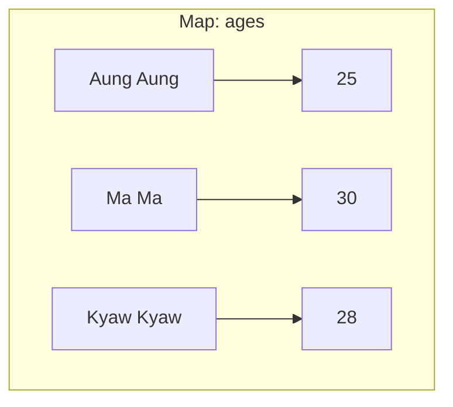

**အရေးကြီးသော အချက်:** Map ထဲမှ data များကို `for...range` loop ဖြင့် ပြန်ထုတ်သည့်အခါ ရရှိလာသော အစီအစဉ်သည် data ထည့်သွင်းခဲ့သည့် အစီအစဉ်အတိုင်း ဖြစ်မည်ဟု **အာမမခံပါ**။ အဘယ်ကြောင့်ဆိုသော် Map သည် hash table ကို အခြေခံထားပြီး performance အတွက် iteration order ကို တမင် random ပြုလုပ်ထားသောကြောင့် ဖြစ်သည်။

**ဥပမာ Code:**

```go
package main

import (
    "fmt"
    "sort"
)

func main() {
    // string key နှင့် int value ရှိသော map တစ်ခုကို ကြေညာပြီး တန်ဖိုးထည့်ခြင်း
    ages := map[string]int{
        "Aung Aung": 25,
        "Ma Ma":     30,
    }
    fmt.Println("Initial Map:", ages)

    // Element တစ်ခုကို ဖျက်ခြင်း
    delete(ages, "Ma Ma")
    fmt.Println("After delete:", ages)

    // Key ရှိမရှိ စစ်ဆေးခြင်း
    // `val` တွင် value ကို ရရှိပြီး `ok` တွင် key ရှိ/မရှိ (true/false) ကို ရရှိမည်
    val, ok := ages["Kyaw Kyaw"]
    if ok {
        fmt.Println("Kyaw Kyaw's age is", val)
    } else {
        fmt.Println("Kyaw Kyaw not found.")
    }

    // --- Map Iteration ---
    testScores := map[string]int{
        "Charlie": 88,
        "Alice":   95,
        "Bob":     72,
    }

    fmt.Println("
Unordered Iteration:")
    // ဤ loop ကို run တိုင်း ရလဒ်အစီအစဉ် ပြောင်းလဲနိုင်သည်
    for name, score := range testScores {
        fmt.Printf("Name: %s, Score: %d", name, score)
    }

    // --- Sorted Iteration (အစီအစဉ်တကျ ပြန်ထုတ်ခြင်း) ---
    // 1. Key များကို slice တစ်ခုထဲ ထည့်ပါ
    var names []string
    for name := range testScores {
        names = append(names, name)
    }
    // 2. Slice ကို sort လုပ်ပါ
    sort.Strings(names)

    fmt.Println("Sorted Iteration:")
    // 3. Sort လုပ်ပြီးသား slice ကို loop ပတ်ပြီး map မှ value များကို ထုတ်ပါ
    for _, name := range names {
        fmt.Printf("Name: %s, Score: %d", name, testScores[name])
    }
}
```# အခန်း ၆: Structs and Methods

ယခုအခန်းတွင် Go ၏ အစွမ်းထက်သော feature တစ်ခုဖြစ်သည့် `struct` နှင့် `method` တို့အကြောင်းကို လေ့လာသွားပါမည်။ Struct သည် data type အမျိုးမျိုးကို စုစည်း၍ ကိုယ်ပိုင် custom data type အသစ်များ တည်ဆောက်ရန် အသုံးပြုပြီး၊ Method များသည် ထို struct များနှင့် သက်ဆိုင်သော လုပ်ဆောင်ချက် (behavior) များကို သတ်မှတ်ပေးပါသည်။

---

## 1. Struct (Custom Data Types)

Struct (structure) ဆိုသည်မှာ data type အမျိုးမျိုးရှိနိုင်သော **fields** (အချက်အလက်များ) ကို စုစည်းထားသည့် collection တစ်ခုဖြစ်သည်။ ဥပမာအားဖြင့်၊ လူတစ်ယောက် (`Person`) ကို ဖော်ပြရန်အတွက် နာမည် (`string`), အသက် (`int`) စသည်တို့ကို `Person` struct တစ်ခုတည်းတွင် စုစည်းထားနိုင်ပါသည်။

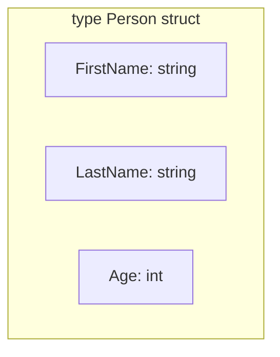

**ဥပမာ Code:**

```go
package main

import "fmt"

// 'Person' အမည်ဖြင့် custom data type အသစ်တစ်ခု တည်ဆောက်ခြင်း
type Person struct {
    FirstName string
    LastName  string
    Age       int
}

func main() {
    // Person struct မှ variable တစ်ခု တည်ဆောက်ခြင်း
    p1 := Person{
        FirstName: "Aung",
        LastName:  "Kyaw",
        Age:       30,
    }

    fmt.Println("Person 1:", p1)
    fmt.Println("First Name:", p1.FirstName) // field ကို dot (.) ဖြင့် ခေါ်သုံးခြင်း

    // field တန်ဖိုးကို ပြောင်းလဲခြင်း
    p1.Age = 31
    fmt.Println("Updated Age:", p1.Age)
}
```

---

## 2. Methods (Struct နှင့် သက်ဆိုင်သော Functions)

Method ဆိုသည်မှာ struct တစ်ခုနှင့် သီးသန့်သက်ဆိုင်သော function တစ်မျိုးဖြစ်သည်။ ၎င်းသည် function ကြေညာရာတွင် `func` keyword နှင့် function name အကြား၌ **"receiver"** ဟုခေါ်သော argument တစ်ခု ပိုမိုပါဝင်သည်။

Receiver အမျိုးအစား နှစ်မျိုးရှိသည်-
1.  **Value Receiver:** Struct ၏ **မိတ္တူ (copy)** ကိုသာ ရရှိသည်။ Method အတွင်း ပြောင်းလဲမှုများသည် မူလ struct ကို **မထိခိုက်ပါ**။
2.  **Pointer Receiver:** Struct ၏ **မူရင်း memory address (pointer)** ကို ရရှိသည်။ Method အတွင်း ပြောင်းလဲမှုများသည် မူလ struct ကို **တိုက်ရိုက် ထိခိုက်ပြောင်းလဲစေသည်**။

### Value Receiver vs. Pointer Receiver

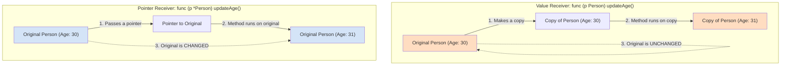

**Pointer Receiver ကို ဘာကြောင့်/ဘယ်အချိန် သုံးသင့်သလဲ?**
1.  **To modify state:** Method အတွင်းမှ struct ၏ မူလတန်ဖိုးများကို ပြောင်းလဲရန် မဖြစ်မနေ သုံးရမည်။
2.  **Efficiency:** Struct အရွယ်အစားကြီးမားပါက data များစွာကို copy ကူးခြင်းမှ ရှောင်ရှားရန် pointer ဖြင့် pass လုပ်ခြင်းက ပိုမိုမြန်ဆန်ပြီး memory သက်သာစေသည်။

**ဥပမာ Code:**

```go
package main

import "fmt"

type Person struct {
    FirstName string
    Age       int
}

// (p Person) -> Value Receiver
func (p Person) Greet() {
    fmt.Printf("Hello, my name is %s and I am %d years old.\n", p.FirstName, p.Age)
    p.Age = 99 // ဤပြောင်းလဲမှုသည် copy ကိုသာ ထိခိုက်ပြီး မူရင်း struct ကို မပြောင်းလဲပါ
}

// (p *Person) -> Pointer Receiver
func (p *Person) SetAge(newAge int) {
    p.Age = newAge
}

func main() {
    p := Person{FirstName: "Su Myat", Age: 25}

    p.Greet()
    fmt.Println("Age after Greet():", p.Age) // Output: 25 (မပြောင်းလဲပါ)

    p.SetAge(26)
    fmt.Println("Age after SetAge():", p.Age) // Output: 26 (ပြောင်းလဲသွားသည်)
}
```

---

## 3. Embedded Structs (Composition)

Go တွင် class inheritance (အမွေဆက်ခံခြင်း) မရှိပါ။ သို့သော် struct တစ်ခုကို အခြား struct တစ်ခုထဲတွင် ထည့်သွင်းခြင်း (**embedding**) ဖြင့် **composition** ကို အားပေးသည်။

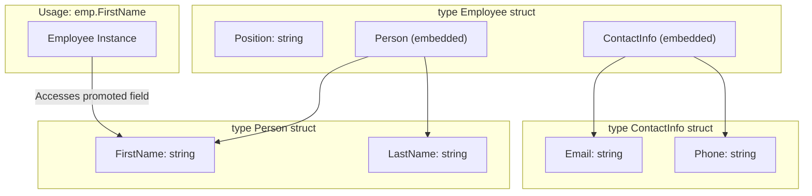

**ဥပမာ Code:**

```go
package main

import "fmt"

type ContactInfo struct {
    Email string
    Phone string
}

type Person struct {
    FirstName string
    LastName  string
}

type Employee struct {
    Position string
    Person      // Person struct ကို embed လုပ်ခြင်း
    ContactInfo // ContactInfo struct ကို embed လုပ်ခြင်း
}

func main() {
    emp := Employee{
        Position: "Software Engineer",
        Person: Person{
            FirstName: "Thura",
            LastName:  "Linn",
        },
        ContactInfo: ContactInfo{
            Email: "thura.linn@example.com",
            Phone: "09123456789",
        },
    }

    fmt.Println("Employee's First Name:", emp.FirstName)
    fmt.Println("Employee's Email:", emp.Email)
    fmt.Println("Full Info:", emp)
}
```# အခန်း ၇: Functions

Function ဆိုသည်မှာ သီးခြားလုပ်ဆောင်ချက်တစ်ခုကို လုပ်ဆောင်ရန်အတွက် စုစည်းရေးသားထားသော code block တစ်ခုဖြစ်သည်။ Functions များသည် code များကို ပြန်လည်အသုံးပြုနိုင်ရန် (reusability)၊ စနစ်တကျခွဲခြားရန် (organization) နှင့် ဖတ်ရှုရလွယ်ကူစေရန် (readability) အတွက် အဓိကကျသော အစိတ်အပိုင်းများ ဖြစ်ကြသည်။

---

## Function ကြေညာခြင်း နှင့် ခေါ်ယူအသုံးပြုခြင်း

Go တွင် function တစ်ခုကို `func` keyword ဖြင့် ကြေညာသည်။ Function တစ်ခုတွင် အမည်၊ parameters (optional)၊ return types (optional) နှင့် code block (body) တို့ ပါဝင်သည်။

```go
package main

import "fmt"

// Parameter မရှိ၊ return value မရှိသော function
func sayHello() {
    fmt.Println("Hello from a function!")
}

func main() {
    // function ကို ခေါ်ယူအသုံးပြုခြင်း
    sayHello()
}
```

---

## Parameters နှင့် Return Values

Functions များသည် တန်ဖိုးများကို input အဖြစ် (parameters) လက်ခံနိုင်ပြီး၊ လုပ်ဆောင်ချက်များ ပြီးဆုံးသောအခါ တန်ဖိုးများကို output အဖြစ် (return values) ပြန်ပေးနိုင်ပါသည်။

```go
package main

import "fmt"

// `a` နှင့် `b` (int type) ကို parameter အဖြစ် လက်ခံပြီး
// `int` type တန်ဖိုးတစ်ခုကို return ပြန်ပေးသော function
func add(a int, b int) int {
    return a + b
}

// Parameter type တွေ တူညီပါက အတို gọn ရေးနိုင်သည်
func subtract(a, b int) int {
    return a - b
}

func main() {
    sum := add(10, 5)
    fmt.Println("Sum:", sum)

    difference := subtract(10, 5)
    fmt.Println("Difference:", difference)
}
```

---

## Multiple Return Values

Go ၏ အစွမ်းထက်သော feature တစ်ခုမှာ function တစ်ခုမှ တန်ဖိုးများစွာကို တစ်ပြိုင်နက်တည်း return ပြန်ပေးနိုင်ခြင်းဖြစ်သည်။ ဤ feature ကို error handling ပြုလုပ်ရာတွင် တွင်ကျယ်စွာ အသုံးပြုလေ့ရှိသည်။ ပုံမှန်အားဖြင့် function သည် ရလဒ် (result) နှင့် error တစ်ခုကို အတူတကွ ပြန်ပေးလေ့ရှိသည်။

```go
package main

import (
    "fmt"
    "errors"
)

// int နှင့် error ကို multiple values အဖြစ် return ပြန်ပေးသည်
func divide(a, b float64) (float64, error) {
    if b == 0 {
        // 0 ဖြင့် စားပါက error message တစ်ခုကို ပြန်ပေးမည်
        return 0, errors.New("cannot divide by zero")
    }
    // အောင်မြင်ပါက ရလဒ်နှင့် nil (error မရှိ) ကို ပြန်ပေးမည်
    return a / b, nil
}

func main() {
    result, err := divide(10.0, 2.0)
    if err != nil {
        fmt.Println("Error:", err)
    } else {
        fmt.Println("Result:", result)
    }

    result, err = divide(10.0, 0)
    if err != nil {
        fmt.Println("Error:", err)
    } else {
        fmt.Println("Result:", result)
    }
}
```

---

## Variadic Functions

Variadic function ဆိုသည်မှာ parameter အရေအတွက် မတူညီဘဲ လက်ခံနိုင်သော function ဖြစ်သည်။ Parameter ၏ type ရှေ့တွင် `...` ထည့်သွင်း၍ ကြေညာသည်။ Function အတွင်းတွင် ထို parameter ကို slice တစ်ခုအနေဖြင့် ရရှိမည်ဖြစ်သည်။

```go
package main

import "fmt"

func sumAll(numbers ...int) int {
    total := 0
    // `numbers` သည် int slice (`[]int`) တစ်ခုဖြစ်သည်
    for _, num := range numbers {
        total += num
    }
    return total
}

func main() {
    fmt.Println(sumAll(1, 2, 3))       // 3 ခု pass လုပ်ခြင်း
    fmt.Println(sumAll(10, 20, 30, 40)) // 4 ခု pass လုပ်ခြင်း

    // Slice တစ်ခုကို pass လုပ်လိုပါက `...` ဖြင့် unpack လုပ်ရမည်
    nums := []int{5, 5, 5}
    fmt.Println(sumAll(nums...))
}
```

---

## Anonymous Functions (Closures)

Anonymous function ဆိုသည်မှာ အမည်မရှိသော function ဖြစ်သည်။ ၎င်းကို variable တစ်ခုတွင် ထည့်သွင်း၍သော်လည်းကောင်း၊ အခြား function တစ်ခု၏ argument အဖြစ် pass လုပ်၍သော်လည်းကောင်း အသုံးပြုနိုင်သည်။

Anonymous function သည် ၎င်း၏ ပတ်ဝန်းကျင် (surrounding scope) မှ variable များကို ရယူသုံးစွဲနိုင်သည့်အခါ ၎င်းကို **closure** ဟုခေါ်သည်။

```go
package main

import "fmt"

func main() {
    // Anonymous function ကို variable တစ်ခုတွင် သိမ်းဆည်းခြင်း
    add := func(a, b int) int {
        return a + b
    }

    fmt.Println("Sum:", add(3, 4))

    // Closure ဥပမာ
    message := "Hello"
    
    // ဤ anonymous function သည် `message` variable ကို ၎င်း၏ scope အပြင်မှ ရယူသုံးစွဲသည်
    greet := func() {
        fmt.Println(message + " from closure!")
    }

    greet()
}
```

### Closure ၏ လက်တွေ့အသုံးဝင်ပုံ: State ကို မှတ်သားထားသော Functions

Closure ၏ အစွမ်းထက်ဆုံး အသုံးဝင်မှုတစ်ခုမှာ "factory" function များ (function များကို return ပြန်ပေးသော function) တည်ဆောက်ခြင်းဖြစ်သည်။ Return ပြန်လိုက်သော function သည် ၎င်းကိုဖန်တီးခဲ့သည့် parent function ပြီးဆုံးသွားသည့်တိုင်အောင် parent function ၏ scope အတွင်းမှ variable များကို "မှတ်သား" ထားပြီး ပြန်လည်ရယူသုံးစွဲနိုင်စွမ်း ရှိသည်။ ဤနည်းလမ်းဖြင့် ကိုယ်ပိုင် private state များကို ထိန်းသိမ်းထားနိုင်သော function များ ဖန်တီးနိုင်ပါသည်။

ဥပမာကောင်းတစ်ခုမှာ တစ်ခုနှင့်တစ်ခုမတူညီသော ID များ ထုတ်ပေးသည့် generator တစ်ခု တည်ဆောက်ခြင်းဖြစ်သည်။

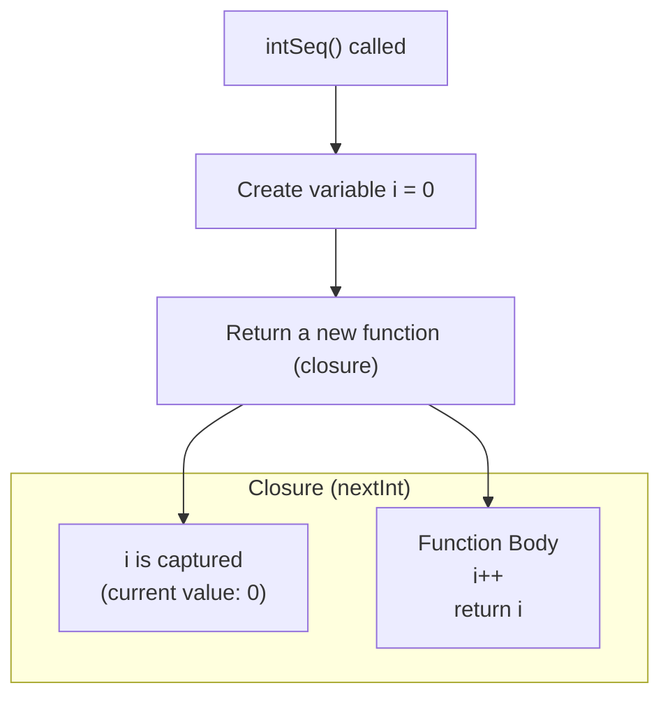
```go
package main

import "fmt"

// intSeq function သည် အခြား function တစ်ခုကို return ပြန်ပေးသည်။
// return ပြန်လိုက်သော anonymous function သည် 'i' variable ကို "closes over" လုပ်ထားသောကြောင့် closure ဖြစ်လာသည်။
func intSeq() func() int {
    i := 0
    return func() int {
        i++
        return i
    }
}

func main() {
    // nextInt သည် ယခုအခါ ကိုယ်ပိုင် 'i' variable တစ်ခုကို ပိုင်ဆိုင်ထားသော function တစ်ခုဖြစ်သွားသည်။
    nextInt := intSeq()

    // nextInt ကို ခေါ်လိုက်တိုင်း ၎င်း၏ 'i' တန်ဖိုးကို တိုးပြီး ပြန်ပေးမည်။
    fmt.Println(nextInt()) // Output: 1
    fmt.Println(nextInt()) // Output: 2
    fmt.Println(nextInt()) // Output: 3

    fmt.Println("---")

    // အသစ်တစ်ခု ထပ်မံဖန်တီးလိုပါက intSeq() ကို ထပ်ခေါ်ရမည်။
    // ၎င်းသည် လုံးဝသီးခြားဖြစ်သော 'i' variable အသစ်တစ်ခုကို ရရှိမည်ဖြစ်သည်။
    newInts := intSeq()
    fmt.Println(newInts()) // Output: 1
}
```

ဤဥပမာတွင် `intSeq()` function ကို ခေါ်လိုက်သောအခါ `i` ဟူသော variable တစ်ခုကို 0 ဖြင့် စတင်ပြီး function တစ်ခုကို return ပြန်ပေးပါသည်။ `nextInt` သည် ထို return ပြန်လာသော function ဖြစ်ပြီး ၎င်းသည် `i` ကို မှတ်သားထားသည်။ `nextInt()` ကို ခေါ်လိုက်တိုင်း မှတ်သားထားသော `i` ၏ တန်ဖိုးကို တိုးခြင်း၊ ပြန်ပေးခြင်းတို့ကို လုပ်ဆောင်သောကြောင့် state ကို ဆက်တိုက် ထိန်းသိမ်းထားနိုင်ခြင်း ဖြစ်သည်။# အခန်း ၈: Pointers

ယခုအခန်းတွင် Go ၏ အရေးကြီးသော concept တစ်ခုဖြစ်သည့် Pointers အကြောင်းကို လေ့လာသွားပါမည်။ Pointer သည် memory address များကို တိုက်ရိုက်ကိုင်တွယ်ရန် အသုံးပြုပြီး၊ function များသို့ data များ pass လုပ်ရာတွင် ပိုမိုထိရောက်စေရန်နှင့် မူလ data များကို ပြောင်းလဲနိုင်ရန်အတွက် အဓိက အသုံးပြုပါသည်။

---

## Pointer ဆိုတာဘာလဲ။ (Memory Address)

Program တစ်ခုတွင် variable တိုင်းသည် ကွန်ပျူတာ၏ memory တွင် နေရာတစ်ခုယူ၍ တန်ဖိုးများကို သိမ်းဆည်းထားပါသည်။ ထို memory နေရာတိုင်းတွင် လိပ်စာ (address) တစ်ခုစီ ရှိပါသည်။

**Pointer** ဆိုသည်မှာ အခြား variable တစ်ခု၏ **memory address** ကို တန်ဖိုးအနေဖြင့် သိမ်းဆည်းထားသော variable တစ်မျိုးဖြစ်သည်။

ဥပမာ၊ `name` ဆိုသော variable တွင် `"Go Language"` ဟူသော တန်ဖိုးရှိပြီး ၎င်းသည် memory address `0x1040a124` တွင် ရှိနေသည်ဆိုပါစို့။ `p` ဟူသော pointer တစ်ခုသည် `name` ၏ တန်ဖိုး `"Go Language"` ကို တိုက်ရိုက်သိမ်းဆည်းခြင်းမဟုတ်ဘဲ၊ `name` ၏ memory address ဖြစ်သော `0x1040a124` ကို သိမ်းဆည်းထားပါသည်။

ဤဆက်စပ်မှုကို အောက်ပါပုံဖြင့် ပိုမိုရှင်းလင်းစွာ မြင်နိုင်ပါသည်။

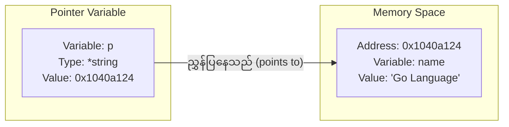

Pointer type ကို ကြေညာရာတွင် ၎င်းညွှန်ပြမည့် variable ၏ type ရှေ့တွင် `*` သင်္ကေတကို ထည့်သွင်းရေးသားရသည်။ ဥပမာ၊ `int` variable တစ်ခုကို ညွှန်ပြမည့် pointer ၏ type မှာ `*int` ဖြစ်သည်။

---

## `&` (address of) နှင့် `*` (dereference) Operators

Pointers များနှင့် အလုပ်လုပ်ရာတွင် အဓိကကျသော operator နှစ်ခုမှာ `&` နှင့် `*` ဖြစ်သည်။

*   **`&` (Address of) Operator:** Variable တစ်ခု၏ ရှေ့တွင် `&` ကို ထားရှိပါက ၎င်း variable ၏ memory address ကို ရရှိမည်ဖြစ်သည်။
*   **`*` (Dereferencing) Operator:** Pointer variable တစ်ခု၏ ရှေ့တွင် `*` ကို ထားရှိပါက ၎င်း pointer ညွှန်ပြနေသော memory address ရှိ **တန်ဖိုး (value)** ကို ရရှိမည်ဖြစ်သည်။ ၎င်းကို "dereferencing" ဟုခေါ်သည်။

```go
package main

import "fmt"

func main() {
    // 1. 'name' variable ကို string တန်ဖိုးတစ်ခုဖြင့် ကြေညာခြင်း
    name := "Go Language"
    fmt.Println("Original value of name:", name)

    // 2. 'name' variable ၏ memory address ကို ရယူပြီး 'p' pointer ထဲသို့ ထည့်ခြင်း
    var p *string = &name
    
    fmt.Println("Memory address of name (&name):", &name)
    fmt.Println("Value of pointer p (address):", p)

    // 3. Pointer 'p' ကို dereference လုပ်ပြီး ၎င်းညွှန်ပြနေသော တန်ဖိုးကို ရယူခြင်း
    fmt.Println("Value at address p (*p):", *p)

    // 4. Pointer မှတစ်ဆင့် မူလ variable ၏ တန်ဖိုးကို ပြောင်းလဲခြင်း
    *p = "Golang"
    fmt.Println("Value of name after modification via pointer:", name)
}
```

---

## Pointer ကို ဘာကြောင့် သုံးသင့်သလဲ။

Pointer ကို အသုံးပြုရခြင်း၏ အဓိက အကြောင်းရင်းနှစ်ခုမှာ-

**1. Function များအတွင်းမှ မူလ Variable ၏ တန်ဖိုးကို ပြောင်းလဲရန်**

Go တွင် function တစ်ခုသို့ variable တစ်ခုကို pass လုပ်သည့်အခါ ၎င်း variable ၏ copy တစ်ခုကိုသာ pass လုပ်ခြင်းဖြစ်သည် (pass-by-value)။ ထို့ကြောင့် function အတွင်းတွင် ထို variable ကို ပြောင်းလဲလိုက်သော်လည်း မူလ variable ပြောင်းလဲသွားမည်မဟုတ်ပါ။

မူလ variable ကို ပြောင်းလဲလိုပါက ၎င်း variable ၏ pointer ကို function သို့ pass လုပ်ရမည်။

```go
package main

import "fmt"

// value ကို pass လုပ်ခြင်း (copy တစ်ခုသာ ရောက်ရှိသည်)
func changeValue(val int) {
    val = 100
}

// pointer ကို pass လုပ်ခြင်း (memory address ကို ရောက်ရှိသည်)
func changeValueByPointer(ptr *int) {
    *ptr = 100
}

func main() {
    x := 10
    changeValue(x)
    fmt.Println("Value of x after changeValue:", x) // 10 (မပြောင်းလဲ)

    y := 10
    changeValueByPointer(&y)
    fmt.Println("Value of y after changeValueByPointer:", y) // 100 (ပြောင်းလဲသွားသည်)
}
```

**2. Performance နှင့် Efficiency**

Struct ကဲ့သို့သော data structure ကြီးများကို function သို့ pass လုပ်သည့်အခါ value ဖြင့် pass လုပ်ပါက data အားလုံးကို copy ကူးရသောကြောင့် memory နှင့် အချိန် ပိုမိုကုန်ကျစေသည်။ Pointer ဖြင့် pass လုပ်ပါက memory address (များသောအားဖြင့် 8 bytes) ကိုသာ copy ကူးရသောကြောင့် ပိုမိုမြန်ဆန်ပြီး ထိရောက်မှုရှိပါသည်။ ဤသည်မှာ အခန်း ၆ တွင် လေ့လာခဲ့သော pointer receivers များ၏ အလုပ်လုပ်ပုံနှင့် တူညီပါသည်။

**Pointer ၏ Zero Value**

Pointer တစ်ခု၏ zero value (တန်ဖိုးမထည့်သွင်းရသေးခင် default တန်ဖိုး) မှာ `nil` ဖြစ်သည်။ `nil` pointer ဆိုသည်မှာ မည်သည့် memory address ကိုမှ ညွှန်ပြမထားသော pointer ဖြစ်သည်။

---

### Nil Pointer Dereference (အမှားများနှင့် ကာကွယ်ခြင်း)

`nil` pointer ဆိုသည်မှာ မည်သည့် memory address ကိုမှ ညွှန်ပြမထားသော pointer ဖြစ်သည်။

`nil` pointer တစ်ခုကို dereference လုပ်ရန် ကြိုးစားခြင်း (ဥပမာ `*p` ဟုရေးခြင်း) သည် Go တွင် အဖြစ်များသော runtime error တစ်ခုဖြစ်ပြီး၊ ၎င်းသည် program ကိုချက်ချင်းရပ်တန့်သွားစေသော **panic** ကို ဖြစ်စေပါသည်။

**အဘယ်ကြောင့် panic ဖြစ်ရသနည်း။**
`nil` pointer သည် မည်သည့် memory location ကိုမှ ညွှန်ပြမထားသောကြောင့် ၎င်းညွှန်ပြရာနေရာရှိ တန်ဖိုးကို ရယူရန် ကြိုးစားခြင်းသည် အဓိပ္ပာယ်မရှိသော လုပ်ဆောင်ချက်ဖြစ်သောကြောင့် program က `invalid memory address or nil pointer dereference` ဟူသော panic message ဖြင့် crash ဖြစ်သွားပါသည်။

```go
package main

import "fmt"

func main() {
    var p *int // p သည် nil ဖြစ်နေသည်

    // nil pointer ကို dereference မလုပ်မီ အမြဲတမ်းစစ်ဆေးသင့်သည်
    if p != nil {
        fmt.Println("Value of p:", *p)
    } else {
        fmt.Println("p is a nil pointer, cannot dereference.")
    }

    // အောက်ပါ code line သည် panic ကို ဖြစ်စေပါမည်။ uncomment လုပ်ပြီး run ကြည့်နိုင်ပါသည်။
    // fmt.Println(*p) 
    // panic: runtime error: invalid memory address or nil pointer dereference
}
```

**အကောင်းဆုံး လိုက်နာရန် (Best Practice):** Pointer တစ်ခုကို dereference မလုပ်မီ၊ ၎င်းသည် `nil` မဟုတ်ကြောင်း အမြဲတမ်း `if p != nil` ဖြင့် စစ်ဆေးခြင်းသည် program crash ဖြစ်ခြင်းမှ ကာကွယ်ပေးနိုင်သော အလေ့အကျင့်ကောင်းတစ်ခု ဖြစ်သည်။# အခန်း ၉: Interfaces

ယခုအခန်းတွင် Go ၏ အလွန်အရေးပါပြီး အစွမ်းထက်သော feature တစ်ခုဖြစ်သည့် `interface` အကြောင်းကို လေ့လာသွားပါမည်။ Interface သည် code များကို ပိုမို flexible, reusable, နှင့် decoupled ဖြစ်စေရန်အတွက် အဓိကကျသော concept တစ်ခုဖြစ်သည်။

---

## Interface ဆိုတာဘာလဲ။

Go တွင် Interface ဆိုသည်မှာ method signatures (method အမည်၊ parameters, return types) များ၏ စုစည်းမှုတစ်ခုကို သတ်မှတ်ထားသော abstract type တစ်ခုဖြစ်သည်။ Interface သည် "ဘာတွေလုပ်ဆောင်နိုင်ရမည်" (`what it can do`) ဆိုသည့် **behavior (အပြုအမူ)** ကိုသာ သတ်မှတ်ပြီး၊ "ဘယ်လိုလုပ်ဆောင်ရမည်" (`how it does it`) ဆိုသည့် implementation ကို မသတ်မှတ်ပါ။

Struct တစ်ခု သို့မဟုတ် အခြား type တစ်ခုက interface တွင် သတ်မှတ်ထားသော method များအားလုံးကို implement လုပ်ထားပါက၊ ထို type သည် ထို interface ကို "satisfy" လုပ်သည် (သို့မဟုတ် implement လုပ်သည်) ဟုခေါ်ဆိုနိုင်ပါသည်။ အခြား language များကဲ့သို့ `implements` keyword ကို တိတိကျကျ ရေးသားရန်မလိုဘဲ Go compiler က အလိုအလျောက် သိရှိပါသည်။

```go
package main

import (
    "fmt"
    "math"
)

// Shape interface သည် Area() 라는 method တစ်ခုရှိရမည်ဟု သတ်မှတ်သည်
type Shape interface {
    Area() float64
}

// Rectangle struct
type Rectangle struct {
    Width  float64
    Height float64
}

// Rectangle အတွက် Area() method ကို implement လုပ်ခြင်း
// ဤ method ရှိသောကြောင့် Rectangle သည် Shape interface ကို satisfy လုပ်သည်
func (r Rectangle) Area() float64 {
    return r.Width * r.Height
}

// Circle struct
type Circle struct {
    Radius float64
}

// Circle အတွက် Area() method ကို implement လုပ်ခြင်း
// ဤ method ရှိသောကြောင့် Circle သည် Shape interface ကို satisfy လုပ်သည်
func (c Circle) Area() float64 {
    return math.Pi * c.Radius * c.Radius
}

func main() {
    rect := Rectangle{Width: 10, Height: 5}
    circ := Circle{Radius: 7}

    // rect နှင့် circ တို့သည် Shape interface ကို implement လုပ်ထားသည်
    fmt.Printf("Rectangle Area: %f\n", rect.Area())
    fmt.Printf("Circle Area: %f\n", circ.Area())
}
```

---

## Polymorphism ကို Interfaces ဖြင့် အကောင်အထည်ဖော်ခြင်း

Interface ၏ အဓိကအသုံးဝင်မှုမှာ polymorphism ကို အကောင်အထည်ဖော်နိုင်ခြင်းဖြစ်သည်။ Polymorphism ဆိုသည်မှာ code တစ်ခုတည်းက မတူညီသော data types များစွာနှင့် အလုပ်လုပ်နိုင်စွမ်းရှိခြင်း ဖြစ်သည်။

Function တစ်ခု၏ parameter ကို interface type ဖြင့် သတ်မှတ်ထားပါက၊ ထို interface ကို satisfy လုပ်သော မည်သည့် concrete type (struct) ကိုမဆို ထို function သို့ pass လုပ်နိုင်ပါသည်။

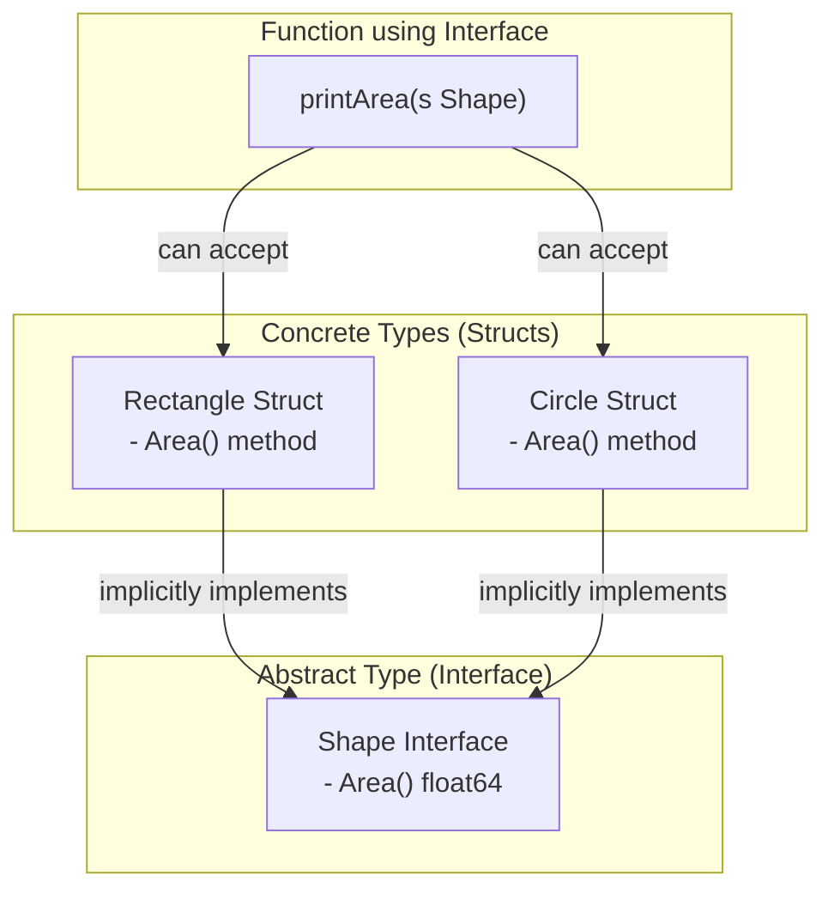

အောက်ပါ code တွင် `printArea` function သည် `Shape` interface ကို parameter အဖြစ် လက်ခံသည်။ ထို့ကြောင့် `Rectangle` နှင့် `Circle` နှစ်မျိုးလုံးကို ၎င်းထံသို့ pass လုပ်နိုင်ပါသည်။

```go
// ... (အပေါ်မှ struct နှင့် method definitions များ ဆက်လက်ပါဝင်သည်)

// ဤ function သည် Shape interface ကို satisfy လုပ်သော မည်သည့် type ကိုမဆို လက်ခံနိုင်သည်
func printArea(s Shape) {
    fmt.Printf("The area of the shape is %f\n", s.Area())
}

func main() {
    rect := Rectangle{Width: 10, Height: 5}
    circ := Circle{Radius: 7}

    printArea(rect)
    printArea(circ)
}
```

---

## Empty Interface (`interface{}`)

Empty interface (`interface{}`) ဆိုသည်မှာ method တစ်ခုမှ မပါဝင်သော interface ဖြစ်သည်။ ၎င်းတွင် method မည်မျှမှ မသတ်မှတ်ထားသောကြောင့် Go ရှိ **မည်သည့် data type မဆို** empty interface ကို အလိုအလျောက် satisfy လုပ်ပါသည်။

၎င်းကို data type ကြိုတင်မသိနိုင်သော တန်ဖိုးများကို ကိုင်တွယ်ရန် အသုံးပြုသည်။ ဥပမာ၊ `int`, `string`, `bool`, `struct` စသည်ဖြင့် မည်သည့် type မဆို ဖြစ်နိုင်သည်။

### Type Assertion

Empty interface ထဲသို့ ထည့်လိုက်သော တန်ဖိုးသည် ၎င်း၏ မူလ type အချက်အလက် ပျောက်ဆုံးသွားသည်။ ထိုတန်ဖိုးကို ပြန်လည်အသုံးပြုရန်အတွက် ၎င်း၏ မူလ concrete type သို့ ပြန်လည်ပြောင်းလဲရန် လိုအပ်သည်။ ဤသို့ ပြောင်းလဲခြင်းကို **type assertion** ဟုခေါ်သည်။

Type assertion ကို `i.(T)` syntax ဖြင့် ပြုလုပ်သည်။ `i` သည် interface variable ဖြစ်ပြီး `T` သည် ပြောင်းလဲလိုသော type ဖြစ်သည်။

```go
package main

import "fmt"

func describe(i interface{}) {
    fmt.Printf("Value: %v, Type: %T\n", i, i)

    // Safe type assertion
    // `s` တွင် တန်ဖိုးကို ရရှိပြီး `ok` တွင် ပြောင်းလဲမှု အောင်မြင်/မအောင်မြင် (true/false) ကို ရရှိမည်
    s, ok := i.(string)
    if ok {
        fmt.Println("This is a string with length", len(s))
    }

    // `switch` ဖြင့် type assertion ပြုလုပ်ခြင်းက ပိုမိုရှင်းလင်းသည်
    switch v := i.(type) {
    case int:
        fmt.Println("This is an integer, and its value is", v)
    case string:
        fmt.Println("This is a string, and its value is", v)
    default:
        fmt.Println("Unknown type!")
    }
    fmt.Println("---")
}

func main() {
    describe(42)
    describe("hello")
    describe(true)
}
```

---

## Interface ၏ လက်တွေ့အသုံးဝင်ပုံ: Database Drivers

Interface ၏ အစွမ်းထက်ပုံကို အကောင်းဆုံးမြင်နိုင်သော လက်တွေ့ဥပမာမှာ Go ၏ standard `database/sql` package ဖြစ်သည်။

**ပြဿနာ:** ကျွန်ုပ်တို့၏ application သည် MySQL, PostgreSQL, SQLite ကဲ့သို့သော မတူညီသည့် database များစွာနှင့် ချိတ်ဆက်ရန် လိုအပ်နိုင်သည်။ Database တစ်ခုချင်းစီအတွက် code များကို သီးခြားစီ ရေးသားမည်ဆိုပါက code များ ထပ်တူညီပြီး ပြုပြင်ထိန်းသိမ်းရန် အလွန်ခက်ခဲသွားပါမည်။

**Interface ဖြင့် ဖြေရှင်းခြင်း:**
`database/sql` package သည် database နှင့် ဆက်သွယ်ရန်အတွက် `sql.Driver`, `sql.Conn` ကဲ့သို့သော interface များကို **သတ်မှတ်ပေးထားသည်**။ သို့သော် ၎င်းသည် MySQL သို့မဟုတ် PostgreSQL နှင့် မည်သို့ချိတ်ဆက်ရမည်ကို **implement မလုပ်ပါ**။

ထိုအစား၊ third-party driver developer များ (ဥပမာ- `go-sql-driver/mysql`) က ထို `sql.Driver` interface ကို သူတို့၏ database အတွက် implement လုပ်ထားသော concrete type များကို ရေးသားပေးပါသည်။

ကျွန်ုပ်တို့၏ application code သည် `database/sql` package ၏ functions (ဥပမာ- `sql.Open()`, `db.Query()`) များကိုသာ ခေါ်ယူသုံးစွဲပြီး၊ နောက်ကွယ်တွင် `database/sql` package က သက်ဆိုင်ရာ driver ၏ implementation ကို interface မှတစ်ဆင့် ခေါ်ယူသုံးစွဲပေးပါသည်။

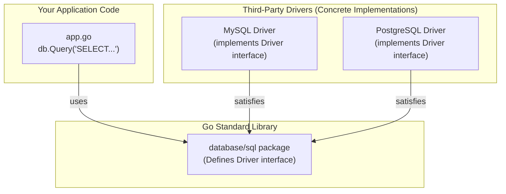

**အကျိုးကျေးဇူး:** ကျွန်ုပ်တို့၏ application code သည် database အမျိုးအစားကို တိုက်ရိုက်သိရန်မလိုဘဲ (database-agnostic)၊ `database/sql` interface ကိုသာ သိရန်လိုအပ်သည်။ ထို့ကြောင့် နောင်တွင် MySQL မှ PostgreSQL သို့ ပြောင်းလဲလိုပါက driver import နှင့် connection string ကိုသာ ပြောင်းလဲရန်လိုအပ်ပြီး application ၏ core logic (e.g., `db.Query(...)`) ကို လုံးဝပြောင်းလဲရန် မလိုအပ်တော့ပါ။

**ဥပမာ Code:**

```go
package main

import (
	"database/sql"
	"fmt"

	// Driver များကို ၎င်းတို့၏ side effect (registering) အတွက် import လုပ်သည်
	// `_` ကို အသုံးပြုခြင်းမှာ driver variable များကို တိုက်ရိုက်အသုံးမပြုသောကြောင့်ဖြစ်သည်
	_ "github.com/go-sql-driver/mysql"
	_ "github.com/lib/pq"
)

// getUsers function သည် database-agnostic ဖြစ်သည်
// ၎င်းသည် *sql.DB ကိုသာ သိပြီး MySQL လား PostgreSQL လား မသိပါ
func getUsers(db *sql.DB) {
	rows, err := db.Query("SELECT id, name FROM users LIMIT 2")
	if err != nil {
		panic(err)
	}
	defer rows.Close()
	fmt.Println("Successfully queried users.")
}

func main() {
	// ဤသည်မှာ conceptual example ဖြစ်သည်
	// MySQL database နှင့် ချိတ်ဆက်ခြင်း
	mysqlDB, err := sql.Open("mysql", "user:password@tcp(127.0.0.1:3306)/hello")
	if err == nil {
		getUsers(mysqlDB)
		mysqlDB.Close()
	}

	// PostgreSQL database နှင့် ချိတ်ဆက်ခြင်း
	postgresDB, err := sql.Open("postgres", "user=pqgotest dbname=pqgotest sslmode=disable")
	if err == nil {
		getUsers(postgresDB) // တူညီသော function ကို ပြန်လည်အသုံးပြုနိုင်သည်
		postgresDB.Close()
	}
}
```# အခန်း ၁၀: Packages နှင့် Modules

ယခုအခန်းတွင် Go project များကို စနစ်တကျ တည်ဆောက်ရန်နှင့် code များကို ပြန်လည်အသုံးပြုရန်အတွက် အခြေခံကျသော Packages နှင့် Modules များအကြောင်းကို လေ့လာသွားပါမည်။

---

## Package ဆိုတာဘာလဲ။

Go တွင် **Package** ဆိုသည်မှာ code များကို စုစည်းရန်နှင့် organize လုပ်ရန်အတွက် အသုံးပြုသော mechanism တစ်ခုဖြစ်သည်။ ရိုးရှင်းစွာဆိုရလျှင်၊ directory တစ်ခုအတွင်းရှိ Go source file များအားလုံးသည် package တစ်ခုတည်းကို ဖွဲ့စည်းထားသည်။

*   Directory တစ်ခုတည်းရှိ file အားလုံးသည် package name တူညီရမည်။
*   Package name ကို source file တိုင်း၏ ထိပ်ဆုံးတွင် `package <name>` ဟု ကြေညာရသည်။
*   Executable program များအတွက် package name သည် `main` ဖြစ်ရမည်။ အခြား library package များအတွက် directory name နှင့် တူညီသော package name ကို အသုံးပြုလေ့ရှိသည်။

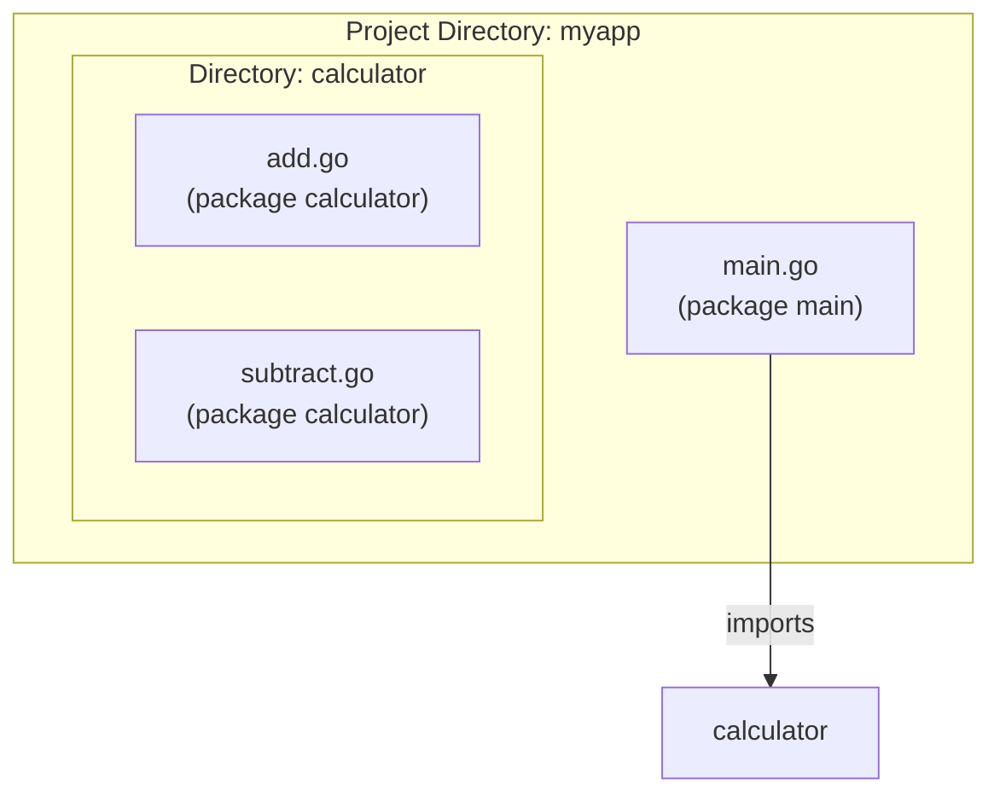

---

## Standard Library မှ Packages များကို `import` လုပ်ခြင်း

Go တွင် အသုံးဝင်သော functions နှင့် types များစွာပါဝင်သည့် standard library တစ်ခု ပါရှိသည်။ ဤ packages များကို အသုံးပြုရန် `import` keyword ကို အသုံးပြုရသည်။

```go
package main

// Multiple packages များကို import လုပ်ခြင်း
import (
    "fmt"
    "math"
    "strings"
)

func main() {
    fmt.Println("Pi is roughly", math.Pi)
    fmt.Println(strings.ToUpper("hello world"))
}
```

### Import Aliases နှင့် Blank Imports

*   **Alias:** Package name တူညီနေပါက သို့မဟုတ် ပိုတိုသော নামဖြင့် ခေါ်လိုပါက alias သတ်မှတ်နိုင်သည်။
    ```go
    import f "fmt" // "fmt" အစား "f" ဖြင့် ခေါ်နိုင်သည်
    ```
*   **Blank Identifier (`_`):** Package ကို တိုက်ရိုက်အသုံးမပြုသော်လည်း ၎င်း၏ side-effects (ဥပမာ- `init` function ကို run စေခြင်း) အတွက်သာ import လုပ်လိုပါက blank identifier `_` ကို အသုံးပြုသည်။ Database drivers များကို import လုပ်ရာတွင် ဤပုံစံကို တွေ့ရလေ့ရှိသည်။
    ```go
    import _ "github.com/go-sql-driver/mysql"
    ```

---

## ကိုယ်ပိုင် Package များ တည်ဆောက်ခြင်း

Project ကြီးမားလာသည်နှင့်အမျှ code များကို သက်ဆိုင်ရာ package များအဖြစ် ခွဲထုတ်ရန် လိုအပ်လာသည်။

### Exported vs. Unexported Names

Go တွင် package တစ်ခုမှ အခြား package တစ်ခုက ခေါ်ယူသုံးစွဲနိုင်ရန်အတွက် ထိုအရာ (variable, function, struct, etc.) ၏ အမည်ကို **စာလုံးအကြီး (uppercase letter)** ဖြင့် စတင်ရမည်။ ၎င်းကို "exported" ဟုခေါ်သည်။

အမည်ကို **စာလုံးအသေး (lowercase letter)** ဖြင့် စတင်ပါက ၎င်းကို package အတွင်းမှာသာ အသုံးပြုနိုင်ပြီး အခြား package များမှ ခေါ်ယူသုံးစွဲနိုင်မည် မဟုတ်ပါ။ ၎င်းကို "unexported" ဟုခေါ်သည်။

### ဥပမာ: `calculator` package တည်ဆောက်ခြင်း

**Project File Structure:**

```
myproject/
├── go.mod
├── main.go
└── calculator/
    └── calc.go
```

**1. `calculator/calc.go` (Library Package)**

```go
package calculator

// 'Add' function သည် စာလုံးအကြီးဖြင့် စသောကြောင့် exported ဖြစ်သည်
func Add(a, b int) int {
    return a + b
}

// 'secretValue' သည် စာလုံးအသေးဖြင့် စသောကြောင့် unexported ဖြစ်သည်
var secretValue = 123
```

**2. `main.go` (Executable Package)**

```go
package main

import (
    "fmt"
    "myproject/calculator" // ကိုယ်ပိုင် package ကို import လုပ်ခြင်း
)

func main() {
    sum := calculator.Add(10, 5)
    fmt.Println("The sum is:", sum)

    // အောက်ပါ code line သည် compile error ဖြစ်စေပါမည်
    // အဘယ်ကြောင့်ဆိုသော် 'secretValue' သည် unexported ဖြစ်သောကြောင့် main package မှ ခေါ်ယူသုံးစွဲ၍မရပါ
    // fmt.Println(calculator.secretValue)
}
```

---

## Go Modules ကို အသုံးပြု၍ Dependencies များကို စီမံခန့်ခွဲခြင်း

**Go Modules** သည် Go project များ၏ dependencies (အခြား packages များအပေါ် မှီခိုမှု) များကို စီမံခန့်ခွဲသည့် စနစ်ဖြစ်သည်။ Project တစ်ခုကို module အဖြစ် သတ်မှတ်လိုက်သည်နှင့် Go က လိုအပ်သော packages များကို download လုပ်ခြင်း၊ version များကို မှတ်သားခြင်းတို့ကို အလိုအလျောက် ပြုလုပ်ပေးသည်။

### အဓိက Commands များ

*   **`go mod init <module-path>`**
    *   Project directory တွင် module အသစ်တစ်ခု စတင်ရန် အသုံးပြုသည်။ `module-path` သည် များသောအားဖြင့် GitHub repository path (e.g., `github.com/your-user/myproject`) ဖြစ်သည်။
    *   ဤ command သည် `go.mod` file ကို ဖန်တီးပေးသည်။

    ```sh
    # ဥပမာ
    go mod init github.com/aung/myproject
    ```

*   **`go get <package-path>`**
    *   Third-party package အသစ်တစ်ခုကို download လုပ်ပြီး dependency အဖြစ် `go.mod` file ထဲသို့ ထည့်သွင်းရန် အသုံးပြုသည်။

    ```sh
    # ဥပမာ: gorilla/mux router ကို download လုပ်ခြင်း
    go get github.com/gorilla/mux
    ```

*   **`go mod tidy`**
    *   Source code ထဲရှိ `import` statements များကို စစ်ဆေးပြီး `go.mod` file ကို update လုပ်ပေးသည်။ အသုံးမပြုတော့သော dependencies များကို ဖယ်ရှားပြီး၊ လိုအပ်နေသော dependencies များကို ထည့်သွင်းပေးသည်။

### `go.mod` နှင့် `go.sum` Files

*   **`go.mod` file:**
    *   Module ၏ path ကို သတ်မှတ်သည်။
    *   Project က အသုံးပြုနေသော Go version ကို သတ်မှတ်သည်။
    *   Project ၏ direct နှင့် indirect dependencies အားလုံးနှင့် ၎င်းတို့၏ version များကို စာရင်းပြုစုထားသည်။

    ```
    module github.com/aung/myproject

    go 1.18

    require (
        github.com/gorilla/mux v1.8.0
        github.com/lib/pq v1.10.7
    )
    ```
*   **`go.sum` file:**
    *   Dependency တိုင်း၏ cryptographic checksum (hash) ကို မှတ်သားထားသည်။
    *   `go build` လုပ်သည့်အခါ download လုပ်လာသော package သည် မူလ package အစစ်အမှန်ဖြစ်ကြောင်းနှင့် ကြားဖြတ်ပြောင်းလဲထားခြင်းမရှိကြောင်း ဤ file ဖြင့် တိုက်ဆိုင်စစ်ဆေးသည်။ ၎င်းသည် supply chain attacks များမှ ကာကွယ်ပေးသည်။
# အခန်း ၁၁: Generics

Go 1.18 တွင် စတင်မိတ်ဆက်ခဲ့သော အစွမ်းထက်ဆုံး feature တစ်ခုဖြစ်သည့် **Generics** အကြောင်းကို ဤအခန်းတွင် လေ့လာသွားပါမည်။ Generics သည် ကျွန်ုပ်တို့အား data type မည်သို့ပင်ဖြစ်စေ အလုပ်လုပ်နိုင်သော functions နှင့် data structures များကို ရေးသားနိုင်စေပြီး ကျွန်ုပ်တို့၏ code များကို ပိုမို flexible ဖြစ်စေကာ ပြန်လည်အသုံးပြုရလွယ်ကူစေသည်။

---

## Generic ဆိုတာဘာလဲ။

Generics ဆိုသည်မှာ တိကျသော data type များပေါ်တွင် မမှီခိုဘဲ အလုပ်လုပ်နိုင်သော code များကို ရေးသားနိုင်သည့် နည်းလမ်းတစ်ခုဖြစ်သည်။ Generics မတိုင်မီက၊ သင်သည် `int` များအတွက် function တစ်ခုနှင့် `float64` များအတွက် အလားတူ function တစ်ခု လိုအပ်ပါက၊ function နှစ်ခု သီးသန့် ရေးသားခဲ့ရသည်။ Generics ဖြင့်၊ သင်သည် type အမျိုးမျိုးအတွက် အလုပ်လုပ်နိုင်သော *type parameter* တစ်ခုကို လက်ခံသည့် function တစ်ခုတည်းကို ရေးသားနိုင်သည်။

**Type parameter** ဆိုသည်မှာ function သို့မဟုတ် type ကို အသုံးပြုသည့်အခါ သတ်မှတ်မည့် type အတွက် placeholder တစ်ခုဖြစ်သည်။

---

## Generic Functions

Generic function ဆိုသည်မှာ type parameters တစ်ခု သို့မဟုတ် တစ်ခုထက်ပို၍ ကြေညာထားသော function ဖြစ်သည်။

### ဥပမာ: `PrintSlice` Function

မည်သည့် type မဆိုရှိသော slice ၏ elements များကို print ထုတ်နိုင်သော function တစ်ခု ရေးကြည့်ကြပါစို့။

```go
package main

import "fmt"

// T သည် မည်သည့် type မဆို ဖြစ်နိုင်သော type parameter ဖြစ်သည်။
func PrintSlice[T any](s []T) {
	for _, v := range s {
		fmt.Printf("%v ", v)
	}
	fmt.Println()
}

func main() {
	// integer slice ဖြင့် PrintSlice ကို ခေါ်ယူခြင်း
	intSlice := []int{1, 2, 3, 4}
	fmt.Print("Integer Slice: ")
	PrintSlice(intSlice) // Go သည် T type ကို int အဖြစ် အလိုအလျောက်သိရှိသည်

	// string slice ဖြင့် PrintSlice ကို ခေါ်ယူခြင်း
	stringSlice := []string{"Hello", "World", "Go"}
	fmt.Print("String Slice: ")
	PrintSlice(stringSlice) // Go သည် T type ကို string အဖြစ် အလိုအလျောက်သိရှိသည်
}
```

ဤဥပမာတွင်၊ `[T any]` သည် `T` ဆိုသော type parameter ကို ကြေညာသည်။ `any` keyword သည် `T` ၏ type မည်သို့မဆို ဖြစ်နိုင်သည်ဟု ဆိုလိုသော *constraint* တစ်ခုဖြစ်သည်။ ကျွန်ုပ်တို့ `PrintSlice(intSlice)` ကို ခေါ်သောအခါ၊ Go compiler သည် `T` ကို `int` ဖြစ်သည်ဟု ကောက်ချက်ချသည်။

---

## Generic Types

ကျွန်ုပ်တို့သည် မည်သည့် type နှင့်မဆို အလုပ်လုပ်သော struct သို့မဟုတ် interface ကဲ့သို့သော generic type များကိုလည်း သတ်မှတ်နိုင်သည်။

### ဥပမာ: Generic `Stack` Data Structure

မည်သည့် type ၏ value များကိုမဆို သိမ်းဆည်းနိုင်သော `Stack` တစ်ခုကို တည်ဆောက်ကြည့်ကြပါစို့။

```go
package main

import "fmt"

// Stack သည် T type ရှိသော slice တစ်ခုကို ကိုင်ထားသည်။
type Stack[T any] struct {
	items []T
}

// Push သည် T type ရှိသော item တစ်ခုကို stack သို့ ထည့်ပေးသည်။
func (s *Stack[T]) Push(item T) {
	s.items = append(s.items, item)
}

// Pop သည် stack မှ နောက်ဆုံး item ကို ဖယ်ရှားပြီး ပြန်ပေးသည်။
func (s *Stack[T]) Pop() (T, bool) {
	if len(s.items) == 0 {
		var zero T // T type အတွက် သုညတန်ဖိုး (zero value) ကို ပြန်ပေးသည်
		return zero, false
	}
	lastIndex := len(s.items) - 1
	item := s.items[lastIndex]
	s.items = s.items[:lastIndex]
	return item, true
}

func main() {
	// integer များအတွက် stack တစ်ခု တည်ဆောက်ခြင်း
	intStack := Stack[int]{}
	intStack.Push(10)
	intStack.Push(20)
	val, _ := intStack.Pop()
	fmt.Printf("Popped from intStack: %d\n", val)

	// string များအတွက် stack တစ်ခု တည်ဆောက်ခြင်း
	stringStack := Stack[string]{}
	stringStack.Push("apple")
	stringStack.Push("banana")
	strVal, _ := stringStack.Pop()
	fmt.Printf("Popped from stringStack: %s\n", strVal)
}
```

ဤနေရာတွင်၊ `Stack[T any]` သည် `T` ဆိုသော type parameter ဖြင့် `Stack` struct ကို သတ်မှတ်သည်။ ထို့နောက် `Stack[int]` သို့မဟုတ် `Stack[string]` ကဲ့သို့သော instance များကို ဖန်တီးနိုင်သည်။

---

## Type Constraints

တစ်ခါတစ်ရံတွင်၊ type parameters အဖြစ် အသုံးပြုနိုင်သော type များကို ကန့်သတ်ရန် လိုအပ်သည်။ ဥပမာအားဖြင့်၊ သင်သည် ကိန်းဂဏန်းများပေါ်တွင်သာ အလုပ်လုပ်သော function တစ်ခုကို ရေးလိုပေမည်။ ဤနေရာတွင် **type constraints** များ ဝင်လာပါသည်။

Constraint ဆိုသည်မှာ type parameter အတွက် ခွင့်ပြုထားသော type များ၏ set ကို သတ်မှတ်သည့် interface တစ်ခုဖြစ်သည်။

### ဥပမာ: `SumNumbers` Function

Slice တစ်ခုရှိ value များကို ပေါင်းရန် generic function တစ်ခု ဖန်တီးကြပါစို့၊ သို့သော် integer နှင့် float type များအတွက်သာ ဖြစ်သည်။

```go
package main

import "fmt"

// Number သည် မည်သည့် integer သို့မဟုတ် floating-point type ကိုမဆို ခွင့်ပြုသော constraint တစ်ခုဖြစ်သည်။
type Number interface {
	~int | ~int32 | ~int64 | ~float32 | ~float64
}

// SumNumbers သည် Number constraint နှင့် ကိုက်ညီသော type ၏ elements များပါဝင်သည့်
// slice တစ်ခု၏ value များကို ပေါင်းပေးသည်။
func SumNumbers[T Number](numbers []T) T {
	var sum T
	for _, n := range numbers {
		sum += n
	}
	return sum
}

func main() {
	intSlice := []int{1, 2, 3, 4}
	fmt.Printf("Sum of ints: %d\n", SumNumbers(intSlice))

	floatSlice := []float64{1.1, 2.2, 3.3}
	fmt.Printf("Sum of floats: %f\n", SumNumbers(floatSlice))

	// အောက်ပါ line သည် compile-time error ဖြစ်စေပါလိမ့်မည်
	// အဘယ်ကြောင့်ဆိုသော် string သည် Number constraint ကို မကျေနပ်သောကြောင့်ဖြစ်သည်။
	// stringSlice := []string{"a", "b"}
	// SumNumbers(stringSlice)
}
```

ဤဥပမာတွင်၊ ကျွန်ုပ်တို့သည် အမျိုးမျိုးသော integer နှင့် float type များ ပါဝင်သော `Number` interface ကို သတ်မှတ်သည်။ `~` သင်္ကေတသည် `int` သာမက၊ underlying type မှာ `int` ဖြစ်သော မည်သည့် type (custom type `type MyInt int` ကဲ့သို့) ကိုမဆို ခွင့်ပြုသည်ဟု ဆိုလိုသည်။ `[T Number]` ကို အသုံးပြုခြင်းဖြင့်၊ `SumNumbers` ကို `Number` constraint ၏ အစိတ်အပိုင်းဖြစ်သော type များ၏ slice များဖြင့်သာ ခေါ်ဆိုနိုင်သည်ဟု compiler ကို ပြောပြသည်။
# အခန်း ၁၂: Goroutines

ယခုအခန်းတွင် Go ၏ အကျော်ကြားဆုံးနှင့် အစွမ်းထက်ဆုံး feature ဖြစ်သော concurrency ကို စတင်လေ့လာပါမည်။ Go သည် Goroutines ဟုခေါ်သော အလွန်ပေါ့ပါးသည့် execution unit များကို အသုံးပြု၍ concurrent programming ကို အလွန်လွယ်ကူအောင် ပြုလုပ်ပေးထားသည်။

---

## Concurrency နှင့် Parallelism ကွာခြားချက်

Concurrency နှင့် Parallelism သည် ဆင်တူသယောင်ရှိသော်လည်း အဓိပ္ပာယ် မတူညီပါ။

*   **Concurrency (တစ်ပြိုင်နက်တည်း စီမံခန့်ခွဲခြင်း):** လုပ်ငန်းတာဝန် (tasks) များစွာကို တစ်ချိန်တည်းတွင် စီမံခန့်ခွဲနိုင်စွမ်းရှိခြင်း ဖြစ်သည်။ Task တစ်ခုကို လုပ်ဆောင်နေစဉ် ခေတ္တရပ်နားပြီး အခြား task တစ်ခုကို ပြောင်းလဲလုပ်ဆောင်နိုင်သည်။ ၎င်းသည် **လုပ်ငန်းများကို စီမံခန့်ခွဲသည့် ပုံစံ (structure)** ဖြစ်ပြီး တစ်ပြိုင်နက်တည်း အမှန်တကယ် run နေရန် မလိုအပ်ပါ။

*   **Parallelism (တစ်ပြိုင်နက်တည်း လုပ်ဆောင်ခြင်း):** လုပ်ငန်းတာဝန်များစွာကို တစ်ချိန်တည်းတွင် အမှန်တကယ် **တစ်ပြိုင်နက်တည်း လုပ်ဆောင်ခြင်း** ဖြစ်သည်။ ၎င်းကို multi-core processor များပေါ်တွင်သာ လုပ်ဆောင်နိုင်ပြီး core တစ်ခုချင်းစီက task တစ်ခုစီကို တစ်ချိန်တည်းမှာပင် လုပ်ဆောင်ပါသည်။

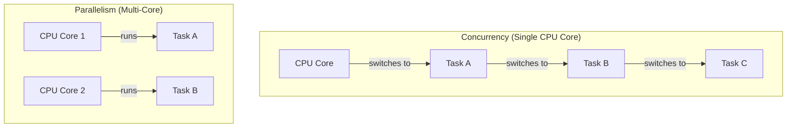

Go သည် concurrency ကို အဓိကထား ဒီဇိုင်းထုတ်ထားပြီး၊ multi-core processor များရှိပါက Go runtime က goroutines များကို cores များပေါ်တွင် parallel အဖြစ် အလိုအလျောက် run ပေးပါသည်။

---

## Goroutine ဆိုတာဘာလဲ။ (`go` keyword)

**Goroutine** ဆိုသည်မှာ Go runtime မှ စီမံခန့်ခွဲသော အလွန်ပေါ့ပါးသည့် thread (lightweight thread) တစ်ခုဖြစ်သည်။ OS thread များနှင့် နှိုင်းယှဉ်ပါက memory အသုံးပြုမှု အလွန်နည်းပါးပြီး (kilobytes အနည်းငယ်သာ)၊ ဖန်တီးရန်နှင့် ဖျက်သိမ်းရန် အလွန်မြန်ဆန်သည်။ ထို့ကြောင့် goroutines ထောင်ပေါင်းများစွာ၊ သိန်းပေါင်းများစွာကို တစ်ပြိုင်နက်တည်း run နိုင်ပါသည်။

Function call တစ်ခု၏ ရှေ့တွင် `go` keyword ကို ထည့်သွင်းလိုက်ရုံဖြင့် goroutine အသစ်တစ်ခုကို အလွယ်တကူ ဖန်တီးနိုင်ပါသည်။

```go
package main

import (
    "fmt"
    "time"
)

func say(s string) {
    for i := 0; i < 3; i++ {
        fmt.Println(s)
        time.Sleep(100 * time.Millisecond)
    }
}

func main() {
    // 'say' function ကို goroutine အသစ်တစ်ခုအနေဖြင့် run မည်
    go say("World")

    // main function (main goroutine) က ဆက်လက် run နေမည်
    say("Hello")
}
```

**ပြဿနာ:** အထက်ပါ code ကို run ကြည့်ပါက "Hello" ကိုသာ print ထုတ်ပြီး "World" ကို print ထုတ်သည်ကို မြင်ရချင်မှ မြင်ရမည်။ အကြောင်းမှာ `main` function (main goroutine) သည် `say("World")` goroutine ပြီးဆုံးသည်ကို **မစောင့်ဘဲ** ၎င်း၏အလုပ် ပြီးဆုံးသွားသည်နှင့် program တစ်ခုလုံးကို ရပ်တန့်လိုက်သောကြောင့် ဖြစ်သည်။

---

## `sync.WaitGroup` ကို အသုံးပြုခြင်း

Goroutines များအားလုံး ပြီးဆုံးသည်အထိ main goroutine ကို စောင့်ဆိုင်းစေရန်အတွက် `sync` package မှ `WaitGroup` ကို အသုံးပြုနိုင်ပါသည်။ `WaitGroup` သည် goroutines အစုအဝေးတစ်ခု ပြီးဆုံးသည်အထိ စောင့်ဆိုင်းရန်အတွက် counter တစ်ခုကို အသုံးပြုသည်။

`WaitGroup` တွင် အဓိက method ၃ ခုရှိသည်:

1.  **`Add(delta int)`:** Counter ကို `delta` တန်ဖိုး만큼 တိုးရန်။ စတင်မည့် goroutine အရေအတွက်ကို သတ်မှတ်ရန် အသုံးပြုသည်။
2.  **`Done()`:** Counter ကို ၁ လျှော့ရန်။ Goroutine တစ်ခု ပြီးဆုံးသည့်အခါ ခေါ်ယူရသည်။
3.  **`Wait()`:** Counter ၏ တန်ဖိုး 0 ဖြစ်သွားသည်အထိ (goroutines အားလုံး `Done()` ခေါ်ပြီးသည်အထိ) program ၏ execution ကို block လုပ်ထားရန် (စောင့်ဆိုင်းရန်)။

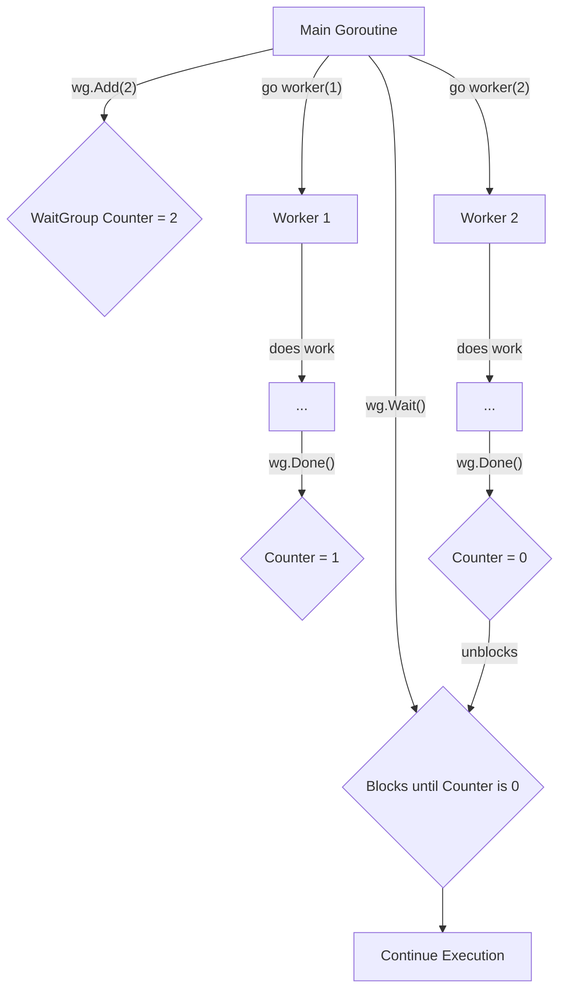

**`WaitGroup` ဖြင့် ပြင်ဆင်ထားသော ဥပမာ:**

```go
package main

import (
    "fmt"
    "sync"
    "time"
)

func worker(id int, wg *sync.WaitGroup) {
    // Goroutine ပြီးဆုံးသည့်အခါ WaitGroup counter ကို လျှော့ရန် defer ဖြင့် ကြိုတင်သတ်မှတ်ထားသည်
    defer wg.Done()

    fmt.Printf("Worker %d starting\n", id)

    // အလုပ်လုပ်နေသည်ကို ပုံဖော်ရန် sleep လုပ်ခြင်း
    time.Sleep(time.Second)
    fmt.Printf("Worker %d done\n", id)
}

func main() {
    // WaitGroup variable တစ်ခု တည်ဆောက်ခြင်း
    var wg sync.WaitGroup

    // Worker goroutines ၃ ခုကို run မည်
    for i := 1; i <= 3; i++ {
        // WaitGroup counter ကို ၁ တိုးသည်
        wg.Add(1)

        // worker function ကို goroutine အဖြစ် run ပြီး WaitGroup pointer ကို pass လုပ်သည်
        go worker(i, &wg)
    }

    // Goroutines အားလုံး ပြီးဆုံးသည်အထိ ဤနေရာတွင် စောင့်ဆိုင်းနေမည်
    wg.Wait()

    fmt.Println("All workers have finished.")
}
```

ဤ code တွင် `main` function သည် `wg.Wait()` နေရာတွင် worker goroutines ၃ ခုလုံး `wg.Done()` ကို ခေါ်ပြီးသည်အထိ စောင့်ဆိုင်းနေမည်ဖြစ်သောကြောင့် worker များအားလုံး၏ output များကို စနစ်တကျ မြင်တွေ့ရမည်ဖြစ်သည်။# အခန်း ၁၃: Channels

ယခင်အခန်းတွင် goroutines များကို အသုံးပြု၍ concurrent tasks များ မည်သို့ run ရမည်ကို လေ့လာခဲ့ပြီးဖြစ်သည်။ ယခုအခန်းတွင် ထို goroutines များ အချင်းချင်း ဘေးကင်းလုံခြုံစွာ ဆက်သွယ်ရန်နှင့် data များ အပြန်အလှန် ပေးပို့ရန်အတွက် Go ၏ အဓိကကျသော feature ဖြစ်သည့် **Channels** အကြောင်းကို လေ့လာသွားပါမည်။

---

## Channel ဆိုတာဘာလဲ။ (Goroutines များကြား ဆက်သွယ်ရေး)

**Channel** ဆိုသည်မှာ goroutines များ အချင်းချင်း data များ ပေးပို့ခြင်း (send) နှင့် လက်ခံခြင်း (receive) ပြုလုပ်နိုင်ရန်အတွက် တည်ဆောက်ထားသော ပိုက်လိုင်း (pipeline) သို့မဟုတ် conduit တစ်ခုဖြစ်သည်။ Channel တိုင်းတွင် သီးခြား data type တစ်ခု သတ်မှတ်ထားပြီး၊ ထို type နှင့် ကိုက်ညီသော data များကိုသာ ပေးပို့ လက်ခံနိုင်ပါသည်။

Go ၏ ဆောင်ပုဒ်မှာ **"Don't communicate by sharing memory; share memory by communicating."** ဖြစ်သည်။ ၎င်းမှာ memory ကို goroutines များစွာက တိုက်ရိုက် access လုပ်ခြင်းထက်၊ channel မှတစ်ဆင့် data များကို ပေးပို့ခြင်းဖြင့် ဆက်သွယ်ခြင်းက ပိုမိုဘေးကင်းပြီး ရိုးရှင်းသည်ဟု ဆိုလိုခြင်းဖြစ်သည်။

### Channel ဖန်တီးခြင်း နှင့် အသုံးပြုခြင်း

Channel ကို `make()` function ဖြင့် ဖန်တီးသည်။ `<-` operator ကို data ပေးပို့ရန်နှင့် လက်ခံရန် အသုံးပြုသည်။

*   `ch <- value`  // `value` ကို channel `ch` ထဲသို့ ပို့သည်
*   `result := <-ch` // channel `ch` မှ data ကို လက်ခံပြီး `result` ထဲသို့ ထည့်သည်

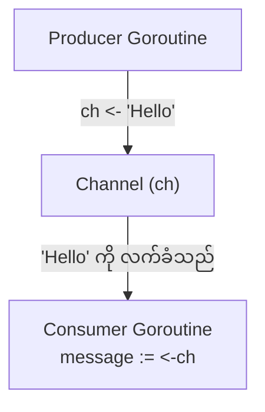

**ဥပမာ:**

```go
package main

import (
    "fmt"
    "time"
)

func producer(ch chan string) {
    fmt.Println("Producer: Sending a message...")
    time.Sleep(2 * time.Second)
    ch <- "Hello from Producer!"
}

func main() {
    // string type data များ သယ်ဆောင်မည့် channel တစ်ခု ဖန်တီးခြင်း
    messages := make(chan string)

    // producer function ကို goroutine အဖြစ် run ခြင်း
    go producer(messages)

    fmt.Println("Main: Waiting for a message...")
    // channel မှ message ရောက်လာသည်အထိ ဤနေရာတွင် block ဖြစ်နေမည် (စောင့်နေမည်)
    msg := <-messages

    fmt.Println("Main: Received message:", msg)
}
```

---

## Buffered vs. Unbuffered Channels

Channels များကို unbuffered နှင့် buffered ဟူ၍ နှစ်မျိုးခွဲခြားနိုင်သည်။

### Unbuffered Channels

`make(chan T)` ဖြင့် capacity မသတ်မှတ်ဘဲ ဖန်တီးသော channel များသည် unbuffered ဖြစ်သည်။

*   **Send Operation:** Sender goroutine သည် channel ထဲသို့ data ပို့သည့်အခါ receiver goroutine က ထို data ကို လက်ခံရန် အသင့်မဖြစ်သေးပါက sender သည် **block** ဖြစ်နေမည် (ရပ်တန့်စောင့်ဆိုင်းနေမည်)။
*   **Receive Operation:** Receiver goroutine သည် channel မှ data လက်ခံရန် ကြိုးစားသည့်အခါ channel ထဲတွင် data မရှိသေးပါက receiver သည် **block** ဖြစ်နေမည်။

Unbuffered channel သည် sender နှင့် receiver ကြားတွင် synchronization (တစ်ပြိုင်တည်း အချိတ်အဆက်မိခြင်း) ကို အာမခံပေးသည်။

### Buffered Channels

`make(chan T, capacity)` ဖြင့် capacity သတ်မှတ်ပြီး ဖန်တီးသော channel များသည် buffered ဖြစ်သည်။

*   **Send Operation:** Channel ၏ buffer မပြည့်မချင်း sender သည် data ပို့ပြီးနောက် block မဖြစ်ဘဲ ဆက်လက်အလုပ်လုပ်နိုင်သည်။ Buffer ပြည့်သွားမှသာ နောက်ထပ် data ပို့သည့်အခါ block ဖြစ်မည်။
*   **Receive Operation:** Channel ၏ buffer ထဲတွင် data ရှိနေသမျှ receiver သည် block မဖြစ်ဘဲ data ကို လက်ခံနိုင်သည်။ Buffer empty ဖြစ်သွားမှသာ နောက်ထပ် data လက်ခံရန် ကြိုးစားသည့်အခါ block ဖြစ်မည်။

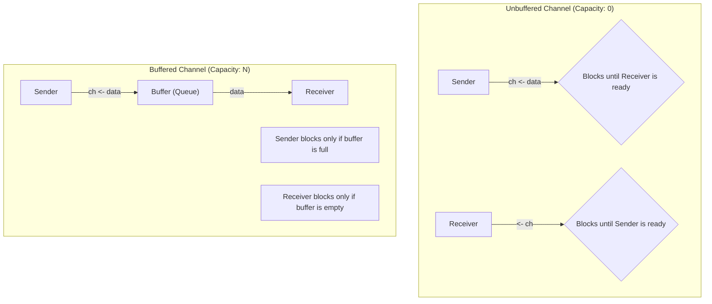

**Buffered Channel ဥပမာ:**

```go
package main

import "fmt"

func main() {
    // capacity 2 ရှိသော buffered channel တစ်ခု ဖန်တီးခြင်း
    ch := make(chan int, 2)

    // buffer မပြည့်သေးသောကြောင့် block မဖြစ်ပါ
    ch <- 1
    ch <- 2

    // အောက်ပါ line ကို uncomment လုပ်ပါက buffer ပြည့်နေသောကြောင့် deadlock ဖြစ်ပြီး panic ဖြစ်မည်
    // ch <- 3 

    fmt.Println(<-ch)
    fmt.Println(<-ch)
}
```

---

## `select` Statement ဖြင့် Channels များကို ကိုင်တွယ်ခြင်း

`select` statement သည် goroutine တစ်ခုကို multiple channel operations များပေါ်တွင် တစ်ပြိုင်နက်တည်း စောင့်ဆိုင်းစေနိုင်သည်။ ၎င်းသည် `switch` statement နှင့် ဆင်တူသော်လည်း channels များအတွက်သာ ဖြစ်သည်။

*   `select` သည် ၎င်း၏ `case` များထဲမှ channel တစ်ခုခု ready ဖြစ်လာသည်အထိ (send/receive လုပ်နိုင်သည်အထိ) block ဖြစ်နေမည်။
*   Channel များစွာ တစ်ပြိုင်နက်တည်း ready ဖြစ်နေပါက `select` က တစ်ခုကို ကျပန်း (randomly) ရွေးချယ်မည်။
*   `default` case ကို ထည့်သွင်းထားပါက မည်သည့် channel မှ ready မဖြစ်သည့်အခါ `default` case ကို ချက်ချင်း run ပြီး `select` သည် block မဖြစ်တော့ပါ။

```go
package main

import (
    "fmt"
    "time"
)

func main() {
    c1 := make(chan string)
    c2 := make(chan string)

    go func() {
        time.Sleep(1 * time.Second)
        c1 <- "one"
    }()
    go func() {
        time.Sleep(2 * time.Second)
        c2 <- "two"
    }()

    // c1 နှင့် c2 မှ data များ ရောက်လာသည်ကို စောင့်ဆိုင်းရန် select ကို အသုံးပြုသည်
    // loop 2 ကြိမ် ပတ်ခြင်းဖြင့် channel နှစ်ခုလုံးမှ data ကို လက်ခံမည်
    for i := 0; i < 2; i++ {
        select {
        case msg1 := <-c1:
            fmt.Println("received", msg1)
        case msg2 := <-c2:
            fmt.Println("received", msg2)
        }
    }
}
```

### Timeout အတွက် `select` ကို အသုံးပြုခြင်း

`select` ကို `time.After` channel နှင့် တွဲဖက်အသုံးပြု၍ channel operation တစ်ခုအတွက် timeout သတ်မှတ်နိုင်သည်။

```go
package main

import (
    "fmt"
    "time"
)

func main() {
    ch := make(chan string)

    go func() {
        time.Sleep(2 * time.Second)
        ch <- "result"
    }()

    select {
    case res := <-ch:
        fmt.Println(res)
    case <-time.After(1 * time.Second):
        fmt.Println("timeout: operation took too long")
    }
}
```# အခန်း ၁၄: Error Handling

Go တွင် error handling သည် အခြား programming languages များစွာနှင့် ကွဲပြားပါသည်။ `try-catch` block များအစား Go သည် errors များကို function return values များအဖြစ် သာမန်တန်ဖိုးများကဲ့သို့ပင် ကိုင်တွယ်သည်။ ဤအခန်းတွင် Go ၏ error handling ပုံစံ၊ custom errors များ တည်ဆောက်ပုံ၊ နှင့် `panic`/`recover` တို့၏ အသုံးဝင်ပုံများကို လေ့လာသွားပါမည်။

---

## Go ၏ Error Handling ပုံစံ (`error` type)

Go တွင် error ဖြစ်နိုင်ခြေရှိသော function များသည် `error` type ကို ၎င်းတို့၏ နောက်ဆုံး return value အဖြစ် ပြန်ပေးလေ့ရှိသည်။ `error` သည် အောက်ပါအတိုင်း method တစ်ခုတည်းသာပါဝင်သော built-in interface တစ်ခုဖြစ်သည်။

```go
type error interface {
    Error() string
}
```

Function တစ်ခုကို ခေါ်ယူသည့်အခါ developer သည် ပြန်လာသော `error` value ကို `nil` ဟုတ်မဟုတ် စစ်ဆေးရန် တာဝန်ရှိသည်။ `nil` မဟုတ်ပါက error ဖြစ်ပွားခဲ့သည်ဟု မှတ်ယူပြီး သင့်လျော်သလို ကိုင်တွယ်ရမည်။

```go
package main

import (
    "fmt"
    "strconv"
)

func main() {
    // "123" သည် ကိန်းဂဏန်းဖြစ်သောကြောင့် error သည် nil ဖြစ်မည်
    num, err := strconv.Atoi("123")
    if err != nil {
        fmt.Println("An error occurred:", err)
    } else {
        fmt.Println("Converted number:", num)
    }

    // "abc" သည် ကိန်းဂဏန်းမဟုတ်သောကြောင့် error ဖြစ်ပွားမည်
    num, err = strconv.Atoi("abc")
    if err != nil {
        fmt.Println("An error occurred:", err)
    } else {
        fmt.Println("Converted number:", num)
    }
}
```

---

## Custom Errors များ တည်ဆောက်ခြင်း

Go တွင် error message များကို ပိုမိုအသေးစိတ်ဖော်ပြရန် custom error များ တည်ဆောက်နိုင်သော နည်းလမ်းများစွာရှိသည်။

### 1. `errors.New()`

`errors` package မှ `New()` function ကို အသုံးပြု၍ ရိုးရှင်းသော error message string တစ်ခုကို ဖန်တီးနိုင်သည်။

```go
import "errors"

func checkAge(age int) error {
    if age < 18 {
        return errors.New("age must be at least 18")
    }
    return nil
}
```

### 2. `fmt.Errorf()`

`fmt.Errorf()` function သည် error message ကို format လုပ်ရန်နှင့် အခြား error များကို "wrap" လုပ်ရန် အသုံးပြုသည်။ `%w` verb ကို အသုံးပြု၍ error တစ်ခုကို wrap လုပ်ခြင်းဖြင့် မူလ error ကို ဆက်လက်ထိန်းသိမ်းထားနိုင်ပြီး၊ `errors.Is()` သို့မဟုတ် `errors.As()` ဖြင့် ပြန်လည်စစ်ဆေးနိုင်သည်။

```go
import (
    "fmt"
    "os"
)

func readFile() error {
    err := os.Open("non-existent-file.txt")
    if err != nil {
        // မူလ os.PathError ကို wrap လုပ်ခြင်း
        return fmt.Errorf("failed to read file: %w", err)
    }
    return nil
}
```

### 3. Custom Error Struct

Error နှင့်ပတ်သက်သော အသေးစိတ်အချက်အလက်များ (e.g., status code, operation name) ကို ထည့်သွင်းလိုပါက custom struct တစ်ခုကို ဖန်တီးပြီး `Error()` method ကို implement လုပ်နိုင်သည်။

```go
package main

import "fmt"

// AppError struct သည် error နှင့်ပတ်သက်သော အချက်အလက်များကို သိမ်းဆည်းသည်
type AppError struct {
    Operation string
    Code      int
    Message   string
}

// AppError အတွက် Error() method ကို implement လုပ်ခြင်း
func (e *AppError) Error() string {
    return fmt.Sprintf("operation '%s' failed with code %d: %s", e.Operation, e.Code, e.Message)
}

func runOperation() error {
    return &AppError{
        Operation: "user_login",
        Code:      401,
        Message:   "invalid credentials",
    }
}

func main() {
    err := runOperation()
    if err != nil {
        fmt.Println(err)
    }
}
```

---

## `panic` နှင့် `recover`

`panic` နှင့် `recover` သည် Go ၏ error handling mechanism ၏ အစိတ်အပိုင်းတစ်ခုဖြစ်သော်လည်း၊ ၎င်းတို့ကို နေ့စဉ် error handling အတွက် **အသုံးမပြုသင့်ပါ**။

*   **`panic`:** Program တွင် ဆက်လက်လုပ်ဆောင်၍မရသော၊ မမျှော်လင့်ထားသည့် အမှားအယွင်းကြီးများ (e.g., nil pointer dereference, index out of bounds) ဖြစ်ပွားသည့်အခါ `panic` ကို အသုံးပြုသည်။ `panic` ဖြစ်ပွားပါက program ၏ normal execution ရပ်တန့်သွားပြီး goroutine stack တစ်လျှောက်ရှိ deferred functions များကို run ပြီးနောက် program သည် crash ဖြစ်သွားသည်။

*   **`recover`:** `panic` ဖြစ်ပွားနေသော goroutine ၏ control ကို ပြန်လည်ရယူရန် `recover` ကို အသုံးပြုသည်။ `recover` ကို `defer` statement အတွင်းမှာသာ ခေါ်ယူမှသာ အလုပ်လုပ်သည်။ ၎င်းသည် `panic` ၏ value ကို return ပြန်ပေးပြီး program ကို ဆက်လက် run စေနိုင်သည်။

**အသုံးဝင်ပုံ:** Web server တစ်ခုတွင် request တစ်ခုကို handle လုပ်သော goroutine `panic` ဖြစ်သွားပါက server တစ်ခုလုံး crash မဖြစ်စေရန် `recover` ဖြင့် ဖမ်းယူပြီး၊ ထို request အတွက် 500 Internal Server Error response ပြန်ပေးကာ အခြား requests များကို ဆက်လက်ဝန်ဆောင်မှုပေးနိုင်သည်။

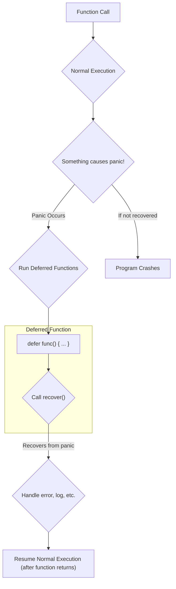

**ဥပမာ:**

```go
package main

import "fmt"

func handlePanic() {
    // recover() ကို defer function အတွင်းမှာ ခေါ်သည်
    if r := recover(); r != nil {
        fmt.Println("Recovered from panic:", r)
    }
}

func causePanic() {
    defer handlePanic()
    
    fmt.Println("About to panic...")
    // nil array ကို access လုပ်ရန် ကြိုးစားခြင်းဖြင့် panic ဖြစ်စေသည်
    var arr []int
    fmt.Println(arr[0]) 
    
    fmt.Println("This line will not be reached.")
}

func main() {
    causePanic()
    fmt.Println("Program continues to run after panic was recovered.")
}
```# အခန်း ၁၅: အသုံးများသော Standard Library Packages

Go ၏ အကြီးမားဆုံး အားသာချက်တစ်ခုမှာ အလွန်စွမ်းဆောင်ရည်မြင့်မားပြီး ကျယ်ပြန့်သော standard library ပါဝင်ခြင်းဖြစ်သည်။ ယခုအခန်းတွင် နေ့စဉ် programming ပြုလုပ်ရာတွင် အသုံးအများဆုံးဖြစ်သော standard library packages အချို့၏ အခြေခံအသုံးပြုပုံကို လေ့လာသွားပါမည်။

---

## `fmt` (Formatted I/O)

`fmt` package သည် console သို့ data များ print ထုတ်ခြင်း (output) နှင့် user ထံမှ data များ ဖတ်ရှုခြင်း (input) ကဲ့သို့သော formatted I/O (Input/Output) လုပ်ဆောင်ချက်များကို ကိုင်တွယ်သည်။

*   `fmt.Println()`: Arguments များကို space ခြား၍ print ထုတ်ပြီးနောက် new line တစ်ကြောင်းဆင်းပေးသည်။
*   `fmt.Printf()`: Format specifiers (`%s`, `%d`, `%v` etc.) များကို အသုံးပြု၍ string ကို format လုပ်ပြီး print ထုတ်သည်။
*   `fmt.Sprintf()`: `Printf` ကဲ့သို့ပင်ဖြစ်သော်လည်း console တွင် print မထုတ်ဘဲ formatted string ကို return ပြန်ပေးသည်။

```go
package main

import "fmt"

func main() {
    name := "Go"
    version := 1.18

    fmt.Println("Language:", name, "Version:", version)

    // %s for string, %f for float
    fmt.Printf("Language: %s, Version: %.2f\n", name, version)

    // %v for any value (default format)
    fmt.Printf("Value: %v, Type: %T\n", version, version)
}
```

---

## `os` (Operating System Interactions)

`os` package သည် operating system နှင့် တိုက်ရိုက်ဆက်နွယ်သော လုပ်ဆောင်ချက်များ (e.g., files, command-line arguments) ကို ကိုင်တွယ်ရန် platform-independent interface တစ်ခုကို ပေးသည်။

*   `os.Args`: Program ကို run သည့်အခါ ပေးလိုက်သော command-line arguments များကို string slice (`[]string`) အဖြစ် ရရှိသည်။ `os.Args[0]` သည် program ၏ အမည်ဖြစ်သည်။
*   `os.ReadFile(name string)`: File တစ်ခုလုံးကို ဖတ်ပြီး byte slice (`[]byte`) အဖြစ် return ပြန်ပေးသည်။
*   `os.WriteFile(name string, data []byte, perm fs.FileMode)`: `data` ကို file ထဲသို့ ရေးသားသည်။

```go
package main

import (
    "fmt"
    "os"
)

func main() {
    // File ထဲသို့ ရေးသားခြင်း
    data := []byte("Hello from Go standard library!")
    err := os.WriteFile("test.txt", data, 0644)
    if err != nil {
        panic(err)
    }
    fmt.Println("Successfully wrote to test.txt")

    // File မှ ဖတ်ရှုခြင်း
    readData, err := os.ReadFile("test.txt")
    if err != nil {
        panic(err)
    }
    fmt.Println("Read from test.txt:", string(readData))
}
```

---

## `strings` and `strconv`

*   **`strings` package:** String များကို ကိုင်တွယ်ရန် အသုံးဝင်သော functions များစွာ ပါဝင်သည်။
*   **`strconv` package:** String နှင့် အခြား data types (e.g., `int`, `bool`) များအကြား အပြန်အလှန် ပြောင်းလဲရန် (conversion) အသုံးပြုသည်။

```go
package main

import (
    "fmt"
    "strconv"
    "strings"
)

func main() {
    // strings package
    s := "Hello, World, Go"
    fmt.Println("Contains 'World':", strings.Contains(s, "World"))
    fmt.Println("To Upper:", strings.ToUpper(s))
    fmt.Println("Split by ',':", strings.Split(s, ","))

    // strconv package
    numStr := "123"
    num, err := strconv.Atoi(numStr) // Atoi = ASCII to Integer
    if err != nil {
        fmt.Println("Error converting string to int:", err)
    } else {
        fmt.Println("Converted number:", num+1)
    }

    numToConvert := 456
    str := strconv.Itoa(numToConvert) // Itoa = Integer to ASCII
    fmt.Println("Converted string:", str)
}
```

---

## `encoding/json` (JSON Data ကိုင်တွယ်ခြင်း)

`encoding/json` package သည် Go data structures (structs, maps) နှင့် JSON data format အကြား အပြန်အလှန် ပြောင်းလဲရန် အသုံးပြုသည်။

*   **Marshalling:** Go struct ကို JSON string (byte slice) အဖြစ်သို့ ပြောင်းလဲခြင်း။
*   **Unmarshalling:** JSON string (byte slice) ကို Go struct အဖြစ်သို့ ပြောင်းလဲခြင်း။

```mermaid
graph TD
    A[Go Struct] -- "json.Marshal()" --> B["JSON String (bytes)"]
    B -- "json.Unmarshal()" --> A
```

**ဥပမာ:**

```go
package main

import (
    "encoding/json"
    "fmt"
)

// Struct field များကို JSON key များနှင့် mapping လုပ်ရန် struct tags များကို အသုံးပြုသည်
type User struct {
    ID       int    `json:"id"`
    Name     string `json:"name"`
    Email    string `json:"email"`
    Password string `json:"-"` // `json:"-"` tag သည် ဤ field ကို JSON တွင် မပါဝင်စေရန် ဖြစ်သည်
}

func main() {
    // --- Marshalling (Go struct to JSON) ---
    user := User{ID: 1, Name: "Aung Aung", Email: "aung@example.com", Password: "secret-password"}
    jsonData, err := json.MarshalIndent(user, "", "  ") // MarshalIndent for pretty-printing
    if err != nil {
        panic(err)
    }
    fmt.Println("Marshalled JSON:\n", string(jsonData))

    // --- Unmarshalling (JSON to Go struct) ---
    jsonString := `{"id": 2, "name": "Ma Ma", "email": "ma@example.com"}`
    var anotherUser User
    err = json.Unmarshal([]byte(jsonString), &anotherUser)
    if err != nil {
        panic(err)
    }
    fmt.Println("\nUnmarshalled User:", anotherUser)
    fmt.Println("Unmarshalled User's Name:", anotherUser.Name)
}
```

---

## `net/http` (Web Server တည်ဆောက်ခြင်း)

`net/http` package သည် production-ready HTTP client နှင့် server များကို အလွယ်တကူ တည်ဆောက်နိုင်ရန် လိုအပ်သော tools များအားလုံးကို ပေးသည်။

```mermaid
graph LR
    Client["User's Browser"] -- "HTTP Request (e.g., GET /hello)" --> Server["Go HTTP Server"]
    Server -- "invokes" --> Handler["Handler Function for /hello"]
    Handler -- "writes response" --> Response["HTTP Response (e.g., 'Hello, World!')"]
    Response -- "sends back to" --> Client
```

**ဥပမာ: Simple Web Server**

```go
package main

import (
    "fmt"
    "net/http"
)

// handler function သည် http.ResponseWriter နှင့် *http.Request ကို parameter အဖြစ် လက်ခံသည်
func helloHandler(w http.ResponseWriter, r *http.Request) {
    // ResponseWriter သို့ data ရေးသားခြင်းဖြင့် client သို့ response ပြန်ပေးသည်
    fmt.Fprintf(w, "Hello, you've requested: %s\n", r.URL.Path)
}

func main() {
    // URL path "/hello" အတွက် helloHandler function ကို register လုပ်သည်
    http.HandleFunc("/hello", helloHandler)

    fmt.Println("Starting server on port 8080...")
    // Port 8080 တွင် server ကို စတင် run ပြီး incoming requests များကို စောင့်ဆိုင်းသည်
    // ဤ function သည် error return ပြန်မှသာ ပြီးဆုံးမည် (e.g., port is already in use)
    err := http.ListenAndServe(":8080", nil)
    if err != nil {
        panic(err)
    }
}
```

ဤ program ကို run ပြီး web browser တွင် `http://localhost:8080/hello` သို့ သွားရောက်ကြည့်ရှုပါက "Hello, you've requested: /hello" ဟူသော စာသားကို မြင်တွေ့ရမည်ဖြစ်သည်။# အခန်း ၁၆: Testing in Go

Software development တွင် testing သည် code ၏ အရည်အသွေး၊ မှန်ကန်မှု၊ နှင့် ယုံကြည်စိတ်ချရမှုကို အာမခံရန်အတွက် မရှိမဖြစ်လိုအပ်သော အစိတ်အပိုင်းတစ်ခုဖြစ်သည်။ Go သည် `testing` package ကို standard library တွင် တပါတည်း ထည့်သွင်းပေးထားပြီး၊ unit tests နှင့် performance benchmark tests များကို ရိုးရှင်းလွယ်ကူစွာ ရေးသားနိုင်ရန် အားပေးသည်။

---

## `testing` package နှင့် Testing Conventions

Go တွင် test code များကို ရေးသားရန်အတွက် လိုက်နာရမည့် conventions အချို့ရှိသည်။

*   **File Naming:** Test code များပါဝင်သော file ၏ အမည်သည် `_test.go` ဖြင့် အဆုံးသတ်ရမည် (e.g., `calculator_test.go`)။
*   **Test Function Signature:** Test function တိုင်းသည် `Test` ဖြင့် စတင်ရမည်ဖြစ်ပြီး `*testing.T` type parameter တစ်ခုတည်းသာ လက်ခံရမည် (e.g., `func TestAdd(t *testing.T)`)။
*   **`*testing.T` Type:** ဤ type သည် test ၏ state ကို စီမံခန့်ခွဲရန်နှင့် test failure များကို report လုပ်ရန် `t.Errorf()`, `t.Fatalf()`, `t.Log()` ကဲ့သို့သော methods များကို ပေးသည်။
*   **Running Tests:** Terminal တွင် `go test` command ကို အသုံးပြု၍ package တစ်ခုအတွင်းရှိ test များအားလုံးကို run နိုင်ပါသည်။

---

## Unit Tests ရေးသားခြင်း

Unit test ဆိုသည်မှာ program ၏ အစိတ်အပိုင်းငယ်တစ်ခု (function သို့မဟုတ် method တစ်ခု) ကို သီးခြားစမ်းသပ်ခြင်းဖြစ်သည်။

**ဥပမာ:** `calculator` package ထဲတွင် `Add` function တစ်ခုရှိသည်ဆိုပါစို့။

**`calculator.go`**
```go
package calculator

func Add(a, b int) int {
    return a + b
}
```

**`calculator_test.go`**
```go
package calculator

import "testing"

func TestAdd(t *testing.T) {
    result := Add(2, 3)
    expected := 5

    if result != expected {
        // Test ကျရှုံးပါက error message ကို print ထုတ်ပြီး test ကို ဆက်လက် run နေမည်
        t.Errorf("Add(2, 3) = %d; want %d", result, expected)
    }
}
```

---

## Table-Driven Tests

Function တစ်ခုကို input အမျိုးမျိုးဖြင့် စမ်းသပ်လိုသည့်အခါ test case တစ်ခုချင်းစီအတွက် test function တစ်ခုစီ ရေးသားခြင်းထက်၊ **Table-driven test** ပုံစံကို အသုံးပြုခြင်းက ပိုမိုရှင်းလင်းပြီး ထိရောက်မှုရှိသည်။ ဤပုံစံတွင် test cases များကို slice of structs အဖြစ် ကြိုတင်သတ်မှတ်ပြီး loop ပတ်၍ တစ်ခုချင်း စမ်းသပ်သည်။

```mermaid
graph TD
    A["Test Function (e.g., TestAdd)"] --> B["Define Slice of Test Cases<br/>(structs)"]
    B --> C{Loop through each test case}
    C -- "Run as a sub-test" --> D["t.Run(test.name, ...)"]
    D --> E{Execute logic with test inputs}
    E --> F{Compare result with expected output}
    F -- "If not equal" --> G["Report Error: t.Errorf()"]
    F -- "If equal" --> H[Pass]
    C -- "Next test case" --> D
```

**ဥပမာ:**

```go
package calculator

import "testing"

func TestAddTableDriven(t *testing.T) {
    // Test cases များကို struct slice အဖြစ် သတ်မှတ်ခြင်း
    testCases := []struct {
        name     string // test case ၏ အမည်
        a, b     int    // inputs
        expected int    // expected output
    }{
        {"positive numbers", 2, 3, 5},
        {"negative numbers", -2, -3, -5},
        {"mixed numbers", -2, 3, 1},
        {"zero value", 0, 0, 0},
    }

    // Test case တစ်ခုချင်းစီကို loop ပတ်၍ run ခြင်း
    for _, tc := range testCases {
        // t.Run() ကို အသုံးပြု၍ sub-test တစ်ခုအဖြစ် run ခြင်းဖြင့် test output များကို ပိုမိုရှင်းလင်းစေသည်
        t.Run(tc.name, func(t *testing.T) {
            result := Add(tc.a, tc.b)
            if result != tc.expected {
                t.Errorf("Add(%d, %d) = %d; want %d", tc.a, tc.b, result, tc.expected)
            }
        })
    }
}
```

---

## Benchmarking

Benchmarking ဆိုသည်မှာ code ၏ performance (အထူးသဖြင့် speed) ကို တိုင်းတာခြင်းဖြစ်သည်။ Go တွင် benchmark tests များကို `testing` package ဖြင့် အလွယ်တကူ ရေးသားနိုင်သည်။

*   **Benchmark Function Signature:** Benchmark function တိုင်းသည် `Benchmark` ဖြင့် စတင်ရမည်ဖြစ်ပြီး `*testing.B` type parameter တစ်ခုတည်းသာ လက်ခံရမည် (e.g., `func BenchmarkAdd(b *testing.B)`)။
*   **`b.N`:** `testing.B` တွင် `N` ဟူသော field တစ်ခုပါဝင်သည်။ Benchmark function အတွင်းရှိ loop ကို `b.N` အကြိမ်အထိ run ရန်ဖြစ်သည်။ Go test runner သည် တည်ငြိမ်သော performance တိုင်းတာမှုတစ်ခုရရှိရန် `N` ၏တန်ဖိုးကို အလိုအလျောက် ချိန်ညှိပေးသည်။
*   **Running Benchmarks:** Benchmarks များကို run ရန် `go test -bench=.` command ကို အသုံးပြုရသည်။ (`.` သည် package အတွင်းရှိ benchmark အားလုံးကို run ရန် ညွှန်ပြသည်)။

**ဥပမာ:**

```go
package calculator

import "testing"

func BenchmarkAdd(b *testing.B) {
    // b.N သည် Go test runner မှ သတ်မှတ်ပေးသော loop အကြိမ်အရေအတွက်ဖြစ်သည်
    for i := 0; i < b.N; i++ {
        Add(100, 200)
    }
}
```

**Benchmark Result ဥပမာ:**

```sh
$ go test -bench=.
goos: darwin
goarch: amd64
pkg: myproject/calculator
cpu: Intel(R) Core(TM) i7-9750H CPU @ 2.60GHz
BenchmarkAdd-12         1000000000               0.2831 ns/op
PASS
ok      myproject/calculator    0.358s
```

*   `BenchmarkAdd-12`: Benchmark function အမည်နှင့် အသုံးပြုခဲ့သော CPU core အရေအတွက်။
*   `1000000000`: `b.N` ၏ တန်ဖိုး (loop ကို အကြိမ်ပေါင်း ဘီလီယံ ၁ ထောင် run ခဲ့သည်)။
*   `0.2831 ns/op`: Operation တစ်ခု (loop တစ်ခါပတ်ခြင်း) အတွက် ပျမ်းမျှကြာချိန် (nanoseconds)။# အခန်း ၁၇: Project - Simple REST API တည်ဆောက်ခြင်း (အပိုင်း ၁)

ယခုအခန်းမှစ၍ ယခင်လေ့လာခဲ့သော Go ၏ concepts များကို ပေါင်းစပ်ပြီး လက်တွေ့ project တစ်ခုကို စတင်တည်ဆောက်ပါမည်။ ကျွန်ုပ်တို့ တည်ဆောက်မည့် project မှာ To-Do List တစ်ခုကို စီမံခန့်ခွဲနိုင်သော ရိုးရှင်းသည့် REST API တစ်ခုဖြစ်သည်။

ဤအပိုင်း (Part 1) တွင် project အတွက် planning ပြုလုပ်ခြင်း၊ data structure များ သတ်မှတ်ခြင်း၊ နှင့် standard `net/http` package ကို အသုံးပြု၍ အခြေခံ routing နှင့် handlers များ ရေးသားခြင်းတို့ကို လေ့လာသွားပါမည်။

---

## Project Planning

Project တစ်ခုကို မစတင်မီ ဘာတွေလုပ်ဆောင်မည်ကို ကြိုတင် plan လုပ်ခြင်းသည် အလွန်အရေးကြီးပါသည်။

**1. Project ၏ ရည်ရွယ်ချက်:**
*   To-Do tasks များကို စီမံခန့်ခွဲရန်အတွက် RESTful API တစ်ခု တည်ဆောက်ရန်။

**2. အဓိက Features (สำหรับ Part 1):**
*   Task အားလုံးကို list အဖြစ် ကြည့်ရှုနိုင်ခြင်း။
*   Task အသစ်တစ်ခု ဖန်တီးနိုင်ခြင်း။

**3. Data Structure:**
*   Task တစ်ခုကို ဖော်ပြရန်အတွက် `Task` struct ကို အောက်ပါအတိုင်း သတ်မှတ်ပါမည်။

```go
type Task struct {
    ID        int    `json:"id"`
    Title     string `json:"title"`
    Completed bool   `json:"completed"`
}
```

**4. API Endpoints:**
*   ကျွန်ုပ်တို့၏ API တွင် အောက်ပါ endpoints များ ပါဝင်မည်ဖြစ်သည်။

```mermaid
graph TD
    subgraph "To-Do List API (Part 1)"
        A["GET /tasks"] --> B["Task အားလုံးကို JSON array အဖြစ် ပြန်ပေးမည်"]
        C["POST /tasks"] --> D["Request body မှ JSON data ကို အသုံးပြု၍<br/>Task အသစ်တစ်ခု ဖန်တီးပြီး<br/>ထို task ကို JSON အဖြစ် ပြန်ပေးမည်"]
    end
```

---

## HTTP Handlers များ ရေးသားခြင်း

HTTP Handler ဆိုသည်မှာ নির্দিষ্ট URL path သို့ ရောက်ရှိလာသော HTTP request များကို လက်ခံပြီး response ပြန်ပေးရန် တာဝန်ရှိသော function ဖြစ်သည်။

ဤ project ၏ ပထမပိုင်းတွင် data များကို database တွင် မသိမ်းဆည်းဘဲ၊ program run နေစဉ်အတွင်း memory ထဲတွင်သာ သိမ်းဆည်းထားရန် in-memory slice တစ်ခုကို အသုံးပြုပါမည်။

**`main.go` File ကို စတင်တည်ဆောက်ခြင်း:**

```go
package main

import (
	"encoding/json"
	"fmt"
	"log"
	"net/http"
	"sync"
)

// Task struct
type Task struct {
	ID        int    `json:"id"`
	Title     string `json:"title"`
	Completed bool   `json:"completed"`
}

// Data များကို memory တွင် သိမ်းဆည်းရန်
var (
	tasks  = make(map[int]Task) // Use a map for easier lookup/delete later
	nextID = 1
	mu     sync.Mutex // Mutex for thread-safe access to tasks and nextID
)

// tasksHandler သည် "/tasks" path သို့ ရောက်လာသော requests များကို ကိုင်တွယ်မည်
func tasksHandler(w http.ResponseWriter, r *http.Request) {
	switch r.Method {
	case http.MethodGet:
		getTasks(w, r)
	case http.MethodPost:
		createTask(w, r)
	default:
		// အခြား HTTP methods များကို ခွင့်မပြုပါ
		http.Error(w, "Method not allowed", http.StatusMethodNotAllowed)
	}
}

// GET /tasks - Task အားလုံးကို ပြန်ပေးသည်
func getTasks(w http.ResponseWriter, r *http.Request) {
	// Map မှ value များကို slice အဖြစ် ပြောင်းလဲခြင်း
	var taskList []Task
	for _, task := range tasks {
		taskList = append(taskList, task)
	}

	w.Header().Set("Content-Type", "application/json")
	json.NewEncoder(w).Encode(taskList)
}

// POST /tasks - Task အသစ်တစ်ခု ဖန်တီးသည်
func createTask(w http.ResponseWriter, r *http.Request) {
	var newTask Task
	
	// Request body မှ JSON ကို decode လုပ်ခြင်း
	if err := json.NewDecoder(r.Body).Decode(&newTask); err != nil {
		http.Error(w, err.Error(), http.StatusBadRequest)
		return
	}

	// ID အသစ်တစ်ခု သတ်မှတ်ပြီး tasks map ထဲသို့ ထည့်သွင်းခြင်း
	newTask.ID = nextID
	tasks[newTask.ID] = newTask
	nextID++

	w.Header().Set("Content-Type", "application/json")
	w.WriteHeader(http.StatusCreated) // 201 Created status code
	json.NewEncoder(w).Encode(newTask)
}

func main() {
    // Routing ကို အောက်တွင် ဆက်လက်ရေးသားပါမည်

	// Data များကို thread-safe ဖြစ်စေရန် handler function တစ်ခုချင်းစီတွင်
	// mutex ကို သီးခြားစီ ခေါ်ယူအသုံးပြုပါမည်။
	// ဥပမာ:
	// mu.Lock()
	// defer mu.Unlock()
}
```

**Code ရှင်းလင်းချက်:**
*   Data များကို in-memory `map` တွင် သိမ်းဆည်းထားသည်။ Map ကို အသုံးပြုခြင်းသည် နောင်တွင် task တစ်ခုကို ID ဖြင့် ရှာဖွေ/ဖျက်ပစ်ရန် ပိုမိုလွယ်ကူစေသည်။
*   `sync.Mutex` ကို အသုံးပြု၍ goroutines များစွာက `tasks` map နှင့် `nextID` ကို တစ်ပြိုင်နက်တည်း access လုပ်ခြင်းမှ ကာကွယ်ထားသည် (thread-safety)။
*   `tasksHandler` သည် request ၏ HTTP method ကို စစ်ဆေးပြီး သက်ဆိုင်ရာ function (`getTasks` or `createTask`) ကို ခေါ်ယူပေးသည်။
*   `getTasks` နှင့် `createTask` functions များသည် JSON data များကို encode/decode လုပ်ပြီး client သို့ response ပြန်ပေးသည်။

---

## Routing ပြုလုပ်ခြင်း

Routing ဆိုသည်မှာ URL path တစ်ခုကို သက်ဆိုင်ရာ handler function တစ်ခုနှင့် ချိတ်ဆက်ပေးခြင်းဖြစ်သည်။ `net/http` package မှ `http.HandleFunc` ကို အသုံးပြု၍ routing ကို အလွယ်တကူ ပြုလုပ်နိုင်သည်။

**`main` function ကို ပြီးပြည့်စုံအောင် ရေးသားခြင်း:**

```go
// ... (အပေါ်မှ code များ ဆက်လက်ပါဝင်သည်)

func main() {
    // "/tasks" path ကို tasksHandler နှင့် ချိတ်ဆက်သည်
    http.HandleFunc("/tasks", tasksHandler)

    fmt.Println("Starting REST API server on http://localhost:8080")
    // Port 8080 တွင် server ကို စတင် run သည်
    if err := http.ListenAndServe(":8080", nil); err != nil {
        log.Fatalf("Could not start server: %s\n", err.Error())
    }
}
```

ယခု `main.go` file ကို `go run main.go` ဖြင့် run ပြီးနောက် `curl` သို့မဟုတ် Postman ကဲ့သို့သော tool များကို အသုံးပြု၍ API ကို စမ်းသပ်နိုင်ပြီဖြစ်သည်။

*   **Get all tasks:** `curl http://localhost:8080/tasks`
*   **Create a new task:** `curl -X POST -d '{"title":"Learn Go", "completed":false}' http://localhost:8080/tasks`# အခန်း ၁၈: Project - Simple REST API တည်ဆောက်ခြင်း (အပိုင်း ၂)

ယခင်အခန်းတွင် ကျွန်ုပ်တို့၏ To-Do List API အတွက် အခြေခံ server တစ်ခုကို `net/http` package ဖြင့် တည်ဆောက်ခဲ့ပြီး `GET /tasks` နှင့် `POST /tasks` endpoints များကို implement လုပ်ခဲ့ပါသည်။

ယခုအခန်းတွင် API ကို ပိုမိုစွမ်းဆောင်ရည်ပြည့်ဝအောင် တိုးချဲ့တည်ဆောက်သွားပါမည်။

1.  Task တစ်ခုချင်းစီကို ID ဖြင့် `GET`, `PUT`, `DELETE` လုပ်နိုင်သော endpoints များ ထပ်မံထည့်သွင်းပါမည်။
2.  Standard `net/http` router ထက် ပိုမိုအစွမ်းထက်သော third-party router ဖြစ်သည့် `gorilla/mux` ကို အသုံးပြု၍ routing ကို ပြန်လည်တည်ဆောက်ပါမည်။

---

## `gorilla/mux` ကို အသုံးပြုခြင်း

Standard `net/http` router သည် ရိုးရှင်းသော routing များအတွက် ကောင်းမွန်သော်လည်း၊ URL path တွင် variables များ (e.g., `/tasks/{id}`) ပါဝင်လာသည့်အခါ ကိုင်တွယ်ရန် ခက်ခဲပါသည်။

`gorilla/mux` သည် Go community တွင် အလွန်ရေပန်းစားသော HTTP router တစ်ခုဖြစ်ပြီး အောက်ပါကဲ့သို့သော အစွမ်းထက်သည့် features များ ပါဝင်သည်။

*   URL path variables များကို အလွယ်တကူ parsing လုပ်နိုင်ခြင်း (e.g., `/tasks/{id}`).
*   HTTP method (`GET`, `POST`, `PUT`, `DELETE`) အလိုက် route များကို သီးခြားသတ်မှတ်နိုင်ခြင်း။
*   Hostnames, schemes, headers, နှင့် query parameters များပေါ်တွင် အခြေခံ၍ routing ပြုလုပ်နိုင်ခြင်း။

### `gorilla/mux` ကို Install ပြုလုပ်ခြင်း

Terminal တွင် အောက်ပါ command ကို run ၍ `gorilla/mux` package ကို သင်၏ project ထဲသို့ ထည့်သွင်းပါ။

```sh
go get github.com/gorilla/mux
```

---

## API Endpoints အသစ်များ ထပ်တိုးခြင်း

ကျွန်ုပ်တို့၏ API ကို အောက်ပါ endpoints များဖြင့် တိုးချဲ့ပါမည်။

```mermaid
graph TD
    subgraph "To-Do List API (Part 2 - New Endpoints)"
        A["GET /tasks/{id}"] --> B["ID ဖြင့် Task တစ်ခုကို ရှာဖွေပြီး<br/>JSON အဖြစ် ပြန်ပေးမည်"]
        C["PUT /tasks/{id}"] --> D["ID ဖြင့် Task တစ်ခုကို ရှာဖွေပြီး<br/>Request body မှ JSON data ဖြင့်<br/>Update လုပ်ပြီး ပြန်ပေးမည်"]
        E["DELETE /tasks/{id}"] --> F["ID ဖြင့် Task တစ်ခုကို ရှာဖွေပြီး<br/>ဖျက်ပစ်မည်"]
    end
```

---

## Code ကို Refactor လုပ်ခြင်း နှင့် Handlers အသစ်များ ရေးသားခြင်း

ယခုအခါ `main.go` file ကို `gorilla/mux` router ကို အသုံးပြုရန်နှင့် endpoints အသစ်များအတွက် handler functions များ ထပ်တိုးရန် ပြန်လည်ပြင်ဆင်ပါမည်။

**`main.go` (Updated Version)**

```go
package main

import (
	"encoding/json"
	"fmt"
	"log"
	"net/http"
	"strconv"
	"sync"

	"github.com/gorilla/mux" // gorilla/mux ကို import လုပ်ခြင်း
)

type Task struct {
	ID        int    `json:"id"`
	Title     string `json:"title"`
	Completed bool   `json:"completed"`
}

var (
	tasks  = make(map[int]Task)
	nextID = 1
	mu     sync.Mutex
)

// GET /tasks
func getTasks(w http.ResponseWriter, r *http.Request) {
	mu.Lock()
	defer mu.Unlock()
	var taskList []Task
	for _, task := range tasks {
		taskList = append(taskList, task)
	}
	w.Header().Set("Content-Type", "application/json")
	json.NewEncoder(w).Encode(taskList)
}

// POST /tasks
func createTask(w http.ResponseWriter, r *http.Request) {
	var newTask Task
	if err := json.NewDecoder(r.Body).Decode(&newTask); err != nil {
		http.Error(w, err.Error(), http.StatusBadRequest)
		return
	}
	mu.Lock()
	defer mu.Unlock()
	newTask.ID = nextID
	tasks[newTask.ID] = newTask
	nextID++
	w.Header().Set("Content-Type", "application/json")
	w.WriteHeader(http.StatusCreated)
	json.NewEncoder(w).Encode(newTask)
}

// --- Handler အသစ်များ ---

// GET /tasks/{id}
func getTask(w http.ResponseWriter, r *http.Request) {
	// URL path မှ "id" variable ကို ရယူခြင်း
	vars := mux.Vars(r)
	id, err := strconv.Atoi(vars["id"])
	if err != nil {
		http.Error(w, "Invalid task ID", http.StatusBadRequest)
		return
	}

	mu.Lock()
	defer mu.Unlock()

	task, ok := tasks[id]
	if !ok {
		http.Error(w, "Task not found", http.StatusNotFound)
		return
	}

	w.Header().Set("Content-Type", "application/json")
	json.NewEncoder(w).Encode(task)
}

// PUT /tasks/{id}
func updateTask(w http.ResponseWriter, r *http.Request) {
	vars := mux.Vars(r)
	id, err := strconv.Atoi(vars["id"])
	if err != nil {
		http.Error(w, "Invalid task ID", http.StatusBadRequest)
		return
	}

	var updatedTask Task
	if err := json.NewDecoder(r.Body).Decode(&updatedTask); err != nil {
		http.Error(w, err.Error(), http.StatusBadRequest)
		return
	}

	mu.Lock()
	defer mu.Unlock()

	if _, ok := tasks[id]; !ok {
		http.Error(w, "Task not found", http.StatusNotFound)
		return
	}

	updatedTask.ID = id
	tasks[id] = updatedTask

	w.Header().Set("Content-Type", "application/json")
	json.NewEncoder(w).Encode(updatedTask)
}

// DELETE /tasks/{id}
func deleteTask(w http.ResponseWriter, r *http.Request) {
	vars := mux.Vars(r)
	id, err := strconv.Atoi(vars["id"])
	if err != nil {
		http.Error(w, "Invalid task ID", http.StatusBadRequest)
		return
	}

	mu.Lock()
	defer mu.Unlock()

	if _, ok := tasks[id]; !ok {
		http.Error(w, "Task not found", http.StatusNotFound)
		return
	}

	delete(tasks, id)
	w.WriteHeader(http.StatusNoContent) // 204 No Content
}

func main() {
	// gorilla/mux router အသစ်တစ်ခု တည်ဆောက်ခြင်း
	r := mux.NewRouter()

	// Routes များကို router တွင် register လုပ်ခြင်း
	r.HandleFunc("/tasks", getTasks).Methods(http.MethodGet)
	r.HandleFunc("/tasks", createTask).Methods(http.MethodPost)
	r.HandleFunc("/tasks/{id}", getTask).Methods(http.MethodGet)
	r.HandleFunc("/tasks/{id}", updateTask).Methods(http.MethodPut)
	r.HandleFunc("/tasks/{id}", deleteTask).Methods(http.MethodDelete)

	fmt.Println("Starting REST API server on http://localhost:8080")
	// http.ListenAndServe တွင် router ကို pass လုပ်သည်
	if err := http.ListenAndServe(":8080", r); err != nil {
		log.Fatalf("Could not start server: %s\n", err.Error())
	}
}
```

**Code ရှင်းလင်းချက်:**
*   `main` function တွင် `mux.NewRouter()` ဖြင့် router အသစ်တစ်ခု တည်ဆောက်သည်။
*   `r.HandleFunc()` ကို အသုံးပြု၍ URL path နှင့် handler function ကို ချိတ်ဆက်သည်။ `.Methods()` ကို ဆက်လက်အသုံးပြုခြင်းဖြင့် ထို path အတွက် သီးခြား HTTP method ကို သတ်မှတ်နိုင်သည်။
*   `getTask`, `updateTask`, `deleteTask` functions များတွင် `mux.Vars(r)` ကို အသုံးပြု၍ URL path မှ `{id}` variable ကို ရယူပြီး `strconv.Atoi` ဖြင့် integer သို့ ပြောင်းလဲသည်။
*   `http.ListenAndServe` ၏ ဒုတိယ argument တွင် `nil` အစား ကျွန်ုပ်တို့ ဖန်တီးထားသော `r` (router) ကို ထည့်သွင်းပေးရသည်။

ယခုအခါ ကျွန်ုပ်တို့၏ API သည် CRUD (Create, Read, Update, Delete) operations အားလုံးကို လုပ်ဆောင်နိုင်ပြီဖြစ်သည်။# အခန်း ၁၉: Project - Simple REST API တည်ဆောက်ခြင်း (အပိုင်း ၃) - Database Integration

ယခင် အခန်း ၁၇ နှင့် ၁၈ တွင်၊ ကျွန်ုပ်တို့သည် in-memory data store ကို အသုံးပြု၍ REST API တစ်ခုကို တည်ဆောက်ခဲ့သည်။ ၎င်းသည် API ၏ အလုပ်လုပ်ပုံကို လေ့လာရန် ကောင်းမွန်သော်လည်း၊ application ကို restart လုပ်လိုက်တိုင်း data များ ပျောက်ဆုံးသွားမည်ဖြစ်သည်။ ဤအခန်းတွင်၊ ကျွန်ုပ်တို့၏ data များကို PostgreSQL database တွင် သိမ်းဆည်းခြင်းဖြင့် data persistence ကို အကောင်အထည်ဖော်ပါမည်။

---

## `database/sql` Package ကို အသုံးပြုခြင်း

Go ၏ standard library တွင်ပါဝင်သော `database/sql` package သည် SQL (သို့မဟုတ် SQL-like) databases များနှင့် အလုပ်လုပ်ရန်အတွက် generic interface တစ်ခုကို ပံ့ပိုးပေးသည်။ ၎င်းသည် database-specific details များကို abstract လုပ်ပေးထားပြီး၊ ကျွန်ုပ်တို့အား တသမတ်တည်းဖြစ်သော API ဖြင့် database operations များ လုပ်ဆောင်နိုင်ရန် ကူညီပေးသည်။

`database/sql` package ကိုယ်တိုင်က database နှင့် တိုက်ရိုက်စကားပြောနိုင်စွမ်းမရှိပါ။ ၎င်းသည် **database driver** များနှင့်အတူ အလုပ်လုပ်သည်။ ကျွန်ုပ်တို့သည် PostgreSQL နှင့် ချိတ်ဆက်လိုပါက၊ PostgreSQL အတွက် driver တစ်ခုကို import လုပ်ပေးရန် လိုအပ်သည်။

---

## Database Driver ထည့်သွင်းခြင်း နှင့် ချိတ်ဆက်ခြင်း

ဤ project အတွက်၊ ကျွန်ုပ်တို့သည် PostgreSQL ကို အသုံးပြုပြီး `pq` driver ကို ထည့်သွင်းပါမည်။

**1. Driver ကို Install လုပ်ခြင်း:**

Terminal တွင် အောက်ပါ command ကို run ပါ။

```sh
go get github.com/lib/pq
```

ဤ command သည် `pq` driver ကို download လုပ်ပြီး ကျွန်ုပ်တို့၏ `go.mod` file ထဲသို့ dependency အဖြစ် ထည့်သွင်းပေးပါလိမ့်မည်။

**2. Database နှင့် ချိတ်ဆက်ခြင်း:**

`main.go` သို့မဟုတ် database connection ကို စီမံခန့်ခွဲမည့် file တွင် အောက်ပါကဲ့သို့ ရေးသားရမည်။

```go
package main

import (
	"database/sql"
	"fmt"
	"log"

	_ "github.com/lib/pq" // The database driver
)

const (
	dbHost = "localhost"
	dbPort = 5432
	dbUser = "your_username" // သင်၏ PostgreSQL username ကို ပြောင်းပါ
	dbPassword = "your_password" // သင်၏ PostgreSQL password ကို ပြောင်းပါ
	dbName = "your_dbname"   // သင်၏ database name ကို ပြောင်းပါ
)

func main() {
	// Connection string ကို တည်ဆောက်ခြင်း
	psqlInfo := fmt.Sprintf("host=%s port=%d user=%s password=%s dbname=%s sslmode=disable",
		dbHost, dbPort, dbUser, dbPassword, dbName)

	// Database connection ကို ဖွင့်ခြင်း
	db, err := sql.Open("postgres", psqlInfo)
	if err != nil {
		log.Fatalf("Error opening database: %q", err)
	}
	defer db.Close()

	// Connection အောင်မြင်မှုရှိမရှိ စစ်ဆေးခြင်း
	err = db.Ping()
	if err != nil {
		log.Fatalf("Error connecting to the database: %q", err)
	}

	fmt.Println("Successfully connected to the database!")

	// ... (API server ကို ဤနေရာတွင် run ပါမည်)
}
```

**အရေးကြီးသော မှတ်ချက်များ:**

*   `import _ "github.com/lib/pq"`: `_` (blank identifier) ကို အသုံးပြုရခြင်းမှာ၊ ကျွန်ုပ်တို့သည် `pq` package ကို တိုက်ရိုက်ခေါ်သုံးနေခြင်းမဟုတ်ဘဲ၊ ၎င်း၏ `init` function ကို run စေခြင်းဖြင့် `database/sql` package တွင် "postgres" driver အဖြစ် register လုပ်စေလိုသောကြောင့် ဖြစ်သည်။
*   `sql.Open` သည် database connection ကို ချက်ချင်းမဖွင့်ပါ။ ၎င်းသည် နောက်ကွယ်တွင် connection pool တစ်ခုကို setup လုပ်ပေးပြီး လိုအပ်မှသာ connection များကို တည်ဆောက်သည်။
*   `db.Ping()` ဖြင့် connection အမှန်တကယ်ရမရ စစ်ဆေးရန် အလွန်အရေးကြီးသည်။

---

## CRUD Operations များ ရေးသားခြင်း

HTTP handlers များထဲတွင် database logic များကို တိုက်ရိုက်ရေးသားခြင်းထက်၊ သီးသန့် file သို့မဟုတ် package (`store` သို့မဟုတ် `models` ကဲ့သို့) တစ်ခုတွင် ခွဲထုတ်ရေးသားခြင်းသည် code ကို ပိုမိုရှင်းလင်းစေသည်။

**ဥပမာ: `products` table အတွက် CRUD functions များ**

`products` table ၏ schema မှာ အောက်ပါအတိုင်းဟု ယူဆပါမည်။

```sql
CREATE TABLE products (
    id SERIAL PRIMARY KEY,
    name VARCHAR(255) NOT NULL,
    price NUMERIC(10, 2) NOT NULL,
    created_at TIMESTAMP WITH TIME ZONE DEFAULT CURRENT_TIMESTAMP
);
```

**`store.go`**
```go
package main

import "database/sql"

// Product struct သည် products table row တစ်ခုကို ကိုယ်စားပြုသည်
type Product struct {
	ID    int     `json:"id"`
	Name  string  `json:"name"`
	Price float64 `json:"price"`
}

// CreateProduct သည် product အသစ်တစ်ခုကို database ထဲသို့ ထည့်ပေးသည်
func CreateProduct(db *sql.DB, product *Product) (int, error) {
	var productID int
	// $1, $2 တို့သည် SQL injection ကို ကာကွယ်ပေးသော placeholders များဖြစ်သည်
	err := db.QueryRow(
		"INSERT INTO products (name, price) VALUES ($1, $2) RETURNING id",
		product.Name, product.Price,
	).Scan(&productID)

	if err != nil {
		return 0, err
	}
	return productID, nil
}

// GetProduct သည် ID ဖြင့် product တစ်ခုကို ရှာဖွေပေးသည်
func GetProduct(db *sql.DB, id int) (*Product, error) {
	var p Product
	err := db.QueryRow("SELECT id, name, price FROM products WHERE id = $1", id).Scan(&p.ID, &p.Name, &p.Price)
	if err != nil {
		if err == sql.ErrNoRows {
			return nil, nil // Product မတွေ့ပါ
		}
		return nil, err
	}
	return &p, nil
}

// GetProducts သည် products အားလုံးကို ပြန်ပေးသည်
func GetProducts(db *sql.DB) ([]Product, error) {
	rows, err := db.Query("SELECT id, name, price FROM products")
	if err != nil {
		return nil, err
	}
	defer rows.Close()

	var products []Product
	for rows.Next() {
		var p Product
		if err := rows.Scan(&p.ID, &p.Name, &p.Price); err != nil {
			return nil, err
		}
		products = append(products, p)
	}
	return products, nil
}

// ... UpdateProduct နှင့် DeleteProduct functions များကို အလားတူပုံစံဖြင့် ရေးသားနိုင်သည်
```

---

## API Endpoints များကို Database နှင့် ချိတ်ဆက်ခြင်း

ယခု ကျွန်ုပ်တို့၏ HTTP handlers များကို ယခင် in-memory store အစား database functions များကို ခေါ်သုံးရန် ပြင်ဆင်ပါမည်။ Handler များသည် `*sql.DB` instance ကို access လုပ်ရန် လိုအပ်မည်ဖြစ်သည်။

```go
// main.go တွင် *sql.DB ကို handler များထံ pass လုပ်ရန် struct တစ်ခု သတ်မှတ်နိုင်သည်
type Env struct {
	db *sql.DB
}

func main() {
	// ... (db connection တည်ဆောက်ပြီး)

	env := &Env{db: db}

	http.HandleFunc("/products", env.getProductsHandler)
	http.HandleFunc("/products/create", env.createProductHandler)
	
	// ... server start
}

func (e *Env) getProductsHandler(w http.ResponseWriter, r *http.Request) {
	if r.Method != http.MethodGet {
		http.Error(w, "Method not allowed", http.StatusMethodNotAllowed)
		return
	}

	products, err := GetProducts(e.db)
	if err != nil {
		http.Error(w, "Failed to fetch products", http.StatusInternalServerError)
		return
	}
	
	json.NewEncoder(w).Encode(products)
}

func (e *Env) createProductHandler(w http.ResponseWriter, r *http.Request) {
	if r.Method != http.MethodPost {
		http.Error(w, "Method not allowed", http.StatusMethodNotAllowed)
		return
	}

	var p Product
	if err := json.NewDecoder(r.Body).Decode(&p); err != nil {
		http.Error(w, "Invalid request body", http.StatusBadRequest)
		return
	}

	productID, err := CreateProduct(e.db, &p)
	if err != nil {
		http.Error(w, "Failed to create product", http.StatusInternalServerError)
		return
	}
	
	p.ID = productID
	w.Header().Set("Content-Type", "application/json")
	w.WriteHeader(http.StatusCreated)
	json.NewEncoder(w).Encode(p)
}

func (e *Env) updateProductHandler(w http.ResponseWriter, r *http.Request) {
	// ... (To be implemented)
}

func (e *Env) deleteProductHandler(w http.ResponseWriter, r *http.Request) {
	// ... (To be implemented)
}

func (e *Env) getProductHandler(w http.ResponseWriter, r *http.Request) {
	// ... (To be implemented)
}


// ... အခြား handlers များကိုလည်း အလားတူ ပြင်ဆင်ပါ
```

ဤအခန်းပြီးဆုံးသောအခါ၊ သင်၏ REST API သည် data များကို database တွင် အမှန်တကယ် သိမ်းဆည်းနိုင်၊ ပြန်လည်ထုတ်ယူနိုင်၊ ပြင်ဆင်နိုင်၊ နှင့် ဖျက်ပစ်နိုင်ပြီ ဖြစ်သည်။ ၎င်းသည် production-ready application တစ်ခု တည်ဆောက်ရန်အတွက် အရေးကြီးသော ခြေလှမ်းတစ်ခုဖြစ်သည်။
# အခန်း ၂၀: အသုံးများသော Data Structures နှင့် Algorithms များ

Software engineering တွင် ထိရောက်ပြီး စွမ်းဆောင်ရည်မြင့်မားသော program များ ရေးသားနိုင်ရန်အတွက် Data Structures (အချက်အလက် တည်ဆောက်ပုံ) နှင့် Algorithms (တွက်ချက်နည်းစနစ်) များကို နားလည်တတ်ကျွမ်းခြင်းသည် အလွန်အရေးကြီးပါသည်။ ဤအခန်းတွင် Go language ကို အသုံးပြု၍ အသုံးအများဆုံး DSA concept များကို လက်တွေ့ code များနှင့်တကွ အသေးစိတ် လေ့လာသွားပါမည်။

---

## Linked Lists

**Linked List** ဆိုသည်မှာ data element များ (Nodes) ကို sequence အလိုက် ချိတ်ဆက်ထားသော linear data structure တစ်ခုဖြစ်သည်။ Array/Slice နှင့်မတူဘဲ၊ linked list ၏ elements များသည် memory တွင် တစ်ဆက်တည်းရှိမနေဘဲ၊ node တစ်ခုစီက နောက် node တစ်ခု၏ memory address ကို pointer ဖြင့် ညွှန်ပြထားသည်။

*   **Node:** Data နှင့် နောက် node ကို ညွှန်ပြသော pointer (`next`) တို့ ပါဝင်သည်။
*   **Head:** List ၏ ပထမဆုံး node ကို ညွှန်ပြသော pointer ဖြစ်သည်။

```mermaid
graph LR
    A[Head] --> B(Node 1<br/>Data: 10<br/>Next: ptr)
    B --> C(Node 2<br/>Data: 20<br/>Next: ptr)
    C --> D(Node 3<br/>Data: 30<br/>Next: ptr)
    D --> E((nil))
```

**Go ဖြင့် ရေးသားခြင်း:**

```go
package main

import "fmt"

// Node struct
type Node struct {
	Data int
	Next *Node
}

// LinkedList struct
type LinkedList struct {
	Head *Node
}

// Append method သည် list ၏ အဆုံးတွင် node အသစ်တစ်ခု ထည့်ပေးသည်
func (ll *LinkedList) Append(data int) {
	newNode := &Node{Data: data}
	if ll.Head == nil {
		ll.Head = newNode
		return
	}

	current := ll.Head
	for current.Next != nil {
		current = current.Next
	}
	current.Next = newNode
}

func main() {
	list := LinkedList{}
	list.Append(10)
	list.Append(20)
	list.Append(30)

	// Print the list
	current := list.Head
	for current != nil {
		fmt.Printf("%d -> ", current.Data)
		current = current.Next
	}
	fmt.Println("nil")
}
```

---

## Stacks and Queues

### Stack (LIFO - Last-In, First-Out)

Stack ဆိုသည်မှာ နောက်ဆုံးထည့်လိုက်သော element ကို ပထမဆုံး ပြန်ထုတ်ရသည့် data structure ဖြစ်သည်။ ဥပမာ- ပန်းကန်ပြားများ ထပ်ထားခြင်းနှင့်တူသည်။ Go တွင် slice ကို အသုံးပြု၍ stack ကို အလွယ်တကူ implement လုပ်နိုင်သည်။

*   **Push:** Stack ၏ အပေါ်ဆုံးတွင် element အသစ်တစ်ခု ထပ်ထည့်ခြင်း (`append`)။
*   **Pop:** Stack ၏ အပေါ်ဆုံးမှ element ကို ဖယ်ထုတ်ခြင်း။

```go
type Stack []string

func (s *Stack) Push(val string) {
	*s = append(*s, val)
}

func (s *Stack) Pop() (string, bool) {
	if len(*s) == 0 {
		return "", false // Stack is empty
	}
	index := len(*s) - 1
	element := (*s)[index]
	*s = (*s)[:index]
	return element, true
}
```

### Queue (FIFO - First-In, First-Out)

Queue ဆိုသည်မှာ ပထမဆုံးထည့်လိုက်သော element ကို ပထမဆုံး ပြန်ထုတ်ရသည့် data structure ဖြစ်သည်။ ဥပမာ- တန်းစီခြင်းနှင့်တူသည်။

*   **Enqueue:** Queue ၏ အနောက်ဆုံးတွင် element အသစ်တစ်ခု ထည့်ခြင်း (`append`)။
*   **Dequeue:** Queue ၏ အရှေ့ဆုံးမှ element ကို ဖယ်ထုတ်ခြင်း။

```go
type Queue []string

func (q *Queue) Enqueue(val string) {
	*q = append(*q, val)
}

func (q *Queue) Dequeue() (string, bool) {
	if len(*q) == 0 {
		return "", false // Queue is empty
	}
	element := (*q)[0]
	*q = (*q)[1:]
	return element, true
}
```

---

## Trees (Binary Search Tree)

**Binary Search Tree (BST)** ဆိုသည်မှာ tree data structure တစ်မျိုးဖြစ်ပြီး node တိုင်းတွင် အောက်ပါ ဂုဏ်သတ္တိများရှိသည်။
1.  ဘယ်ဘက် child node ၏ တန်ဖိုးသည် parent node ၏ တန်ဖိုးထက် အမြဲငယ်ရမည်။
2.  ညာဘက် child node ၏ တန်ဖိုးသည် parent node ၏ တန်ဖိုးထက် အမြဲကြီးရမည်။
3.  ဘယ်ဘက်နှင့် ညာဘက် subtrees များသည်လည်း binary search trees များ ဖြစ်ရမည်။

ဤဂုဏ်သတ္တိကြောင့် data များကို ရှာဖွေရာတွင် အလွန်မြန်ဆန်သည် (ပျမ်းမျှ O(log n))။

```mermaid
graph TD
    A(10) --> B(5)
    A --> C(15)
    B --> D(2)
    B --> E(7)
    C --> F(12)
    C --> G(18)
```

**Go ဖြင့် ရေးသားခြင်း:**

```go
type TreeNode struct {
	Value int
	Left  *TreeNode
	Right *TreeNode
}

func (n *TreeNode) Insert(value int) {
	if value < n.Value {
		if n.Left == nil {
			n.Left = &TreeNode{Value: value}
		} else {
			n.Left.Insert(value)
		}
	} else if value > n.Value {
		if n.Right == nil {
			n.Right = &TreeNode{Value: value}
		} else {
			n.Right.Insert(value)
		}
	}
}
```

---

## Sorting Algorithms

### Bubble Sort

Bubble Sort သည် ရိုးရှင်းသော sorting algorithm တစ်ခုဖြစ်ပြီး၊ ကပ်လျက် element နှစ်ခုကို နှိုင်းယှဉ်ကာ နေရာမှန်မရောက်မချင်း အပြန်အလှန် လဲလှယ်ပေးသည်။ ၎င်းသည် performance မကောင်းသော်လည်း (O(n²))၊ sorting ၏ အခြေခံကို နားလည်ရန်အတွက် ကောင်းမွန်သော ဥပမာတစ်ခုဖြစ်သည်။

```go
func BubbleSort(arr []int) {
	n := len(arr)
	for i := 0; i < n-1; i++ {
		for j := 0; j < n-i-1; j++ {
			if arr[j] > arr[j+1] {
				arr[j], arr[j+1] = arr[j+1], arr[j] // Swap
			}
		}
	}
}
```

### Quick Sort

Quick Sort သည် "divide and conquer" နည်းစနစ်ကို အသုံးပြုထားသော ပိုမိုထိရောက်သည့် sorting algorithm ဖြစ်သည်။
1.  Array ထဲမှ element တစ်ခုကို **pivot** အဖြစ် ရွေးချယ်သည်။
2.  Array ကို pivot ထက်ငယ်သော elements များ (ဘယ်ဘက်) နှင့် pivot ထက်ကြီးသော elements များ (ညာဘက်) ဟူ၍ နှစ်ပိုင်းခွဲ (partition) သည်။
3.  ဘယ်ဘက်နှင့် ညာဘက် sub-arrays များကို Quick Sort ဖြင့် recursive ပြန်ခေါ်၍ sort လုပ်သည်။

ပျမ်းမျှအားဖြင့် ၎င်း၏ time complexity မှာ O(n log n) ဖြစ်သောကြောင့် အလွန်မြန်ဆန်သည်။

```go
func QuickSort(arr []int) []int {
	if len(arr) < 2 {
		return arr
	}

	left, right := 0, len(arr)-1
	pivotIndex := len(arr) / 2
	arr[pivotIndex], arr[right] = arr[right], arr[pivotIndex]

	for i := range arr {
		if arr[i] < arr[right] {
			arr[i], arr[left] = arr[left], arr[i]
			left++
		}
	}

	arr[left], arr[right] = arr[right], arr[left]

	QuickSort(arr[:left])
	QuickSort(arr[left+1:])

	return arr
}
```

---

## Backtracking (နောက်ပြန်ဆုတ်၍ ရှာဖွေခြင်း)

**Backtracking** ဆိုသည်မှာ ပြဿနာတစ်ခု၏ solution ကို ရှာဖွေရာတွင် ဖြစ်နိုင်ခြေရှိသော လမ်းကြောင်း (choices) အားလုံးကို တစ်ဆင့်ချင်း စမ်းသပ်တည်ဆောက်သွားသည့် algorithm နည်းစနစ်ဖြစ်သည်။ ဝင်္ကပါတစ်ခုကို ဖြေရှင်းသကဲ့သို့ပင်၊ လမ်းကြောင်းတစ်ခုသည် solution သို့ မရောက်နိုင်တော့ဟု သိရှိပါက (dead end)၊ နောက်ဆုံး ပြုလုပ်ခဲ့သော choice ကို ပြန်ဖျက်ပြီး နောက်ပြန်ဆုတ် (backtrack) ကာ အခြားလမ်းကြောင်းတစ်ခုကို ရွေးချယ်စမ်းသပ်သည်။

```mermaid
graph TD
    Start --> Choice1
    Choice1 --> Choice2
    Choice2 --> DeadEnd1[x Dead End]
    Choice2 -- "Backtrack" --> Choice1
    Choice1 --> Choice3
    Choice3 --> Solution[Solution Found!]
```

Backtracking ကို Sudoku solvers, N-Queens problem, နှင့် permutations/combinations ရှာဖွေခြင်းကဲ့သို့သော ပြဿနာများတွင် တွင်ကျယ်စွာ အသုံးပြုသည်။

### ဥပမာ ၁: String Permutations

String တစ်ခု (`"ABC"`) ၏ ဖြစ်နိုင်ခြေရှိသော ပြောင်းပြန်လှန်လှယ်မှု (permutations) အားလုံးကို ရှာဖွေခြင်း။

```go
func findPermutations(s string) []string {
	var result []string
	var permute func(prefix string, str string)

	permute = func(prefix string, str string) {
		n := len(str)
		if n == 0 {
			result = append(result, prefix)
		} else {
			for i := 0; i < n; i++ {
				// Recursive call: i-th character ကို prefix ထဲထည့်ပြီး ကျန် string ကို pass လုပ်သည်
				permute(prefix+string(str[i]), str[0:i]+str[i+1:n])
			}
		}
	}

	permute("", s)
	return result
}
```

### ဥပမာ ၂: N-Queens Problem

**ပြဿနာ:** N x N စစ်တုရင်ခုံပေါ်တွင် ဘုရင်မ (Queen) N ကောင်ကို တစ်ကောင်နှင့်တစ်ကောင် တိုက်ခိုက်၍မရအောင် (တူညီသော row, column, သို့မဟုတ် diagonal တွင် မရှိစေရ) မည်သို့နေရာချမည်နည်း။

**Backtracking ဖြင့် ဖြေရှင်းခြင်း:**
1.  ပထမဆုံး row မှ စတင်ပြီး column တစ်ခုတွင် Queen တစ်ကောင်ကို ချကြည့်ပါ။
2.  ထိုနေရာသည် အခြား Queen များနှင့် conflict ဖြစ်/မဖြစ် စစ်ဆေးပါ။
3.  Conflict မရှိပါက နောက်တစ် row သို့ ဆက်သွားပြီး အဆင့် ၁ ကို ပြန်လုပ်ပါ။
4.  Conflict ရှိပါက (သို့မဟုတ် နောက် row တွင် နေရာချရန်မဖြစ်နိုင်ပါက) လက်ရှိ Queen ကို ဖယ်ရှားပြီး (backtrack)၊ လက်ရှိ row ၏ နောက် column တစ်ခုတွင် ပြန်ချကြည့်ပါ။
5.  Queen N ကောင်လုံး အောင်မြင်စွာ နေရာချပြီးပါက solution တစ်ခုကို တွေ့ရှိပြီဖြစ်သည်။

```go
func solveNQueens(n int) [][]string {
	var result [][]string
	board := make([][]byte, n)
	for i := range board {
		board[i] = make([]byte, n)
		for j := range board[i] {
			board[i][j] = '.'
		}
	}

	var backtrack func(row int)
	backtrack = func(row int) {
		if row == n {
			var solution []string
			for _, r := range board {
				solution = append(solution, string(r))
			}
			result = append(result, solution)
			return
		}

		for col := 0; col < n; col++ {
			if isValid(board, row, col, n) {
				board[row][col] = 'Q'
				backtrack(row + 1)
				board[row][col] = '.' // Backtrack
			}
		}
	}

	backtrack(0)
	return result
}

func isValid(board [][]byte, row, col, n int) bool {
	// Check column
	for i := 0; i < row; i++ {
		if board[i][col] == 'Q' {
			return false
		}
	}
	// Check upper-left diagonal
	for i, j := row-1, col-1; i >= 0 && j >= 0; i, j = i-1, j-1 {
		if board[i][j] == 'Q' {
			return false
		}
	}
	// Check upper-right diagonal
	for i, j := row-1, col+1; i >= 0 && j < n; i, j = i-1, j+1 {
		if board[i][j] == 'Q' {
			return false
		}
	}
	return true
}
```

---

## Dynamic Programming (DP)

**Dynamic Programming** ဆိုသည်မှာ ပြဿနာကြီးတစ်ခုကို ပိုမိုသေးငယ်ပြီး **ထပ်နေသော ပြဿနာငယ်များ (overlapping subproblems)** အဖြစ် ခွဲခြမ်းစိတ်ဖြာပြီး၊ ထိုပြဿနာငယ်များ၏ အဖြေများကို မှတ်သားထားကာ (caching) နောက်တစ်ကြိမ် ထပ်မံတွက်ချက်ရန်မလိုဘဲ ပြန်လည်အသုံးပြုသည့် နည်းစနစ်ဖြစ်သည်။ ၎င်းသည် naive recursive solutions များ၏ performance ကို အဆများစွာ တိုးတက်စေသည်။

DP တွင် အဓိက နည်းလမ်းနှစ်မျိုးရှိသည်။
1.  **Memoization (Top-Down):** ပြဿနာကြီးမှ စတင်၍ recursive ခေါ်ဆိုပြီး၊ subproblem တစ်ခု၏ အဖြေကို ပထမဆုံးအကြိမ် တွက်ချက်ပြီးတိုင်း cache (e.g., map or array) ထဲတွင် မှတ်သားထားသည်။ နောက်တစ်ကြိမ် ထို subproblem ကို ထပ်မံတွေ့ရှိပါက တွက်ချက်မနေတော့ဘဲ cache မှ အဖြေကို ချက်ချင်းပြန်ယူသုံးသည်။
2.  **Tabulation (Bottom-Up):** အသေးငယ်ဆုံး subproblem မှ စတင်၍ အဖြေများကို တွက်ချက်ပြီး table (e.g., array) တစ်ခုတွင် သိမ်းဆည်းသည်။ ထို့နောက် ထိုအဖြေများကို အသုံးပြု၍ ပိုကြီးသော subproblem များကို တစ်ဆင့်ပြီးတစ်ဆင့် ဖြေရှင်းသွားပြီး နောက်ဆုံးတွင် မူလပြဿနာကြီး၏ အဖြေကို ရရှိသည်။

### ဥပမာ ၁: Fibonacci Sequence (Memoization ဖြင့်)

Fibonacci sequence `fib(n)` ကို တွက်ချက်ရာတွင် `fib(n-1)` နှင့် `fib(n-2)` ကို လိုအပ်သည်။ `fib(5)` ကို တွက်ရန် `fib(3)` ကို နှစ်ကြိမ် တွက်ချက်ရသည်ကို တွေ့ရမည်။ DP သည် ဤသို့ ထပ်ခါထပ်ခါ တွက်ချက်ခြင်းကို ရှောင်ရှားပေးသည်။

```go
// memo (map) ကို အသုံးပြု၍ တွက်ချက်ပြီးသား အဖြေများကို မှတ်သားထားမည်
func fibDP(n int, memo map[int]int) int {
	// 1. Cache ကို စစ်ဆေးခြင်း
	if val, ok := memo[n]; ok {
		return val // မှတ်သားထားသော အဖြေကို ပြန်ပေးသည်
	}
	// 2. Base case
	if n <= 1 {
		return n
	}

	// 3. Recursive တွက်ချက်ခြင်း
	result := fibDP(n-1, memo) + fibDP(n-2, memo)
	
	// 4. အဖြေကို cache ထဲသို့ မှတ်သားခြင်း
	memo[n] = result
	return result
}
```

### ဥပမာ ၂: Climbing Stairs (Tabulation ဖြင့်)

**ပြဿနာ:** လှေကားထစ် N ထစ်ကို တက်ရန်အတွက် တစ်ကြိမ်လျှင် ၁ ထစ် သို့မဟုတ် ၂ ထစ် တက်နိုင်သည်။ နည်းလမ်းပေါင်း မည်မျှဖြင့် တက်နိုင်မည်နည်း။

**DP ဖြင့် ဖြေရှင်းခြင်း:**
*   `ways(n)` = လှေကားထစ် n ထစ်ကို တက်နိုင်သော နည်းလမ်းအရေအတွက်
*   `ways(n) = ways(n-1) + ways(n-2)` (နောက်ဆုံးအဆင့်ကို ၁ ထစ်ဖြင့် တက်ခဲ့ခြင်း + နောက်ဆုံးအဆင့်ကို ၂ ထစ်ဖြင့် တက်ခဲ့ခြင်း)
*   Base cases: `ways(1) = 1`, `ways(2) = 2`

```go
func climbStairs(n int) int {
	if n <= 2 {
		return n
	}
	// dp array (table) ကို တည်ဆောက်သည်
	dp := make([]int, n+1)
	dp[1] = 1
	dp[2] = 2

	// Bottom-up တွက်ချက်သည်
	for i := 3; i <= n; i++ {
		dp[i] = dp[i-1] + dp[i-2]
	}

	return dp[n]
}
```# အခန်း ၂၁: Context

Go တွင် concurrent programming နှင့် network applications များ ရေးသားရာတွင် `context` package သည် အလွန်အရေးပါသော အခန်းကဏ္ဍမှ ပါဝင်ပါသည်။ `context.Context` သည် API boundaries များ (ဥပမာ- function calls, goroutines) တစ်လျှောက်တွင် cancellation signals, deadlines, နှင့် request-scoped values များကို သယ်ဆောင်ရန်အတွက် standard mechanism တစ်ခုဖြစ်သည်။

---

## `context` package ဆိုတာဘာလဲ။

`Context` သည် program တစ်ခု၏ execution path တစ်လျှောက်တွင် သက်ဆိုင်ရာ အချက်အလက်များကို လက်ဆင့်ကမ်း သယ်ဆောင်သွားသော "context" သို့မဟုတ် ပတ်ဝန်းကျင်တစ်ခု ဖြစ်သည်။ ၎င်း၏ အဓိက အသုံးဝင်မှုများမှာ-

1.  **Cancellation:** Parent operation တစ်ခုက ၎င်းမှစတင်ခဲ့သော child operations (goroutines) များကို အချိန်မရွေး ရပ်တန့်စေနိုင်ခြင်း။
2.  **Timeouts/Deadlines:** Operation တစ်ခုကို အချိန်အကန့်အသတ်တစ်ခုအတွင်း ပြီးမြောက်ရန် သတ်မှတ်ပြီး၊ အချိန်ကျော်လွန်ပါက အလိုအလျောက် cancel လုပ်ခြင်း။
3.  **Request-scoped Values:** Request တစ်ခုနှင့်သာ သက်ဆိုင်သော data (e.g., request ID, user token) များကို function call chain တစ်လျှောက် လက်ဆင့်ကမ်း သယ်ဆောင်သွားခြင်း။

`Context` သည် immutable ဖြစ်သည်။ `context` အသစ်တစ်ခုကို ဖန်တီးလိုပါက ရှိပြီးသား parent context မှ child context အသစ်တစ်ခုကို ထုတ်ယူ (derive) ရသည်။

---

## Cancellation (လုပ်ငန်းစဉ်များကို ရပ်တန့်စေခြင်း)

`context.WithCancel()` function သည် parent context မှ cancel function တစ်ခုပါဝင်သော child context အသစ်တစ်ခုကို ဖန်တီးပေးသည်။ ထို cancel function ကို ခေါ်လိုက်သည့်အခါ၊ ထို child context နှင့် ၎င်းမှ ဆင်းသက်လာသော context များအားလုံးသည် cancelled ဖြစ်သွားပြီး၊ ၎င်းတို့၏ `Done()` channel သည် close ဖြစ်သွားသည်။

Goroutines များသည် `ctx.Done()` channel ကို `select` statement ဖြင့် စောင့်ကြည့်နားထောင်ခြင်းဖြင့် cancellation signal ကို လက်ခံရရှိပြီး မိမိတို့၏ လုပ်ငန်းစဉ်များကို ဘေးကင်းစွာ ရပ်တန့်နိုင်သည်။

```mermaid
graph TD
    A[Parent Goroutine] -- "creates" --> B["Context with Cancel<br/>(ctx, cancel)"]
    A -- "go longRunningOperation(ctx)" --> C[Child Goroutine]
    C -- "listens on" --> D{"ctx.Done()"}
    
    subgraph "After some time..."
        A -- "calls cancel()" --> E{Cancellation Signal}
    end

    E -- "closes" --> D
    D -- "unblocks" --> F[Child Goroutine stops its work]
```

**ဥပမာ:**

```go
package main

import (
	"context"
	"fmt"
	"time"
)

func worker(ctx context.Context) {
	for {
		select {
		case <-ctx.Done():
			// Cancellation signal ရရှိပါက goroutine မှ ထွက်ခွာမည်
			fmt.Println("Worker: cancellation signal received. Shutting down.")
			return
		default:
			// ပုံမှန်အလုပ်များကို ဆက်လက်လုပ်ဆောင်နေမည်
			fmt.Println("Worker: doing some work...")
			time.Sleep(500 * time.Millisecond)
		}
	}
}

func main() {
	// Background context မှ cancelable context အသစ်တစ်ခု ဖန်တီးသည်
	ctx, cancel := context.WithCancel(context.Background())

	go worker(ctx)

	// 2 seconds ကြာသောအခါ worker goroutine ကို cancel လုပ်မည်
	time.Sleep(2 * time.Second)
	fmt.Println("Main: sending cancellation signal.")
	cancel()

	// Worker goroutine မှ shutdown message ကို မြင်နိုင်ရန် ခေတ္တစောင့်ဆိုင်းသည်
	time.Sleep(1 * time.Second)
	fmt.Println("Main: finished.")
}
```

---

## Timeouts နှင့် Deadlines

`context.WithTimeout()` နှင့် `context.WithDeadline()` functions များသည် အချိန်အကန့်အသတ်ဖြင့် context များကို ဖန်တီးရန် အသုံးပြုသည်။

*   `context.WithTimeout(parent, duration)`: လက်ရှိအချိန်မှစ၍ သတ်မှတ် `duration` ကြာပြီးနောက် အလိုအလျောက် cancel ဖြစ်မည့် context ကို ဖန်တီးသည်။
*   `context.WithDeadline(parent, time)`: သတ်မှတ်ထားသော `time` အချိန်အတိအကျတွင် အလိုအလျောက် cancel ဖြစ်မည့် context ကို ဖန်တီးသည်။

ဤသည်မှာ external network call များ သို့မဟုတ် database queries များကဲ့သို့ အချိန်ကြာမြင့်နိုင်သော operations များအတွက် အလွန်အသုံးဝင်သည်။

**ဥပမာ: HTTP Request Timeout**

```go
package main

import (
	"context"
	"fmt"
	"net/http"
	"time"
)

func main() {
	// 50 milliseconds timeout ဖြင့် context တစ်ခု ဖန်တီးသည်
	ctx, cancel := context.WithTimeout(context.Background(), 50*time.Millisecond)
	defer cancel() // context နှင့် သက်ဆိုင်သော resources များကို ရှင်းလင်းရန် အရေးကြီးသည်

	// HTTP request အသစ်တစ်ခု တည်ဆောက်သည်
	req, _ := http.NewRequestWithContext(ctx, "GET", "http://google.com", nil)

	// Request ကို ပေးပို့သည်
	fmt.Println("Sending request...")
	_, err := http.DefaultClient.Do(req)

	if err != nil {
		// Timeout ဖြစ်သွားပါက context deadline exceeded error ကို ရရှိမည်
		fmt.Println("Error:", err)
	} else {
		fmt.Println("Success!")
	}
}
```

---

## Request-Scoped Values

`context.WithValue(parent, key, value)` function ကို အသုံးပြု၍ context ထဲတွင် key-value pair များကို သိမ်းဆည်းပြီး function call chain တစ်လျှောက် လက်ဆင့်ကမ်း သယ်ဆောင်သွားနိုင်သည်။

**အကောင်းဆုံး လိုက်နာရန် (Best Practice):**
1.  **Key Type:** Key collision များ မဖြစ်စေရန်အတွက် key ကို `string` ကဲ့သို့သော built-in type များအစား ကိုယ်ပိုင် custom type (`type myKey string`) ဖြင့် သတ်မှတ်သင့်သည်။
2.  **အသုံးဝင်ပုံ:** `WithValue` ကို function တစ်ခုအတွက် optional parameters များ pass လုပ်ရန် **မသုံးသင့်ပါ**။ ၎င်းကို request-scoped data (e.g., request ID, user authentication info) ကဲ့သို့ process တစ်ခုလုံးနှင့် သက်ဆိုင်သော data များကို သယ်ဆောင်ရန်အတွက်သာ အသုံးပြုသင့်သည်။

**ဥပမာ:**

```go
package main

import (
	"context"
	"fmt"
)

// Key အတွက် custom type တစ်ခု သတ်မှတ်ခြင်း
type key string

const requestIDKey key = "requestID"

func processRequest(ctx context.Context) {
	// Context မှ request ID ကို ထုတ်ယူခြင်း
	reqID, ok := ctx.Value(requestIDKey).(string)
	if !ok {
		reqID = "unknown"
	}
	fmt.Printf("Processing request with ID: %s\n", reqID)

	// အခြား function ကို context နှင့်အတူ ခေါ်ဆိုခြင်း
	logSomething(ctx, "Starting step 1...")
}

func logSomething(ctx context.Context, message string) {
	reqID, _ := ctx.Value(requestIDKey).(string)
	fmt.Printf("[Log - %s] %s\n", reqID, message)
}

func main() {
	// Context ထဲသို့ request ID ကို ထည့်သွင်းသည်
	ctx := context.WithValue(context.Background(), requestIDKey, "abc-123-xyz")

	processRequest(ctx)
}
```# အခန်း ၂၂: နောက်ထပ် လေ့လာစရာများ (Next Steps)

ဤစာအုပ်တစ်လျှောက်တွင် သင်သည် Go programming language ၏ အခြေခံမှစ၍ concurrency, web development နှင့် data structures ကဲ့သို့သော အဆင့်မြင့် အကြောင်းအရာများအထိ လေ့လာခဲ့ပြီးဖြစ်ပါသည်။ သင်၏ Go programming ခရီးလမ်းသည် ဤနေရာတွင် မပြီးဆုံးသေးပါ။ ဤနောက်ဆုံးအခန်းသည် သင်၏ ကျွမ်းကျင်မှုကို ပိုမိုတိုးတက်စေရန်အတွက် နောက်ထပ် လေ့လာစရာများနှင့် အသုံးဝင်သော resources များကို လမ်းညွှန်ပေးသွားမည်ဖြစ်သည်။

---

## Go Community နှင့် Resources များ

Programming language တစ်ခုကို သင်ယူရာတွင် community နှင့် ချိတ်ဆက်နေခြင်းသည် အလွန်အရေးကြီးပါသည်။ အကူအညီများ တောင်းခံရန်၊ အသိပညာများ မျှဝေရန်၊ နှင့် နောက်ဆုံးပေါ်သတင်းများကို သိရှိနိုင်ရန် အောက်ပါ resources များကို အသုံးပြုနိုင်ပါသည်။

*   **The Go Website (go.dev):** Go ၏ တရားဝင် website ဖြစ်ပြီး documentation, tutorials, နှင့် standard library reference များအတွက် အဓိကနေရာဖြစ်သည်။
*   **The Go Blog (go.dev/blog):** Go team မှ တရားဝင်ရေးသားသော blog ဖြစ်ပြီး language updates, best practices, နှင့် case studies များကို ဖတ်ရှုနိုင်သည်။
*   **Go Playground (go.dev/play):** Go code များကို browser ထဲမှာပင် တိုက်ရိုက် run ကြည့်နိုင်သော online editor ဖြစ်သည်။ Code snippet များကို အလွယ်တကူ share ရန် အလွန်အသုံးဝင်သည်။
*   **Gophers Slack:** ကမ္ဘာတစ်ဝှမ်းမှ Go developer များ စုဝေးရာ Slack workspace ဖြစ်သည်။ မေးခွန်းများမေးရန်နှင့် ဆွေးနွေးမှုများတွင် ပါဝင်ရန် အကောင်းဆုံးနေရာတစ်ခုဖြစ်သည်။
*   **Reddit (r/golang):** Go နှင့်ပတ်သက်သော သတင်းများ၊ ဆွေးနွေးမှုများ၊ နှင့် project showcases များအတွက် တက်ကြွသော subreddit တစ်ခုဖြစ်သည်။
*   **Awesome Go (github.com/avelino/awesome-go):** Go frameworks, libraries, နှင့် tools များ၏ အလွန်ကျယ်ပြန့်သော curated list တစ်ခုဖြစ်သည်။ Project အသစ်တစ်ခုအတွက် library ရှာဖွေလိုပါက ဤနေရာတွင် စတင်ကြည့်ရှုသင့်သည်။

---

## အသုံးဝင်သော Third-party Libraries များ

Standard library သည် အစွမ်းထက်သော်လည်း၊ third-party libraries များက development process ကို ပိုမိုမြန်ဆန်လွယ်ကူစေပါသည်။ အသုံးများသော libraries အချို့မှာ-

*   **Web Frameworks/Routers:**
    *   `gin-gonic/gin`: Performance အလွန်ကောင်းမွန်ပြီး features များစွာပါဝင်သော web framework တစ်ခု။
    *   `labstack/echo`: High-performance, extensible, minimalist web framework တစ်ခု။
    *   `gorilla/mux`: ကျွန်ုပ်တို့၏ project တွင် အသုံးပြုခဲ့သည့်အတိုင်း၊ အစွမ်းထက်သော HTTP router တစ်ခု။
*   **ORM & Database Tooling:**
    *   `gorm`: Go အတွက် အသုံးအများဆုံး ORM (Object-Relational Mapping) library တစ်ခု။
    *   `sqlx`: Standard `database/sql` package ကို အခြေခံ၍ ပိုမိုအသုံးဝင်သော features များ ထပ်တိုးပေးထားသော extension တစ်ခု။
*   **Logging:**
    *   `zerolog`: High-performance JSON logger တစ်ခု။
    *   `zap`: Uber မှ ထုတ်လုပ်သော အလွန်မြန်ဆန်သည့် structured logging library တစ်ခု။
*   **Configuration Management:**
    *   `spf13/viper`: Application configuration များကို files, environment variables, remote K/V stores များမှ ဖတ်ရှုရန်အတွက် ပြည့်စုံသော solution တစ်ခု။
*   **Testing:**
    *   `stretchr/testify`: Standard `testing` package ကို assertions နှင့် mocking tools များဖြင့် ပိုမိုလွယ်ကူအောင် ကူညီပေးသော library တစ်ခု။

---

## ဆက်လက်လေ့လာရန် လမ်းညွှန်ချက်များ

သင်၏ Go ကျွမ်းကျင်မှုကို နောက်တစ်ဆင့်သို့ တက်လှမ်းရန်အတွက် အောက်ပါတို့ကို ဆက်လက်လုပ်ဆောင်သင့်သည်။

*   **Project များ ပိုမိုတည်ဆောက်ပါ:** သင်ယူခဲ့သော အသိပညာများကို လက်တွေ့အသုံးချရန် အကောင်းဆုံးနည်းလမ်းမှာ project များ တည်ဆောက်ခြင်းဖြစ်သည်။ ဥပမာ-
    *   Command-Line Interface (CLI) tool တစ်ခု။
    *   Database ပါဝင်သော ပိုမိုရှုပ်ထွေးသည့် REST API တစ်ခု။
    *   Website တစ်ခုမှ data များကို ဆွဲထုတ်သည့် Web Scraper တစ်ခု။
    *   File များကို process လုပ်သည့် concurrent data processor တစ်ခု။
*   **Open Source Projects များတွင် ပါဝင်ပါ:** GitHub ပေါ်ရှိ သင်စိတ်ဝင်စားသော Go open-source project များတွင် bug fix များ၊ documentation improvements များ၊ သို့မဟုတ် feature အသစ်များ ပါဝင်ရေးသားခြင်းဖြင့် လက်တွေ့အတွေ့အကြုံများစွာ ရရှိနိုင်သည်။
*   **Concurrency Patterns များကို နက်နက်နဲနဲ လေ့လာပါ:** `WaitGroup` နှင့် `channels` များအပြင်၊ worker pools, fan-in/fan-out, rate limiting ကဲ့သို့သော advanced concurrency patterns များကို လေ့လာပါ။
*   **Performance Tuning ကို လေ့လာပါ:** Go ၏ built-in profiling tool ဖြစ်သော `pprof` ကို အသုံးပြု၍ သင်၏ application ၏ performance bottlenecks များကို ရှာဖွေပြီး optimize လုပ်နည်းကို လေ့လာပါ။
*   **System Design ကို လေ့လာပါ:** Go ကို microservices, distributed systems, နှင့် cloud-native applications များ တည်ဆောက်ရာတွင် မည်သို့အသုံးပြုသည်ကို လေ့လာခြင်းဖြင့် ဗိသုကာပိုင်းဆိုင်ရာ အမြင်ကို ကျယ်ပြန့်စေသည်။

---

## နိဂုံး

Go programming language သည် ရိုးရှင်းမှု၊ စွမ်းဆောင်ရည်၊ နှင့် concurrency တို့ကြောင့် ခေတ်မီ software development တွင် နေရာတစ်ခု အခိုင်အမာ ရယူထားပါသည်။ ဤစာအုပ်သည် သင်၏ Go ခရီးလမ်းအတွက် ခိုင်မာသော အခြေခံအုတ်မြစ်တစ်ခု ချပေးနိုင်ခဲ့မည်ဟု မျှော်လင့်ပါသည်။ စဉ်ဆက်မပြတ် လေ့လာခြင်း၊ လက်တွေ့တည်ဆောက်ခြင်း၊ နှင့် community တွင် ပါဝင်ခြင်းတို့ဖြင့် သင်သည် ထူးချွန်သော Go developer တစ်ယောက် ဖြစ်လာနိုင်မည်မှာ မလွဲဧကန်ပင်။

Happy coding!